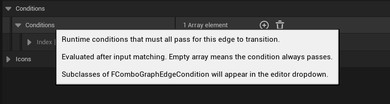
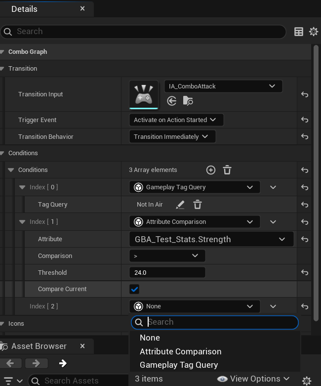
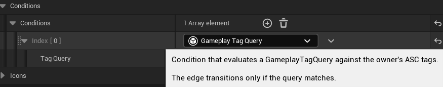
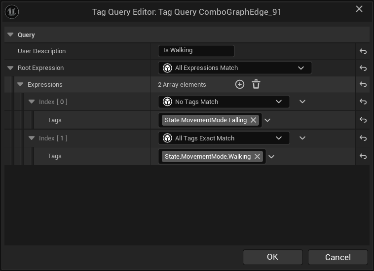
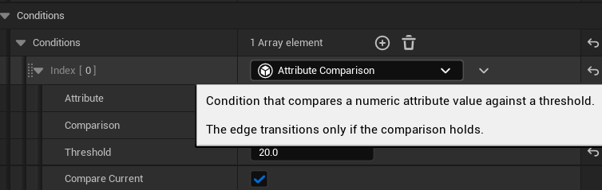
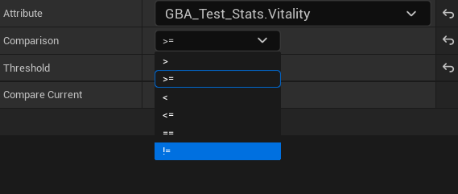

## Introduction

Edge conditions allow you to gate combo graph transitions on gameplay state, beyond just input matching. When an edge has conditions attached, the transition will only occur if all conditions evaluate to true at the moment the input is received.

This enables context-sensitive branching within a single Combo Graph without needing separate graphs or animation nodes.

Here is an example of a graph that branches based on the owner's movement mode:

*Branching to different nodes depending on whether the owner actor is walking or in the air*

<video controls>
  <source src="/content/docs/graph/edge-conditions/demo.mp4" type="video/mp4" />
</video>

*Conditions evaluated at runtime, branching to the appropriate path based on current gameplay tags*

## How Conditions Work

Conditions are evaluated at transition time, integrated into both the initial start node lookup (`GetEdgeWithInput`) and runtime input handling (`OnEventInputReceived`).

- **All conditions must pass** — multiple conditions on a single edge use strict AND logic
- **Empty conditions = always pass** — an edge with no conditions behaves as before, transitioning on input alone
- Conditions are evaluated against the owner actor's current state

## Adding Conditions to an Edge

Select an edge in the graph to view its properties in the details panel. You'll find a new `Conditions` array property:


*Conditions array on edge properties*

Click the `+` button to add a new condition. You'll be presented with the available condition types to choose from.



## Condition Types

### Gameplay Tag Query

This condition queries the owner actor's Ability System Component for gameplay tags. It supports standard tag query operators:


*Configuring a Gameplay Tag Query condition*


*Tag query property details with operator and tag selection*

Select the tags to check and the matching operator. The condition passes if the owner ASC matches the query.

<div className="notes">

> This condition type is particularly useful for branching based on movement modes, combat states, or any tag-driven state 
  you already use in your project.

</div>

### Attribute Comparison

This condition compares a gameplay attribute value (on the owner's actor ASC) against a threshold using one of six comparison operators:


*Configuring an Attribute Comparison condition*


*Attribute comparison property details with attribute, operator, and threshold*

| Operator | Description |
| -------- | ----------- |
| `>` | Attribute is greater than threshold |
| `>=` | Attribute is greater than or equal to threshold |
| `<` | Attribute is less than threshold |
| `<=` | Attribute is less than or equal to threshold |
| `==` | Attribute equals threshold |
| `!=` | Attribute does not equal threshold |

Select the attribute to compare, the operator, and the threshold value. The condition passes if the comparison is true.

<div className="notes">

> This is useful for gating transitions on stamina, health, ammo, or any other numeric gameplay attribute granted to your ASC.

</div>

## Extensibility

The condition system is built on `FInstancedStruct` polymorphism, meaning new condition types can be added without modifying core edge logic.
If you need custom evaluation rules beyond gameplay tags and attribute comparisons, you can author your own condition type by implementing
the abstract `FComboGraphEdgeCondition` base class.

No explicit registration is needed. The editor automatically discovers all subclasses through the `BaseStruct` meta property on the
`Conditions` array in `UComboGraphEdge`, so new types will appear in the dropdown after a rebuild.

### Creating a Custom Condition

**1. Create your struct header** — define a `USTRUCT` inheriting from `FComboGraphEdgeCondition`, add `DisplayName` and `Category` meta,
declare your configurable properties, and override `Evaluate`.

**2. Implement `Evaluate`** — access the owner ASC via `InOwningTask.AbilitySystemComponent`, run your check, and return `true` to allow
the transition or `false` to block it.

Below are three practical examples.

### Example: Cooldown Active

Prevents transition if a specific cooldown tag is currently active on the owner ASC.

**MyEdgeConditionCooldown.h**
```cpp
#pragma once

#include "Conditions/ComboGraphEdgeCondition.h"
#include "GameplayTagContainer.h"
#include "MyEdgeConditionCooldown.generated.h"

USTRUCT(DisplayName = "Cooldown Active", Meta = (Category = "ComboGraph"))
struct FComboGraphEdgeConditionCooldown : public FComboGraphEdgeCondition
{
    GENERATED_BODY()

    virtual bool Evaluate(const UComboGraphAbilityTask_StartGraph& InOwningTask, const UComboGraphEdge* InEdge) const override;

    UPROPERTY(EditAnywhere, Category = "Parameters")
    FGameplayTag CooldownTag;
};
```

**MyEdgeConditionCooldown.cpp**
```cpp
#include "MyEdgeConditionCooldown.h"
#include "Abilities/Tasks/ComboGraphAbilityTask_StartGraph.h"
#include "AbilitySystemComponent.h"

bool FComboGraphEdgeConditionCooldown::Evaluate(const UComboGraphAbilityTask_StartGraph& InOwningTask, const UComboGraphEdge* InEdge) const
{
    const TStrongObjectPtr<UAbilitySystemComponent> ASC = InOwningTask.AbilitySystemComponent.Pin();
    if (!ASC.IsValid() || !IsValid(ASC.Get()))
    {
        return false;
    }

    return ASC->HasMatchingGameplayTag(CooldownTag);
}
```

### Example: Ability Granted

Prevents transition unless a specific Gameplay Ability is currently granted.

**MyEdgeConditionAbilityGranted.h**
```cpp
#pragma once

#include "Conditions/ComboGraphEdgeCondition.h"
#include "MyEdgeConditionAbilityGranted.generated.h"

class UGameplayAbility;

USTRUCT(DisplayName = "Ability Granted", Meta = (Category = "ComboGraph"))
struct FComboGraphEdgeConditionAbilityGranted : public FComboGraphEdgeCondition
{
    GENERATED_BODY()

    virtual bool Evaluate(const UComboGraphAbilityTask_StartGraph& InOwningTask, const UComboGraphEdge* InEdge) const override;

    UPROPERTY(EditAnywhere, Category = "Parameters")
    TSubclassOf<UGameplayAbility> AbilityClass;
};
```

**MyEdgeConditionAbilityGranted.cpp**
```cpp
#include "MyEdgeConditionAbilityGranted.h"

#include "Abilities/Tasks/ComboGraphAbilityTask_StartGraph.h"
#include "Abilities/GameplayAbility.h"
#include "AbilitySystemComponent.h"

bool FComboGraphEdgeConditionAbilityGranted::Evaluate(const UComboGraphAbilityTask_StartGraph& InOwningTask, const UComboGraphEdge* InEdge) const
{
    const TStrongObjectPtr<UAbilitySystemComponent> ASC = InOwningTask.AbilitySystemComponent.Pin();
    if (!ASC.IsValid() || !IsValid(ASC.Get()))
    {
        return false;
    }

    if (!AbilityClass.IsValid())
    {
        return false;
    }

    FGameplayAbilitySpec* Spec = ASC->FindAbilitySpecFromClass(AbilityClass);
    if (!Spec)
    
        return false;
    }

    return Spec->IsActive();
}
```

### Example: Distance to Target

Prevents transition if the avatar is too far from a designated target actor.

**MyEdgeConditionDistanceToTarget.h**
```cpp
#pragma once

#include "Conditions/ComboGraphEdgeCondition.h"
#include "MyEdgeConditionDistanceToTarget.generated.h"

class AActor;

USTRUCT(DisplayName = "Distance to Target", Meta = (Category = "ComboGraph"))
struct FComboGraphEdgeConditionDistanceToTarget : public FComboGraphEdgeCondition
{
    GENERATED_BODY()

    virtual bool Evaluate(const UComboGraphAbilityTask_StartGraph& InOwningTask, const UComboGraphEdge* InEdge) const override;

    UPROPERTY(EditAnywhere, Category = "Parameters")
    TObjectPtr<AActor> TargetActor;

    UPROPERTY(EditAnywhere, Category = "Parameters", Meta = (ClampMin = "0"))
    float MaxDistanceThreshold = 200.f;
};
```

**MyEdgeConditionDistanceToTarget.cpp**
```cpp
#include "MyEdgeConditionDistanceToTarget.h"
#include "Abilities/Tasks/ComboGraphAbilityTask_StartGraph.h"

bool FComboGraphEdgeConditionDistanceToTarget::Evaluate(const UComboGraphAbilityTask_StartGraph& InOwningTask, const UComboGraphEdge* InEdge) const
{
    if (!TargetActor)
    {
        return false;
    }

    const AActor* Avatar = InOwningTask.GetAvatarActor();
    if (!Avatar)
    {
        return false;
    }

    const float Distance = Avatar->GetDistanceTo(TargetActor);
    return Distance <= MaxDistanceThreshold;
}
```

## Example: Movement Mode Branching

A common use case is branching combo behavior based on whether the character is grounded or airborne. Using Gameplay Tag Query conditions, 
you can set up two edges from the same node:

1. **Grounded path** — edge condition checks for `Movement.Walking` tag
2. **Airborne path** — edge condition checks for `Movement.Airborne` tag

Both edges share the same input action. When the input is received during the combo window, the graph evaluates which edge's conditions 
are satisfied and transitions accordingly.

This is the pattern demonstrated in the video above — a single graph handles both grounded and aerial combos, with the correct path 
selected at runtime based on the character's current movement mode tags from CMC.
