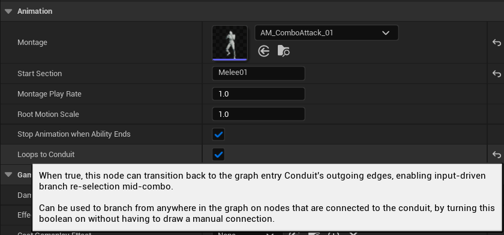
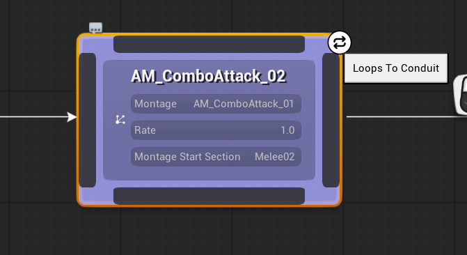

## Introduction

The Loops to Conduit feature allows any combo graph node to transition back to the Conduit's outgoing edges, enabling input-driven branch re-selection mid-combo.

<video width="853" height="480" controls autoPlay muted>
  <source src="/content/docs/graph/loops-to-conduit/demo.mp4" type="video/mp4" />
  Your browser does not support the video tag.
</video>

*Loops to Conduit in action — nodes can branch back to the Conduit's paths mid-combo*

When enabled on a node, it will listen for the Conduit's outgoing edges in addition to its own, meaning any input matching a Conduit edge can trigger a transition back to the initial branch selection — without having to draw a manual connection.

## Enabling the Feature

To enable Loops to Conduit, select a combo node and check the **Loops to Conduit** checkbox in the Details panel under the Animation category.

*Loops to Conduit property in the Details panel*

## Visual Indicator

When Loops to Conduit is enabled on a node, a loop icon appears in the top-right corner of the node in the graph editor.

*Visual indicator on a node with Loops to Conduit enabled*

## How It Works

When **Loops to Conduit** is enabled on a node, the graph's edge gathering logic includes both the node's own outgoing edges and the Conduit node's edges.

At runtime, when the node is active and an input is registered, the graph evaluates all available edges — including the Conduit's — and transitions to the matching branch. This means you can re-select a different input branch from anywhere in the combo sequence.

For example, if your Conduit has edges for both Light Attack and Heavy Attack, a node further down the Light Attack chain with Loops to Conduit enabled can transition to the Heavy Attack branch when a Heavy Attack input is received.

## Use Cases

### Re-branching Mid-Combo

The most common use case is allowing the player to switch between attack types (Light / Heavy) at any point during a combo, without requiring manual edges drawn back to the Conduit.

### Simplified Graphs

By leveraging Loops to Conduit, you can avoid cluttering your graph with redundant transition edges that loop back to the initial branch point.

## Restrictions

Loops to Conduit is not available on the following node types:

- **Conduit** — the feature only applies to nodes downstream of the Conduit
- **Redirect** — redirect nodes do not support Loops to Conduit
