Combo Graph does come in with a built in collision system but was built from the ground up with integration in mind.

## Introduction

While combo graph do provide a custom solution for this, it is not tightly integrated with the system. Combo Graph instead relies on gameplay events that your hit collision system sends to the owner (the avatar actually) of combo abilities when a hit is registered, along with proper payload information such as instigator / targets and hit result with target data.

Doing so, it is fairly straight forward to integrate with third party collision system, or your own mechanism.

There is quite a few really good collisions systems on the marketplace, either at reasonable price or even free.

This page will describe the typical usage of two of those systems, and how they can be used along with Combo Graph plugin.

- AGR Pro (free): https://www.unrealengine.com/marketplace/en-US/product/agr-pro
- Combat Components: https://www.unrealengine.com/marketplace/en-US/product/combat-components

If you're using another system, you can head over to [Send Hit Information to Abilities](#send-hit-information-to-abilities) section, and adjust the detailed step to the system you're using. As long as your collision mechanism exposes an Hit Event along with proper Hit Result, the pattern will be the same.

### Setup Collision Mesh

**This part is common to most collision plugins, and to Combo Graph built in collision component. It is about setting up a Static or Skeletal Mesh Component for your Character Blueprint that you can attach melee weapons to.**

The first thing we need to have is a static or skeletal mesh that will represent our melee weapon.

Open up your character blueprint, and under the Character Mesh (called `Mesh` by default), select the mesh and click add component to add a new Static Mesh Component (or Skeletal Mesh Component if your weapon is a skeletal mesh):

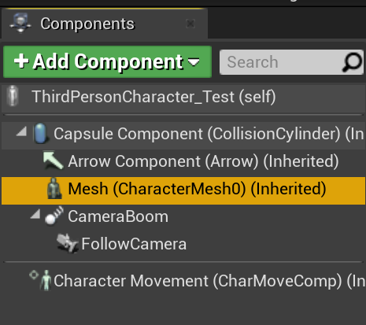
*Select the Skeletal Mesh Component for your Character Mesh*

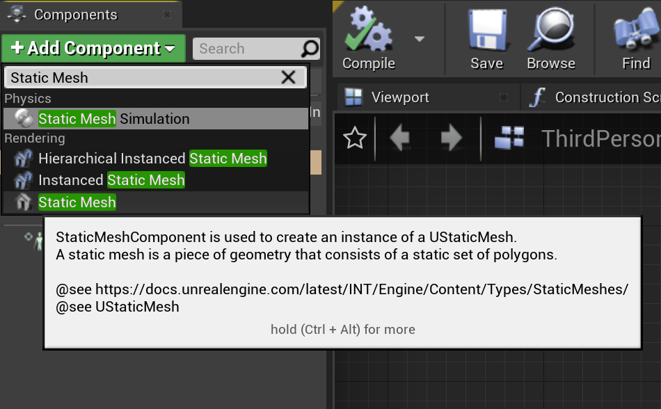
*Click Add Component and add either a Static Mesh Component or Skeletal Mesh Component (depending on your weapon mesh)*

With the Static Mesh Component we just added selected, setup the Static Mesh to use for your weapon in the Details Panel, define a socket to attach to (or tweak the component transform):

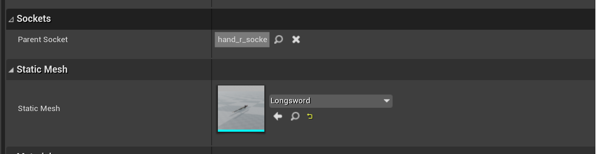
*If your skeleton has a socket to attach the weapon to (recommended), you can define the attach point with the `Parent Socket` magnifying glass*

> **Note** If you're equipping / unequipping weapons, you can also do this programmatically with 
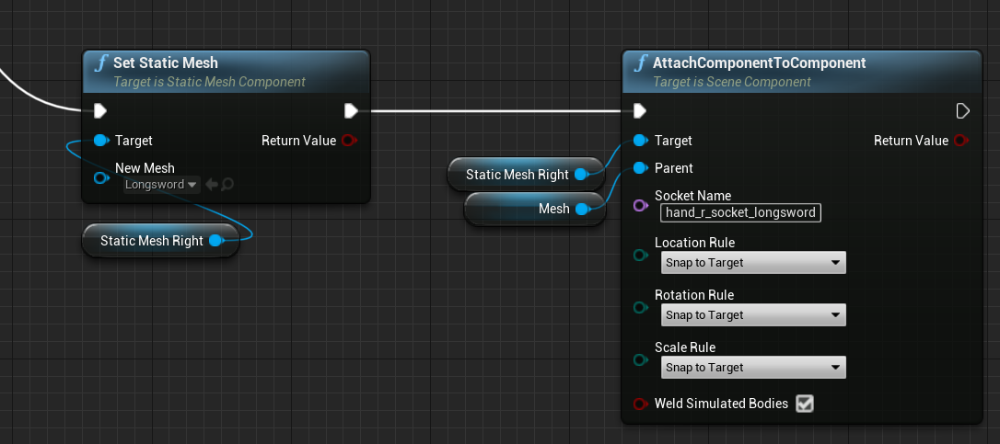

## Plugin Integration

### AGR Pro

[Plugin Integration: AGR Pro](/collision/plugin-integration-agrpro)

### Combat Components

[Plugin Integration: Combat Components](/collision/plugin-integration-combatcomponents)

## Combo Graph Collision Component

> If you wish to use another plugin to handle collisions, you can skip this chapter and refer to the integration guides linked above.

`ComboGraphCollisionComponent` is an Actor Component providing basic collision detection mechanism for registered meshes using traces.

It implements simple logic for hit detection not meant to replace more robust solutions such as Combat Components or AGR Pro (Combat Manager in v4), but rather to provide a quick and easy way to handle collision for those not having or not willing to use aforementioned plugins, or not having a game-specific custom collision system already in place.

Registered meshes can be Static or Skeletal meshes, this component relies on Sockets attached to those primitives to draw traces for each socket.

No sub-stepping is involved, we simply draw traces for each frame checking for collisions between last frame position and current frame position for a given socket.

### Setup Actor Component

First thing we need to do is to ensure our Character Blueprint as the component created and attached to the character.

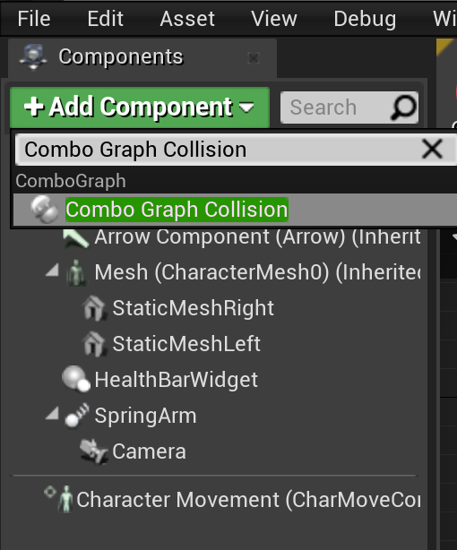
*Click "Add Component* in the components panel and add `ComboGraphCollisionComponent`*

With the Component selected in the components panel, the details panel should be update with properties for the Actor Component.

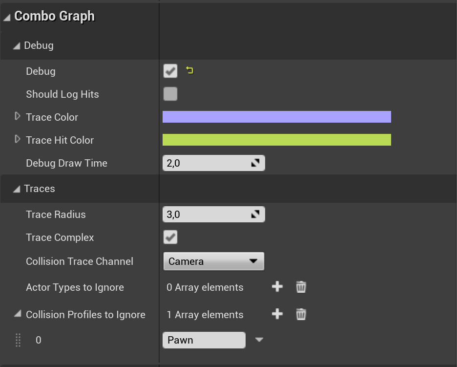

Here is a brief description of each exposed configuration properties:

| Name                          | Description                                       |
| -----------------             | ------------------------------------------------- |
| Debug                         | If set to true, traces will be rendered on screen for a duration |
| Should Log Hits               | If set to true, registered hits will be logged to console (successful hits or ignored ones due to configuration) |
| Trace Color                   | In debug mode, traces will be rendered on screen using this color |
| Trace Hit Color               | In debug mode, registered hits will be rendered on screen using this color |
| Debug Draw Time               | In debug mode, this is the amount in seconds that visual debug traces will persist on screen |
| Trace Radius                  | Radius of the sphere to sweep during collision traces |
| Trace Complex                 | True to test against complex collision, false to test against simplified collision |
| Collision Trace Channel       | Trace channel to use when we perform collision traces (Default set to "Camera" for ease of use, but custom collision profiles can be used for further tuning) |
| Actor Types to Ignore         | List of Actor classes to ignore during hit collisions |
| Collision Profiles to Ignore  | List of collision profile names to ignore during hit collision. Can be useful to ignore profile for capsule component and ensure hits only register against character meshes |

Additionally, the component defines a few Event Delegates you can register to in Blueprints:

| Name              | Description                                                                       |
| ----------------- | --------------------------------------------------------------------------------- |
| On Hit Registered | Delegate invoked when a successful hit is registered, only on server              |
| On Trace Start    | Delegate invoked when we start to check for collision traces on registered meshes |
| On Trace End      | Delegate invoked when we end the collision tracing process on registered meshes   |

### Setup Mesh Collision Sockets

**This section assumes you have followed the steps outlined in [Setup Collision Mesh](#setup-collision-mesh)**

The last required step for the setup of the Collision Mesh is to define and place some sockets on the colliding component.

Here is the socket setup for the Staff mesh I am using in this tutorial (the mesh itself comes from [Paragon: Wukong
](https://www.unrealengine.com/marketplace/en-US/product/paragon-wukong) on the marketplace, extracted in Blender that I use in the Demo project for Combo Graph)

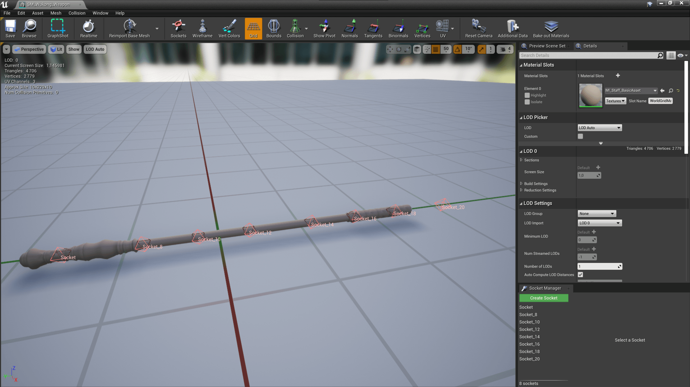
*Click `Create Socket` as many times as needed in the Socket Manager on the bottom right (Click the image to open in full screen)*

Combo Graph collision component relies on Sockets attached to the collision mesh to draw traces for each socket. It simply draw traces for each frame checking for collisions between last frame position and current frame position for a given socket, when the collision window is active.

### Setup Event Graph

There are two events we need to implement for the collision component.

### Register collision meshes on activation

We need to configure the Actor Component so that it knows which Primitive Component (can be either Static or Skeletal meshes) it should consider for melee hit traces. This is done via `RegisterCollisionMesh()`.

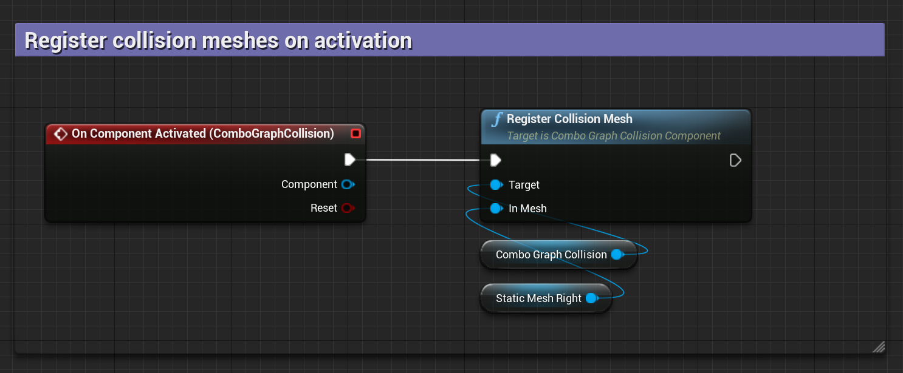
*The component is set to "Auto Activates", so `OnComponentActivated` and `OnComponentDeactivated` will be triggered accordingly by Unreal.*

You can also use your Pawn's `BeginPlay` event to invoke `RegisterCollisionMesh()` and setup the mesh for the collision component.

### Enable / Disable collision via Anim Notify States

The primary way to activate and deactivate collision traces is via an Anim Notify States in animations.

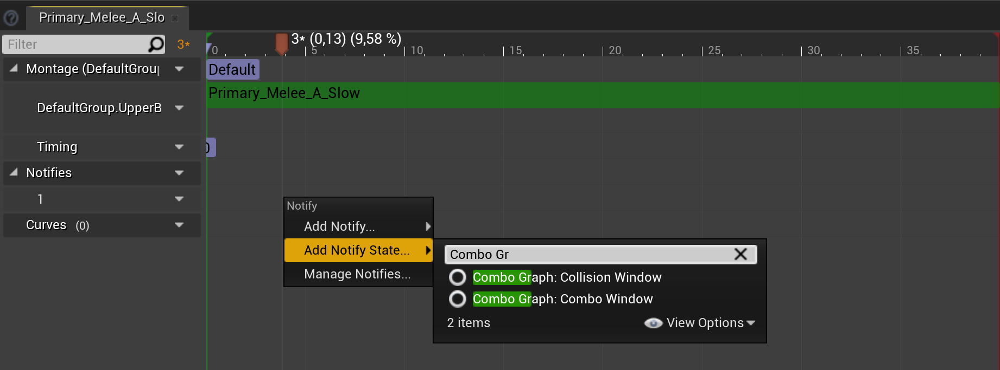
*Add `Combo Graph: Collision Window` notifier (`UComboGraphANS_CollisionWindow` is the c++ class) to the animation timeline...*

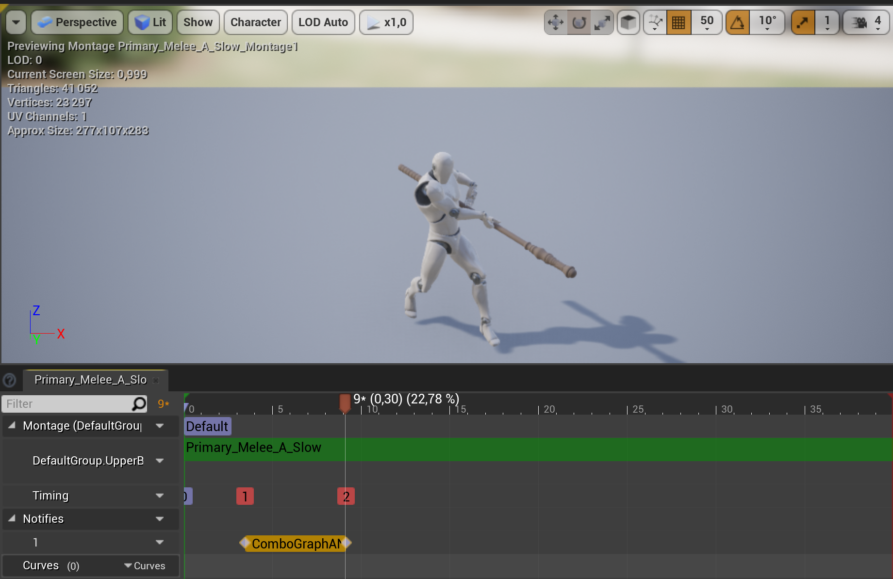
*... Starting the notify state when the character starts the melee swing, and ending the notify we should stop traces for the registered meshes.*

It is a pretty basic notify state that will call the collision component's `StartTrace()` and `EndTrace()` (Those are not Blueprint exposed methods, can only be used natively for now).

No specific parameters or exposed properties for this notify state, all registered meshes will start to generate melee traces when this notify state is active.

If we test in game now, with `Debug` property set to true in the component details panel. We should see melee traces drawn on screen.

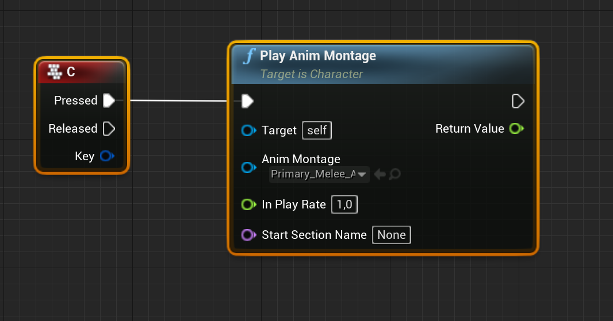

[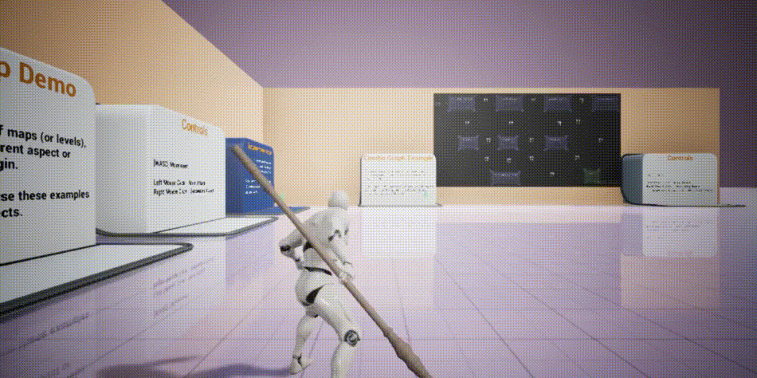](cg_test_02.gif)

### Hit Event

Now that initial setup for the Collision Component is in place, we can test registration of hits and send back that information to Abilities, such as abilities that are using Combo Graphs with `StartComboGraph` ability task. For now, we're going to simply print out information we get from hit results.

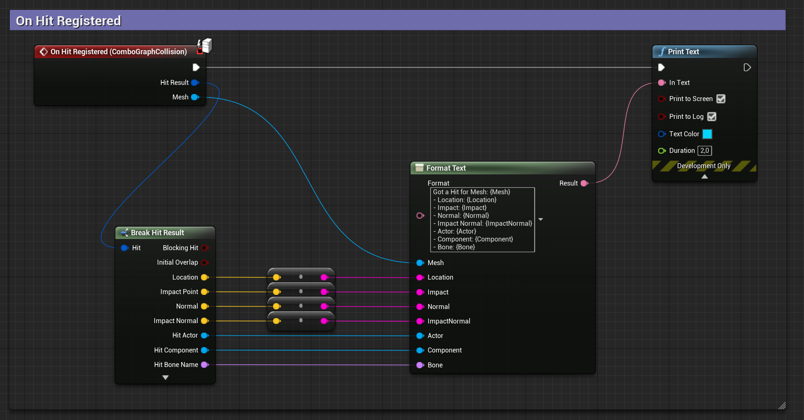

[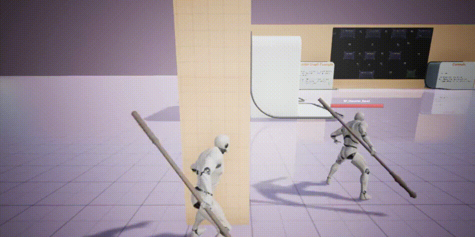](cg_hit_event_02.gif)

The default collision profile setup allows for registering hit against the environment, and ignores capsule component for character so that hits are only considered for the `CharacterMesh` profile.

You can customize this behavior with `Collision Trace Channel`, `Actor Types to Ignore` and `Collision Profiles to Ignore` and configuration properties for the component.

For instance, you could add `BlockAll` to `Collision Profiles to Ignore` to disable hits against the environment. A more robust and flexible way to further tune how collision is handled internally is to setup custom collision profiles (see [AGR integration part about collision setup](/collision/plugin-integration-agrpro#collision-setup), where we go over briefly how it can be done).

The `Should Log Hits` boolean on the collision component can be useful on these scenarios, as it will print out to console both successful and ignored hits, with information about hit component and the collision profile it has.

The full graph should look similar to below:

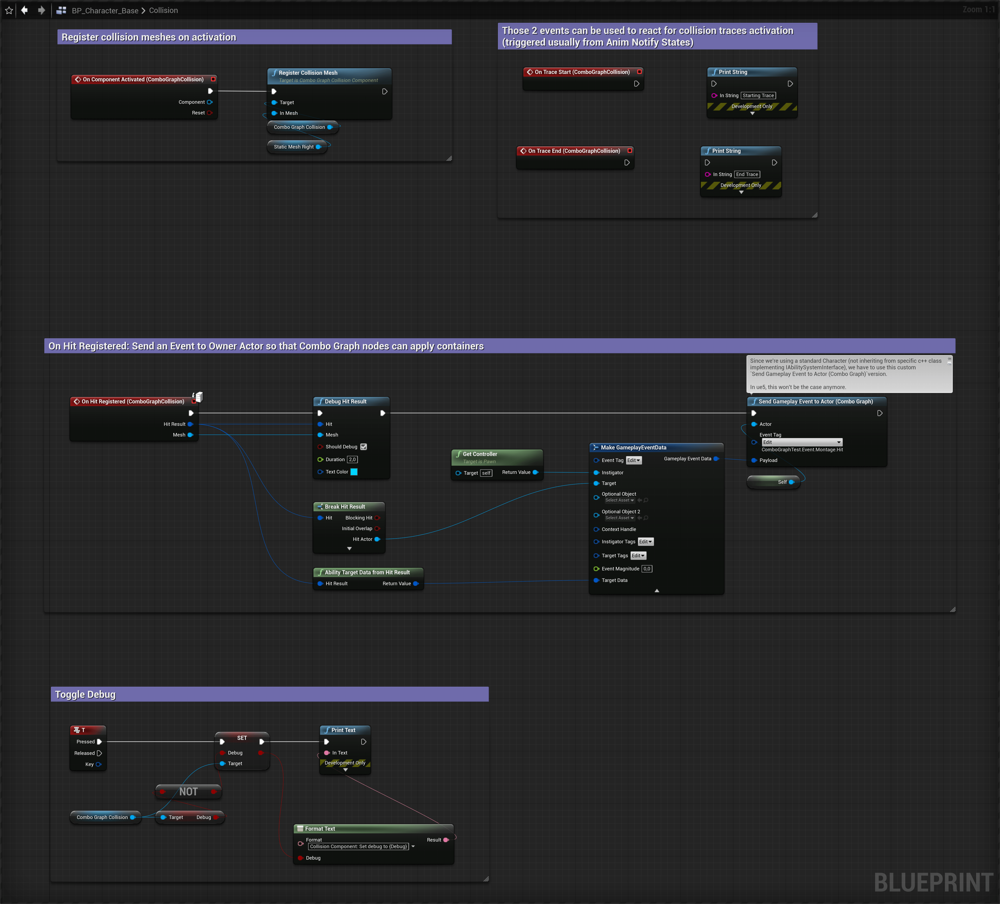

## Send Hit Information to Abilities

We have now everything needed to send back that information to Abilities so that they can react to it, such as apply Gameplay Effects for damages, or trigger Gameplay Cues for visual or sound effects.

We do so by sending a Gameplay Event with tag **Event.Montage** (you can use another tag for this, it is completely up to you) to the owner of ability with proper payload and information for:

- Instigator (usually self): The actor responsible for the hit. This is also the actor to which we're sending the event to.
- Target: The actor receiving the hit
- Target Data: The Ability Target Data we're building from the Hit Result we got using `AbilityTargetDataFromHitResult` method of the `AbilitySystemBlueprintLibrary`.

Doing so, abilities have everything needed to apply gameplay effects or trigger gameplay cues with information about the hit result location / impact points, etc.

### For Combo Graph Collision Component

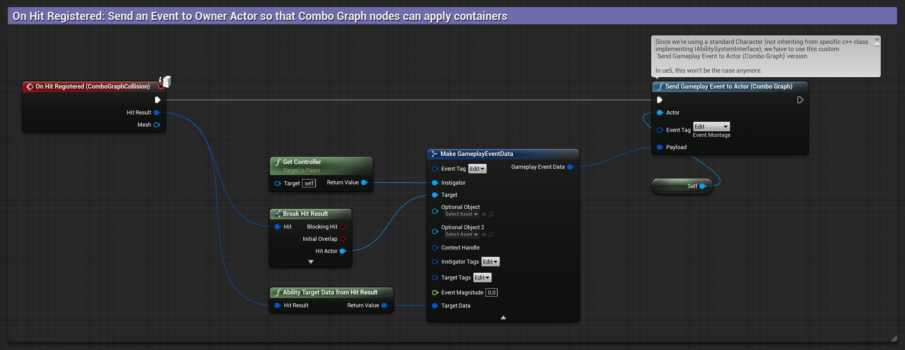

### For AGR Pro

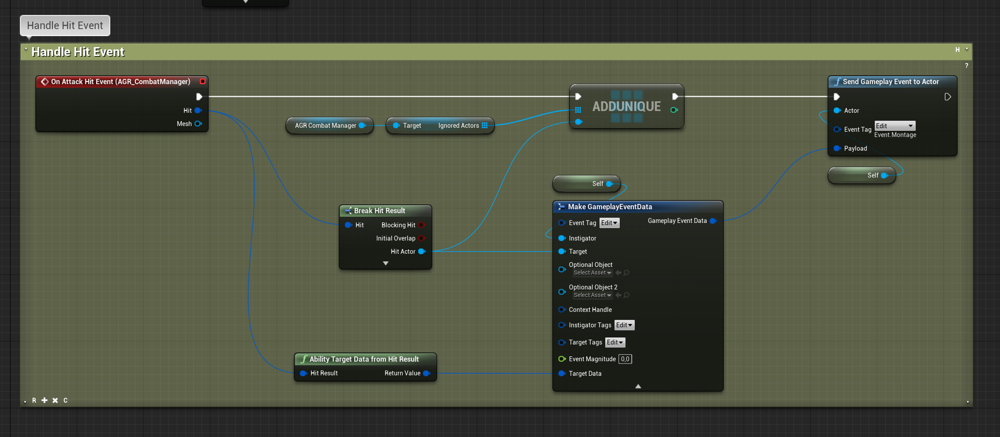

### For Combat Components

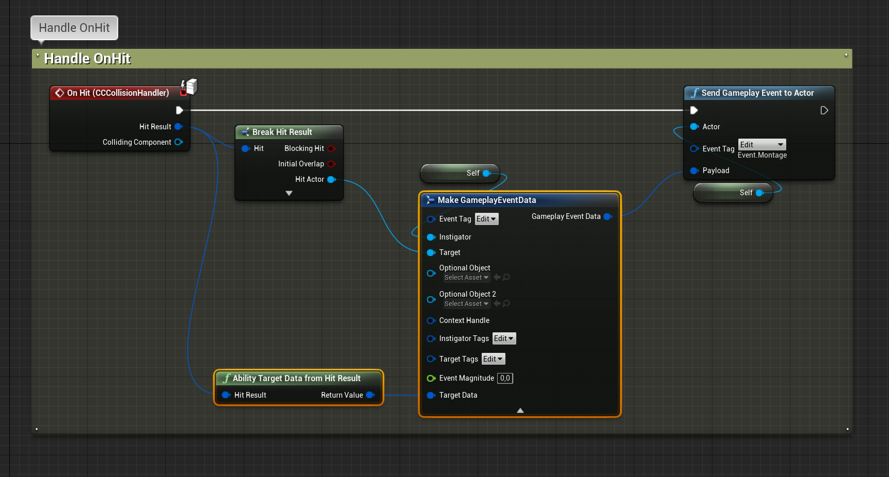

### Hit Reactions ?

> This pattern can also be used to handle hit reactions via abilities (for instance to play a hit reaction montage) by sending an event that is going to trigger the activation of an ability ([by event](https://github.com/tranek/GASDocumentation#concepts-ga-data)) on the hit actor (actor which received the hit and to which we're sending the gameplay event).    
> Since we're passing along infos such as instigator / target and complete hit result along with location and hit bone, the receiving ability should have everything needed to decide which montage it's going to play
> 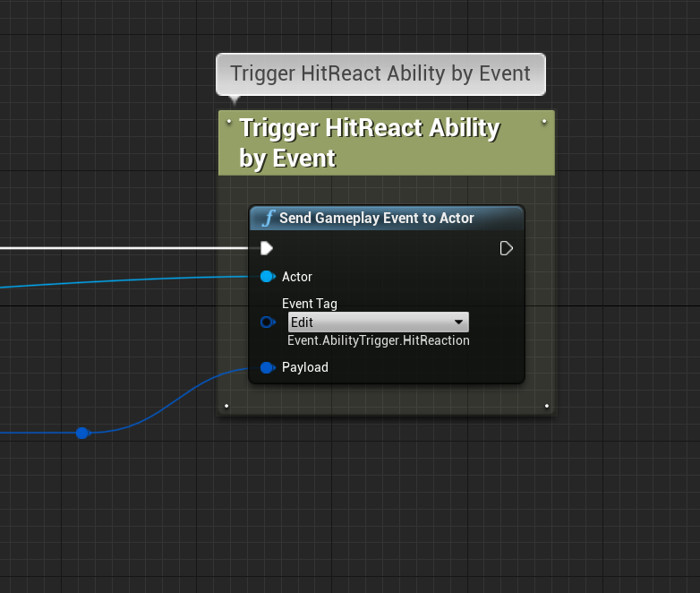

## Receiving the Event from Abilities

Using the `StartComboGraph` task in abilities, the `EventReceived` should trigger for the event we send on hit, as long as the underlying Combo Graph nodes are telling the system to listen for that event tag (with `EventTags` gameplay tag container on nodes), or if the nodes are defining some effect containers with these tags as value for the effect containers map (More info for this in the [Gameplay Effects (Cost and Containers)](/usage/gameplay-effects) page).

For instance, we can print again the hit result info from within the gameplay ability, like we did previously in the Character Blueprint, but this time using the payload we sent earlier:

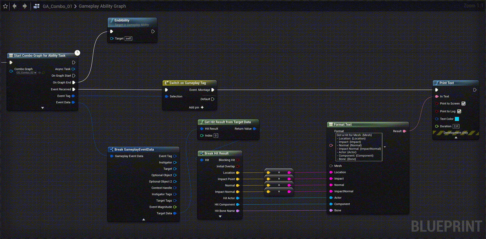

> Make sure that the combo graph node playing the montage is defining in the `EventTags` container the same Gameplay Event Tag we send from the Character BP for the `On Hit` event.
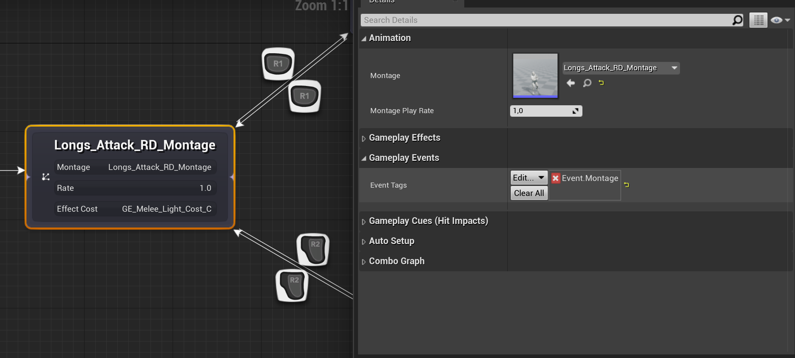  
> Setting up [Effect Containers](/gameplay-effects/containers) will also register the event, and should broadcast `EventReceived` accordingly. In this case configuring `EventTags` is not necessary
> 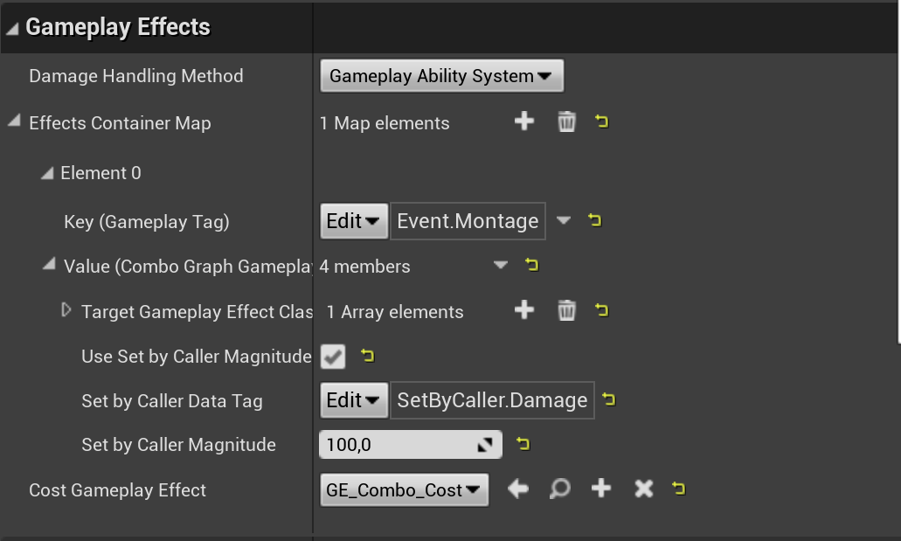   
> Same goes for [Cue Containers](/gameplay-cues/).
> 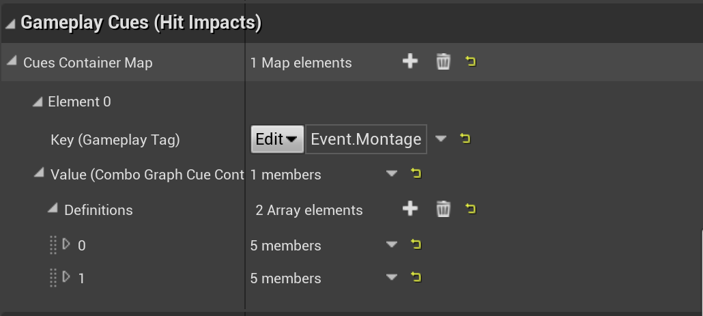