Tutorial videos from AGR author: [AGR PRO v 4.0.0 Combat Manager Component](https://youtu.be/ls5tQEHiBow) / [Melee weapon full setup](https://youtu.be/vN-_DnaWNvw)

### Collision Setup

Go to `Project's Settings > Engine > Collision`

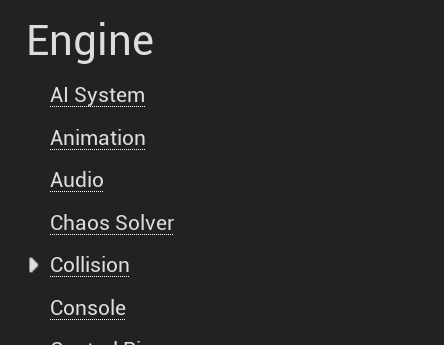

In the **Trace Channels** category, click `New Trace Channel...` button and crate a new custom chanel with the name of your choosing, set the Default Response to `Ignore`. We'll specifically turn collision presets to Block later on:

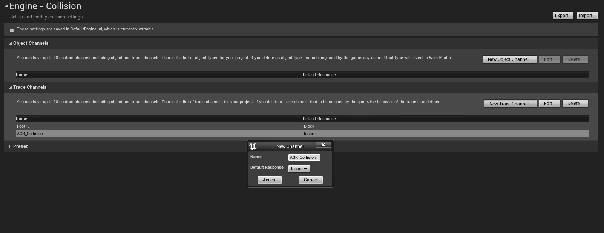
*Here using `AGR_Collision` for the channel name with `Ignore` for the Default Response*

Then for the `CharacterMesh` Preset, click the `Edit` button and change the profile for `AGR_Collision` trace type from `Ignore` to `Block`.

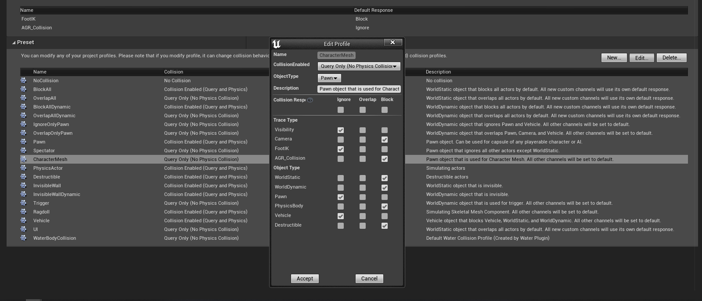

Doing so, we will ensure the trace channel AGR is going to use for collisions is ignoring everything but the `CharacterMesh` profile. With this setup, we are making sure Hit Events are going to be triggered when our collision mesh collides with the actual Skeletal Mesh for characters (which are of `Pawn` object type using `CharacterMesh` profile for collisions) and ensure we're ignoring the actual capsule for the pawns (which are of `Pawn` object type but using `Pawn` profile for collisions).

This way, we'll be able to get accurate hit information for location / impact vector along the bone name that was hit. If the collision was triggered on the capsule, Hit Bone name would always be invalid as the capsule doesn't have a skeleton to get back this info from.

> **Note** If you'd like your mesh to collide with other objects than Character's Skeletal Mesh (for instance the environment such as walls), you can adjust the settings here for the various preset and set the `AGR_Collision` collision response to `Block` instead of `Ignore`.

### Setup Mesh Collision Sockets (AGR)

AGR Combat Component is using two sockets to know where melee traces should start and end. To do so, we need to create a `Start` at the base of the hitting part of the weapon, and an `End` socket at the tip of the sword.

Here is the socket setup for the Longsword mesh I am using in this tutorial (the mesh itself comes from [Kubold's LongSword Animset Pro](https://www.unrealengine.com/marketplace/en-US/product/longsword-animset-pro) on the marketplace)

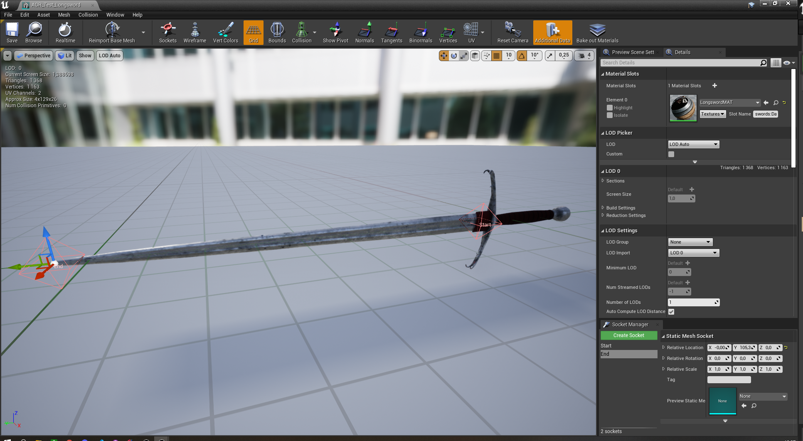
*Click `Create Socket` for each socket in the Socket Manager on the bottom right (Click the image to open in full screen)*

### Setup AGR Combat Manager Actor Component

We now need to add `AGR_CombatManager` Actor Component to our character.

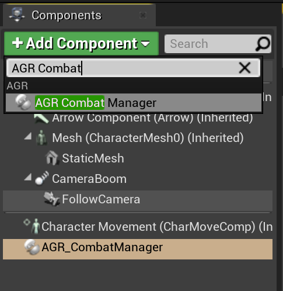
*Click `AddComponent` and add `AGR Combat Manager`*

With the component selected, adjust the settings to your liking.

At the very least, you should change the `Trace Channel` setting to the one we created earlier `AGR_Collision`, make sure Start and End Socket Trace names match the socket created in the previous section, and maybe turn on `Debug` boolean if you'd like to see the debug trace when the collision is enabled.

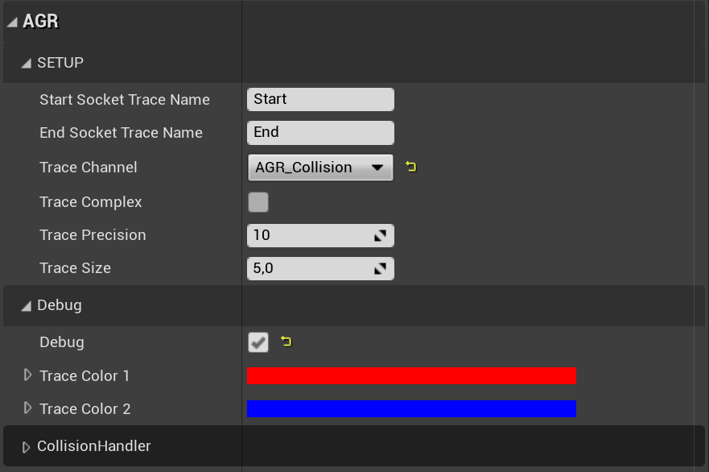
*Make sure the Trace Channel is set to our custom channel for collisions*

With the component added, we can setup the collision meshes (in this tutorial, we're setting up just one) with the Pawns's `On Begin Play` event.

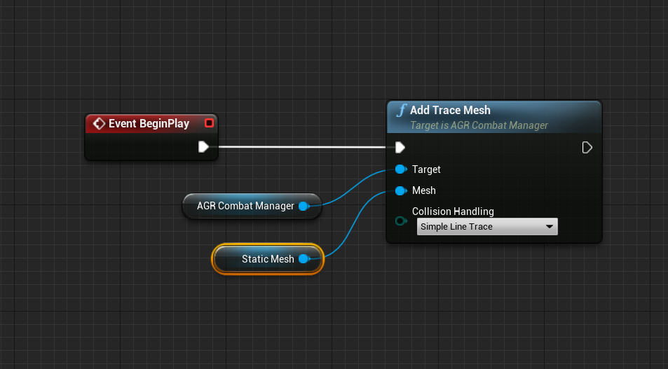
*Alternately, you could use the component `On Component Activated` event if you also set `Auto Activate` bool for the component to true*

We can test the collision activation now with an animation montage. Open up the anim montage you'd like to use and setup the anim notify state `AGR_Attack_NotifyState` to begin when the character starts swinging and end the notify when it stops swinging.

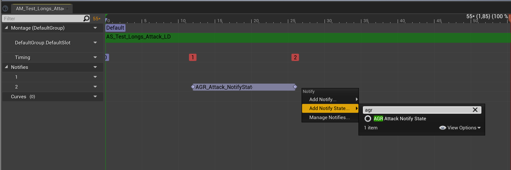

If we setup a basic test input to play this montage, and if you have setup the `Debug` boolean to true for `AGR_CombatManager` component, you should see debug traces being drawn when you play the montage.

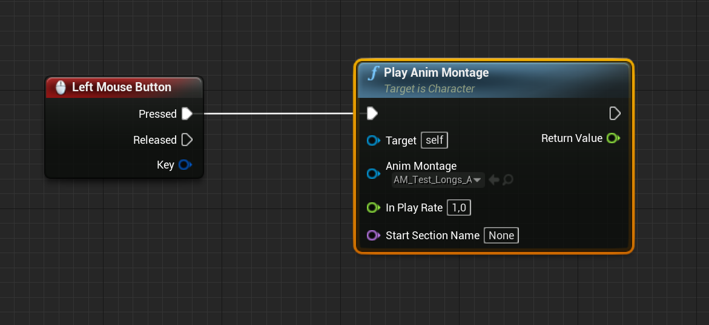
*As usual with montages, make sure the skeleton the montage is using is compatible with your character mesh, and that your Animation Blueprint is using the same Montage slot as your montage*

*I've changed here the Collision Handling method to `Simple Box Trace` with `Add Trace Mesh` method called on begin play, so that debug traces are a bit more visual.*

### Test Hit Event (AGR)

Now that collision system for AGR Component is in place, we can test registration of hits and send back that information to Abilities, such as abilities that 
are using Combo Graphs with `StartComboGraph` ability task. For now, we're going to simply print out information we get from hit results.

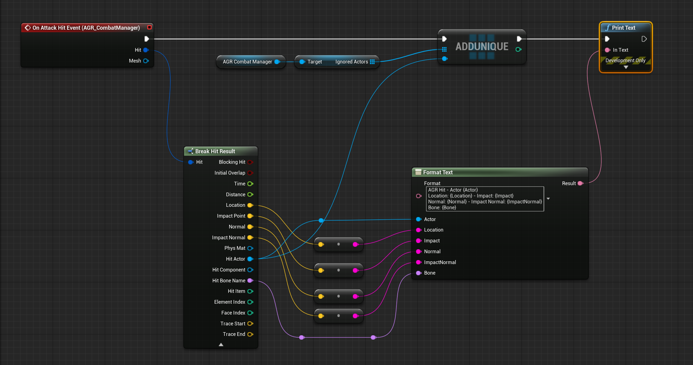
*With `AGR_CombatManager` selected in the components list, click `+` next to `On Attack Hit Event` event in the details panel, and setup the event graph like so. Here, we're just printing out information for the Hit Result we get.*

> AGR Combat Component by default will register multiple hits for a melee trace, but it provides a mechanism to ensure it only happens once. This is why we use `AGR_CombatManager > IgnoredActors` array, and add the hit actor to it on the first registered hits. AGR will internally clear up that array when the attack ends.

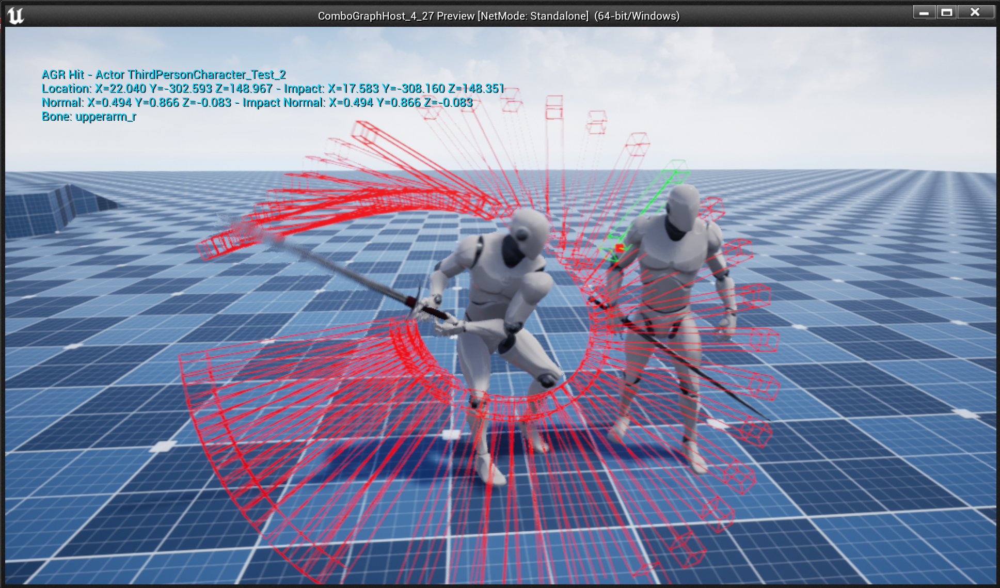
*With a Pawn placed in our level, if we try to hit him, we should have `On Attack Hit Event` event called with hit result properly filled.*

We have now everything needed to send back that information to Abilities so that they can react to it, such as apply Gameplay Effects for damages, or trigger Gameplay Cues for visual or sound effects. Head over to [Send Hit Information to Abilities](/collision#send-hit-information-to-abilities) section to complete this tutorial.