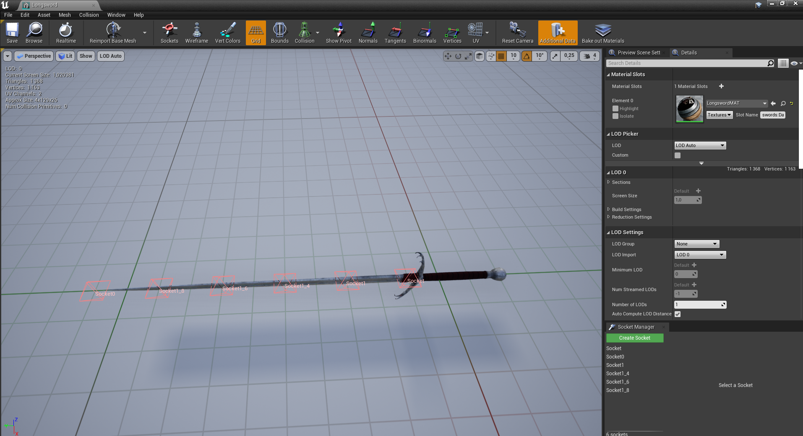
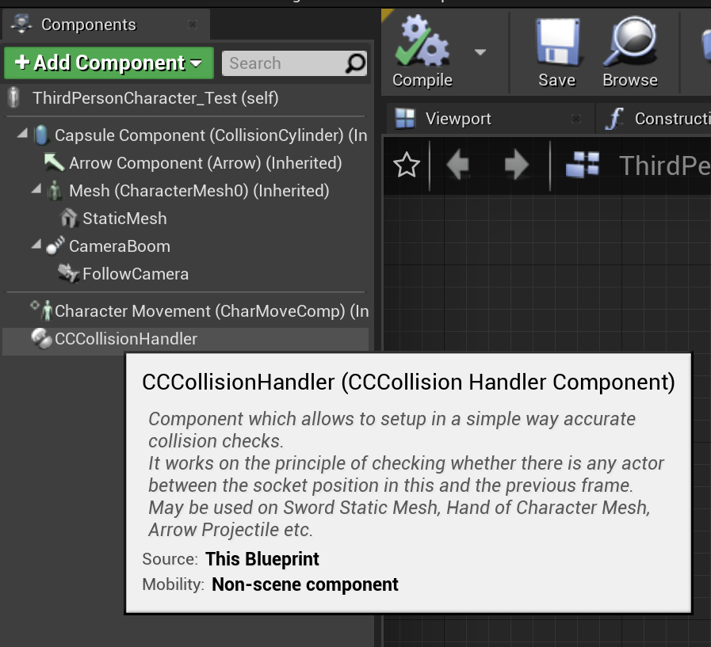
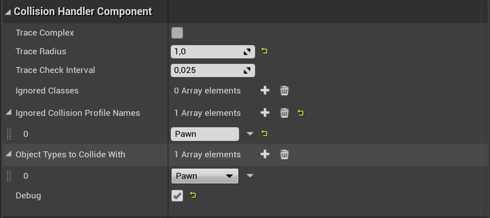
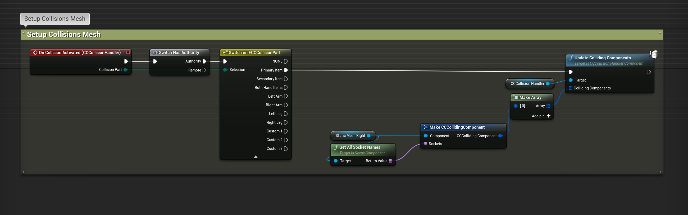
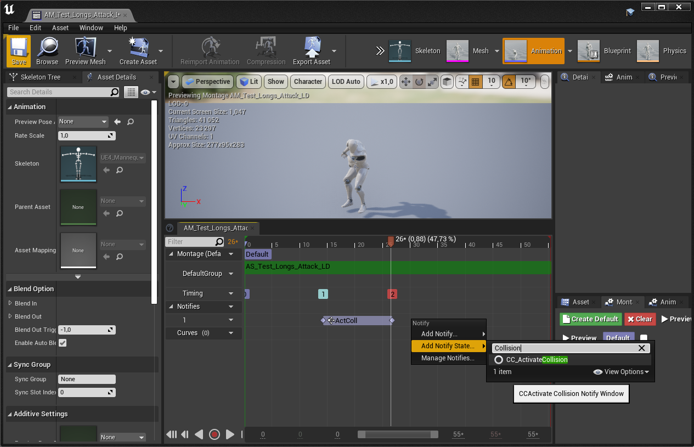
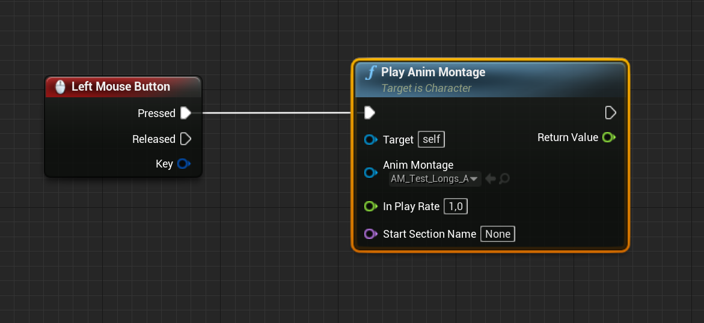
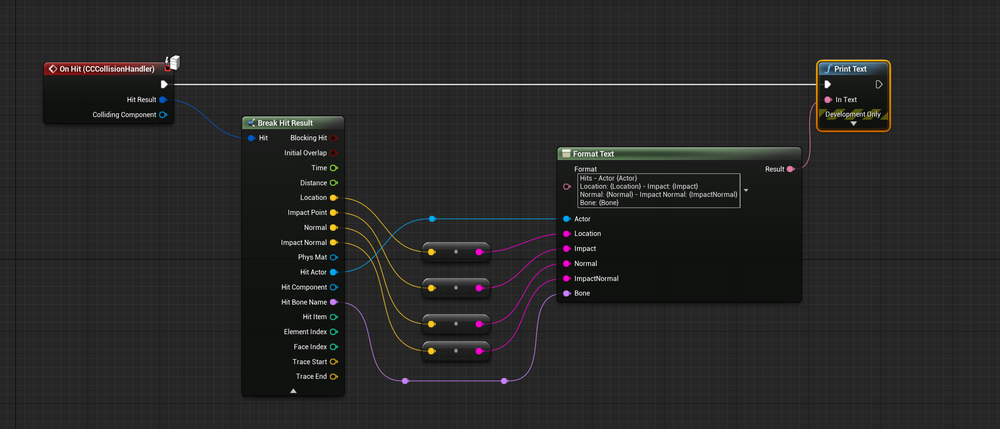
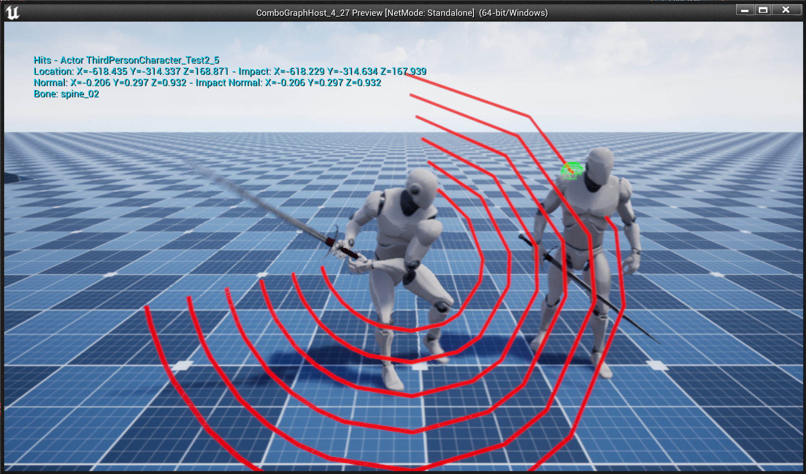

## Plugin Integration: Combat Components

[Combat Components](https://www.unrealengine.com/marketplace/en-US/product/combat-components) comes with a an actor component `CCColisionHandlerComponent` designed to handle collisions for primitive components (such as static or skeletal mesh weapons).

This section will focused on the bare minimal steps to get hit collision system working with this plugin, and how to communicate back hit registration events back to Combo Graphs. Head over to their [official documentation](https://ue4dcs.com/combatcomponents/collisionhandler/overview) if you'd like to know more about Combat Components itself.

### Setup Mesh Collision Sockets (CC)

**This section assumes you have followed the steps outlined in [Setup Collision Mesh](/collision#setup-collision-mesh)**

The last required step for the setup of the Collision Mesh, as explained in [Combat Components' documentation](https://ue4dcs.com/combatcomponents/collisionhandler/overview), is to define and place some sockets on the colliding component.

Here is the socket setup for the Longsword mesh I am using in this tutorial (the mesh itself comes from [Kubold's LongSword Animset Pro](https://www.unrealengine.com/marketplace/en-US/product/longsword-animset-pro) on the marketplace)

*Click `Create Socket` as many times as needed in the Socket Manager on the bottom right (Click the image to open in full screen)*

### Setup Collision Actor Component

We now need to add `CCColisionHandlerComponent` Actor Component to our character.

*Click `AddComponent` and add `CCColisionHandler`*

And, with the component selected, adjust the settings to your liking (you should refer to [Combat Components' documentation](https://ue4dcs.com/combatcomponents/collisionhandler/overview) for more information on this)

*These are typical settings I'm usually using. Setting `Pawn` in the ignored profile names will ensure hits are going to be registered with characters' skeletal meshes while ignoring the capsule. It ensures we get more accurate collisions and information such as the hit bone name in the hit result.*

With the component added, we can setup the collision meshes (in this tutorial, we're setting up just one) with the component's `On Collision Activated` event. This will be called later on with Anim notifiers in montage where we tell the system when collisions should be enabled and disabled based on our melee animations.

With `CCColisionHandler` collision handler selected in the components list, check at the bottom of the Details panel for the event list, and click `+` for `On Collision Activated`, and setup your event graph like so:

*Click the image to open in full screen*

We can test the collision activation now with an animation montage. Open up the anim montage you'd like to use and setup the anim notify state `CC_ActivateCollision` to begin when the character starts swinging and end the notify when it stops swinging.

*Click the image to open in full screen*

If we setup a basic test input to play this montage, and if you have setup the `Debug` boolean to true for `CCColisionHandler` component, you should see debug traces being drawn when you play the montage.

*As usual with montages, make sure the skeleton the montage is using is compatible with your character mesh, and that your Animation Blueprint is using the same Montage slot as your montage*

### Test Hit Event (CC)

Now that collision system for Combat Components is in place, we can test registration of hits and send back that information to Abilities, such as abilities that are using Combo Graphs with `StartComboGraph` ability task.

First, like we did previously with `On Collision Activated`, we need to define behavior for `On Hit` event for `CCColisionHandler` component. 

*With `CCColisionHandler` selected in the components list, click `+` next to `On Hit` event in the details panel, and setup the event graph like so. Here, we're just printing out information for the Hit Result we get.*

*With a Pawn placed in our level, if we try to hit him, we should have `On Hit` event called with hit result properly filled.*

We have now everything needed to send back that information to Abilities so that they can react to it, such as apply Gameplay Effects for damages, or trigger Gameplay Cues for visual or sound effects. Head over to [Send Hit Information to Abilities](/collision#send-hit-information-to-abilities) section to complete this tutorial.