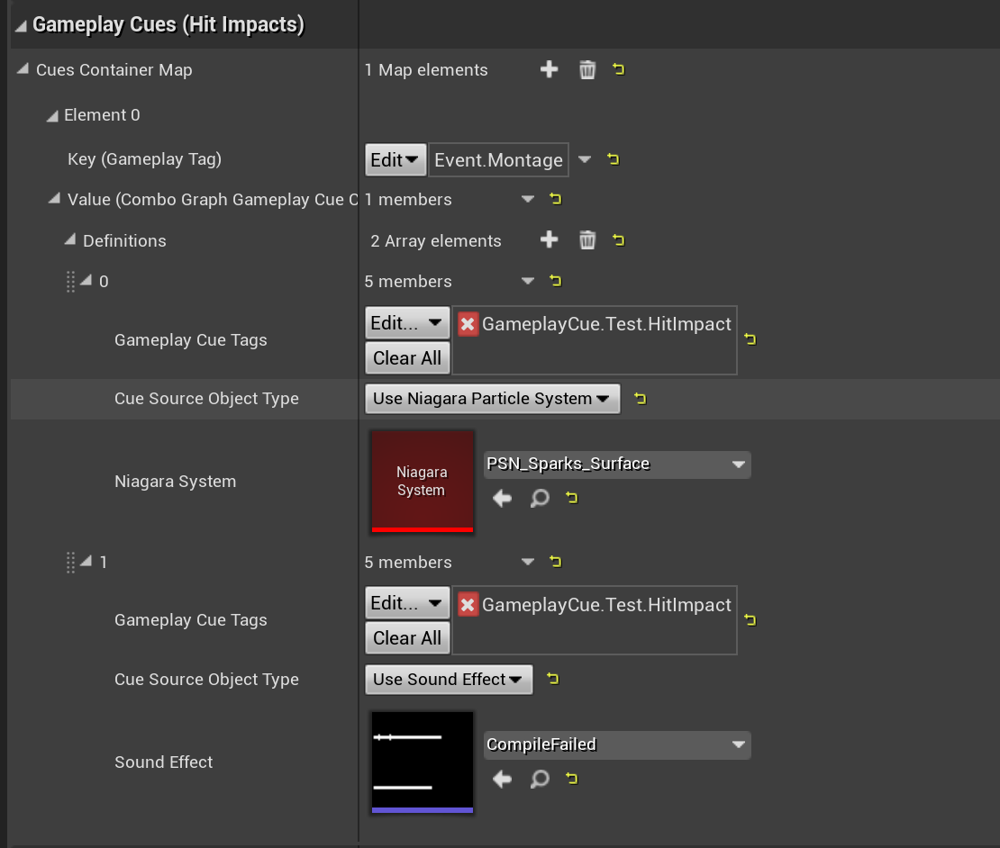
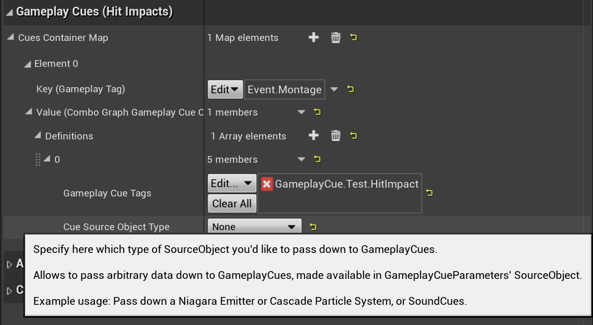
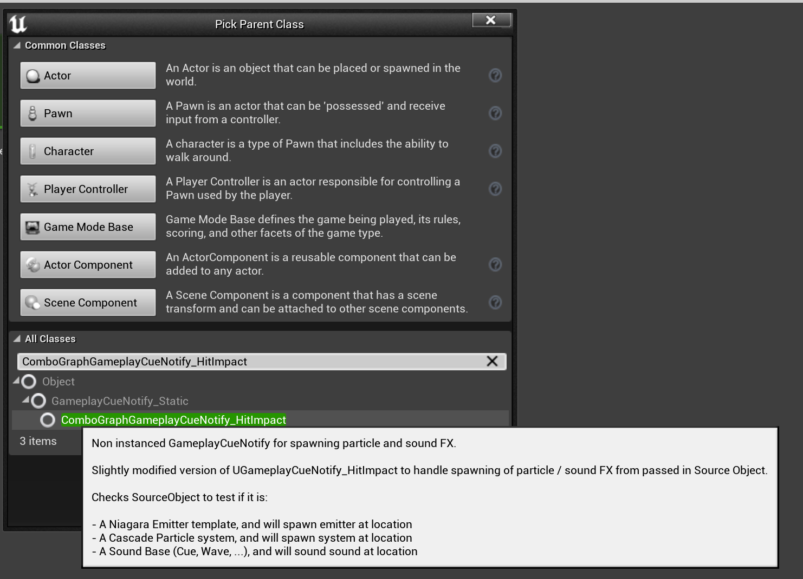
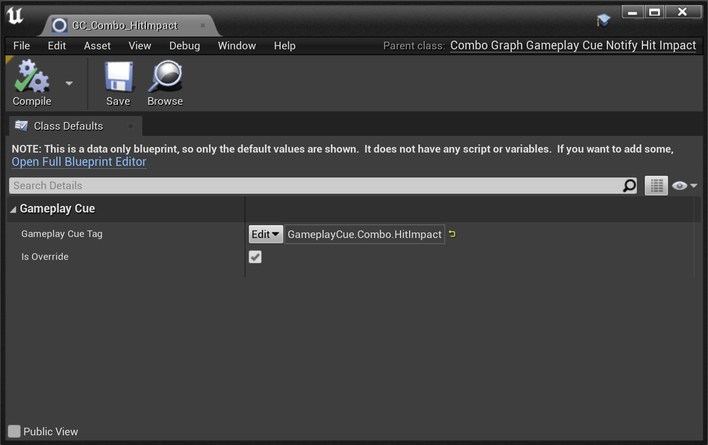
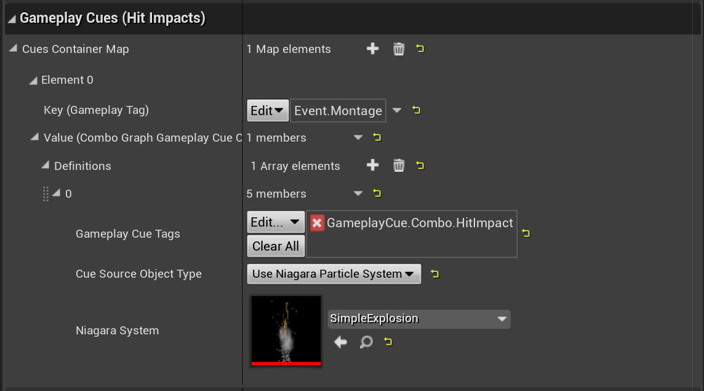
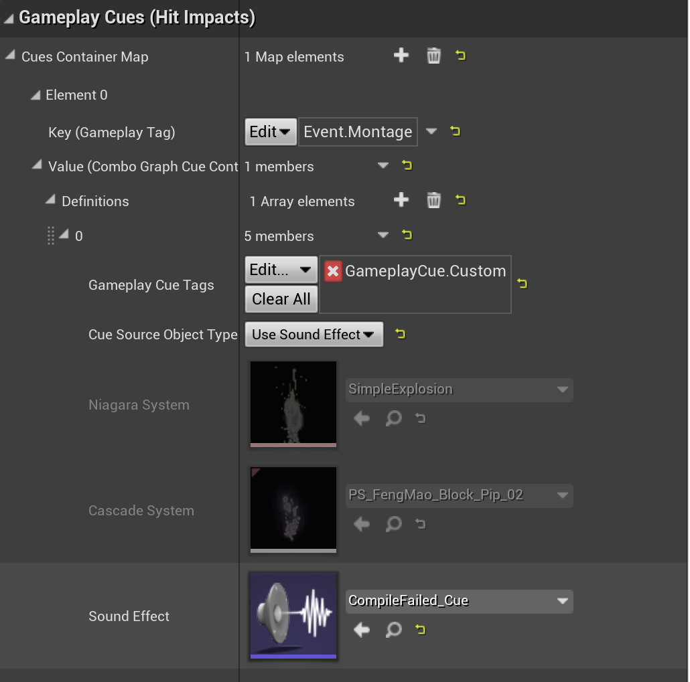
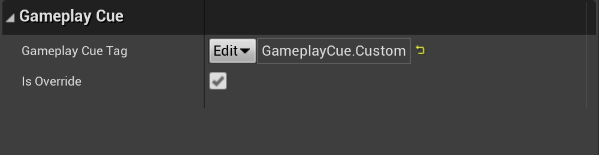
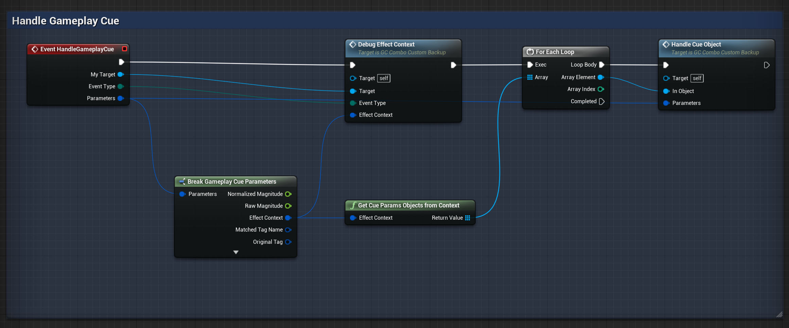
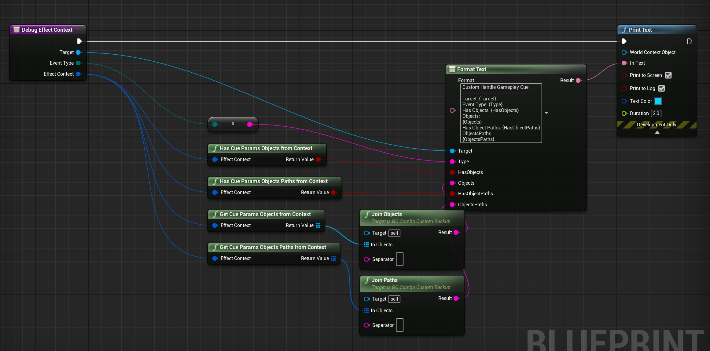
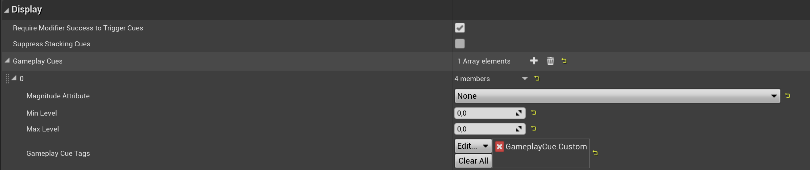

Combo nodes exposes a way to execute a list of Gameplay Cues for one-off "burst" effects for visual / sounds when a hit is registered.

## Overview

Similarly to [Gameplay Effect Containers](/gameplay-effects/containers/), each combo nodes provides a `Cues Container Map` giving the ability to execute one-off "burst" gameplay cues that can be used for visual or sound effects.

Upon receiving a gameplay event (like it's done in the [Handling Collision](/collision/) guide), the Cues Container matching the Gameplay Event Tag will be applied. If the `Gameplay Cue Tags` is matching a Gameplay Cue Blueprint, the Gameplay Cue Manager should execute them appropriately.


*Usage example with a Niagara Particle System (coming from [Niagara Footstep VFX
](https://www.unrealengine.com/marketplace/en-US/product/niagara-footstep-vfx)) and a Sound Effect (coming from Engine)*


`video: /gameplay-cues/gc_container_test.mp4`
*Turn on the volume to hear that sweet compiler sound.*

If the gameplay event received is including proper hit locations (which should be the case with Hit Results), particle systems and sounds should be played at the location of the impacts.

## Using built-in Gameplay Cue

Combo Graph provides a special Gameplay Cue Notify Static called `UComboGraphGameplayCueNotify_HitImpact` that you can subclass with Blueprints and setup a `Gameplay Cue Tag` for it.

You don't need to implement any Blueprint logic for it (and if you want or need to, can always do so by creating a child blueprint of `UGameplayCueNotify_Static`), it is handled natively and meant to be used with Gameplay Cue Parameters you can adjust in Combo Graphs with nodes.



The `Cue Source Object Type` can be set to the following value (when set, the corresponding parameter will be editable):

- `None` - Default value, no parameter will be passed down from combo nodes to gameplay cues (suitable to use when you determine the visual / sound effects to use from within the cue)
- `Use Niagara Particle System` - Allows to define a Niagara Particle System that if defined will be passed down to Gameplay Cues as SourceObject and available in params.
- `Use Cascade Particle System` - Allows to define a Cascade Particle System that if defined will be passed down to Gameplay Cues as SourceObject and available in params (Cascade is likely to be deprecated in Unreal, prefer to use Niagara instead).
- `Use Sound Effect` - The Sound to play (Cue, Wave, ...) that if defined will be passed down to Gameplay Cues as SourceObject and available in params.

### Create Gameplay Cue Blueprint

To use the built-in Gameplay Cue, you still need to define a Blueprint for it so that you can define the Gameplay Tag for it, and setup `GameplayCueNotifyPaths` accordingly in your `DefaultGame.ini` file.

Create a new Blueprint with parent class `ComboGraphGameplayCueNotify_HitImpact`.



Once created, open it up and setup a `Gameplay Cue Tag` for it (Gameplay Cue tags should begin with `GameplayCue.`).


*Gameplay Cues inheriting from `ComboGraphGameplayCueNotify_HitImpact` are meant to be data only blueprint. BP exposed methods such as `HandleGameplayCue`, `OnActive`, `OnRemove`, ... won't be called.*

> It is recommended to setup the `GameplayCueNotifyPaths` in your `DefaultGame.ini` configuration file to include the parent folder where your Gameplay Cue lives. By default, if no `GameplayCueNotifyPaths` are defined, the engine will default to `/Game` path which can be very slow. <br /> <br />

```ini title=Config/DefaultGame.ini
[/Script/GameplayAbilities.AbilitySystemGlobals]
GameplayCueNotifyPaths="/Game/MyGame/Abilities"
```
*Example if your Gameplay Cues are stored in `/Content/MyGame/Abilities` or one of its subfolder*

Once the Gameplay Cue Blueprint Handler has been created for the cue, you can use its Gameplay Cue Tag in Combo Graphs Cues Containers.


*Make sure both the Gameplay Cue Tag in the Cues Container and the Gameplay Cue Handler Blueprint are matching.*

[](gc_container_test_simple_explosion.gif)

## Using custom Gameplay Cues

Nothing prevents you from implementing the Gameplay Cue Handler in Blueprint. You can get access to the cue container parameters `Cue Source Object` if you defined some, via the Gameplay Cue Parameters Effect Context.

> Note that this implies your Ability System Globals class is setup to allocate Combo Graph custom Effect Context. It should be the case already if you followed the [project setup](/project-setup#first-opening) steps.

### Via Cue Containers

In this section, we're using a combo node with the following Cue Container definitions:


*Note that both Niagara and Cascade system properties are only disabled in this screenshot because I'm using 4.26, and Edit Condition when used to hide properties within an array of struct have [little issues](https://issues.unrealengine.com/issue/UE-117661). It's fixed in 4.27, so if you're using 4.27, switching the Cue Source Object Type dropdown will show / hide them appropriately.*

Here we're using a slightly different tag for the `Gameplay Cue Tags` set to `GameplayCue.Custom`.

You can use several definitions for a given `Key (Gameplay Tag)`. Each definition when using the same `Gameplay Cue Tags` will be handled as a single Gameplay Cue RPC and passing down each individual VFX / SFX asset defined there in a list of resolved `Objects` and `FSoftObjectPath` within the Cue parameters Effect Context.

Those are defined as soft object references in Combo Graph, which are async loaded when the cue container is applied, before forwarding the resolved object with the gameplay cue to the gameplay cue manager.

#### Create Gameplay Cue Blueprint

Like we did [here](#create-gameplay-cue-blueprint), you need to create a new Blueprint class, using `GameplayCueNotify_Static` as a parent class (instead of `ComboGraphGameplayCueNotify_HitImpact` like we did with the built in cue).

Once done, ensure you're using the same Gameplay Tag that the one defined in the Cue Container:



And implement the `HandleGameplayCue` event with your custom logic:


*This GC example is available in the Demo project with the `GC_Combo_Custom` Blueprint. It is essentially doing in Blueprint what `ComboGraphGameplayCueNotify_HitImpact` does in native.*


*Here is the implementation of `DebugEffectContext` method.*

The following methods taking an Effect Context as input parameters are available in Combo Graph Blueprint Library. They provide helper to extract info from Combo Graph Effect Context in Blueprints, so that you can access cue containers VFX / SFX parameter in your GC Blueprints.

| Name              | Description                                                                                                               |
| ----------------- | ------------------------------------------------------------------------------------------------------------------------- |
| `GetCueParamsObjectsFromContext` | Extracts Cue Params resolved Objects (set in a combo graph node) from Gameplay Effect Context              |
| `HasCueParamsObjectsFromContext` | Checks if Gameplay Effect Context has any Cue Params resolved Objects (set in a combo graph node)          |
| `GetCueParamsObjectsPathsFromContext` | Extracts Cue Params Soft Object Paths (set in a combo graph node) from Gameplay Effect Context        |
| `HasCueParamsObjectsPathsFromContext` | Checks if Gameplay Effect Context has any Cue Params Soft Object Paths (set in a combo graph node)    |

> *Note*: only the `Execute` event type is going to happen when used within a Cue Container in a combo graph. If you wish to apply other type of cues, such as persisting effects using `GameplayCueNotify_Actor`, it should be applied from Gameplay Effects (infinite or duration based).

### Via applied Gameplay Effects in Effect Containers

> This section is only relevant to GAS users. While Cue Containers can be used directly, even for users not using GAS already, gameplay effect containers are meant to be used with proper GAS setup.

Gameplay Effects applied via [Effect Containers](/gameplay-effects/containers) can define a list of Gameplay Cue tags in the "Display" category.



You would handle those cues like you would usually do, gameplay cues applied this way won't have any specifics to Combo Graph plugin (meaning effect context won't include any custom parameters, unlike with cue containers).