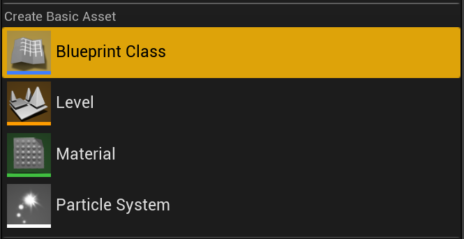

## Overview

Each Combo nodes, montage or sequence, are exposing a `Cost Gameplay Effect` property under the **Gameplay Effects** category.

*With a combo node selected...*

*... The details panel should be updated with its properties, where we can define a Gameplay Effect for cost to check for attributes and apply when the node is evaluating*

`Cost Gameplay Effect` is a subclass of `GameplayEffect` and you can put here any Gameplay Effect, the same way you would do with the `Cost Gameplay Effect Class` available in Gameplay Abilities.

When a combo node is evaluating, prior to playing the montage, this `Cost Gameplay Effect` will be used to:

- check all the modifier attributes against the owner current attributes value, testing that all attributes value after application will be above 0.
- if the check is successful, the gameplay effect is committed and all attributes modifier are applied

If one of those two steps failed, the combo node will prevent the animation from playing and proceed to end the graph execution, calling the `OnGraphEnd` delegate on the `StartComboGraph` task (which should in turn end the ability if you wire in `EndAbility` for that delegate)

## Example

In this example, I am using a character with an AttributeSet that includes attributes for Health, Stamina and Mana (**Note** *This is using GAS Companion standard setup and built in AttributeSet*) and will use this setup to demonstrate the use of a Gameplay Effect to apply Stamina cost for combo nodes.

*The Character starts off with a stamina value of 90*

The Combo Graph I'm going to use here is fairly simple and implements a looping combo going back and forth between two melee attack:

*"Looping" combo that will go back and forth between two melee attack animations as long as user input for the light attack is triggered*

## Cost Gameplay Effect Creation

Let's first go through the step of creating a gameplay effect to apply cost for our combo nodes.

The Gameplay Effect should be an **Instant** effect with any number of Modifiers for attributes. In this example, we're simply going to define one modifier to decrease stamina value by a set amount.

*Right Click in Content Browser, and create a new Blueprint Class*

*Pick `GameplayEffect` for the parent class*

*Create the effect and name it however you wish, here using `GE_Light_Attack_Stamina_Cost`*

*Open the Gameplay Effect Blueprint, and setup the modifiers with at least one attribute with an Additive modifier operation (`Modifier Op` set to `Add`) and a negative scalable float.*

> Here, we're using the stamina attribute from `GSCAttributeSet` (part of GAS Companion). Adjust the attribute to use with the one you'd like to use for your Character (Remember that the AttributeSet must be granted in the Character's Ability System Component)

## Usage with Combo Nodes

Now that we have a Gameplay Effect we can use to check and apply cost, we can go back to our Combo Graph asset, and set it up for our Combo Nodes.

*Select the nodes for which you'd like to setup a cost, and pick the gameplay effect created earlier for `Cost Gameplay Effect`. You can select multiple nodes and change the property for all of them (Click the image to open in full screen)*

Upon setting up a cost gameplay effect, the graph node should be updated to display it in the box.

With both combo nodes now using a Gameplay Effect to decrease the stamina value by a value of 20 (like we created earlier), if we now hit play and run the combo graph, the attributes should be updated each time the combo node is evaluating and animation is playing.

*Stamina is decreased each time the attack animations are played, and prevented if current stamina value is lower than 20 (`OnGraphEnd` event for the task is then called)*

*You can also use GAS gameplay debugger with `showdebug abilitysystem` command to check the attribute values.*