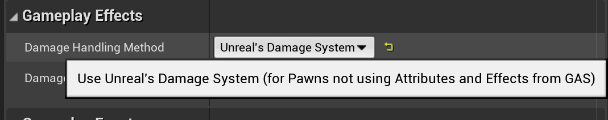
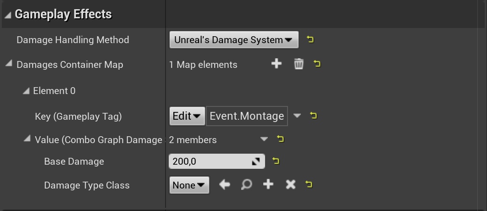
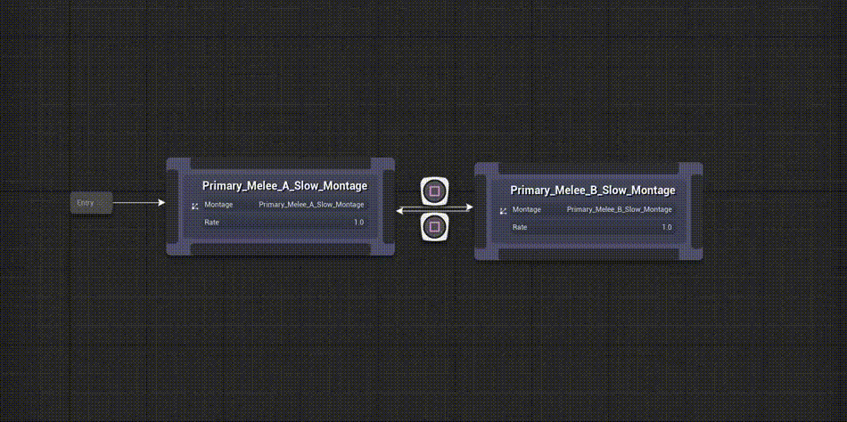
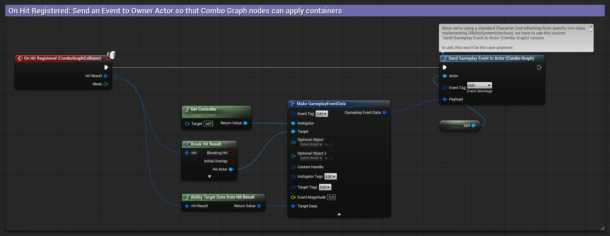
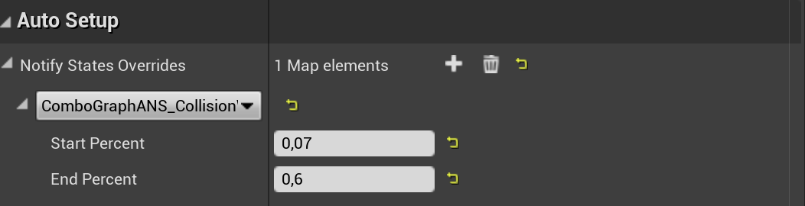
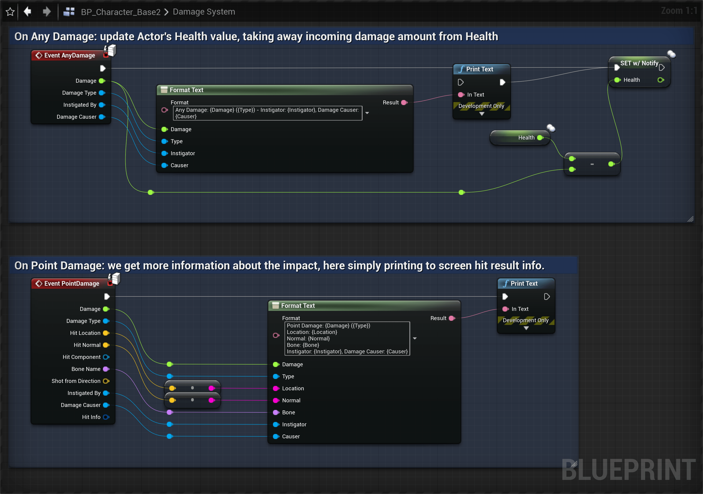
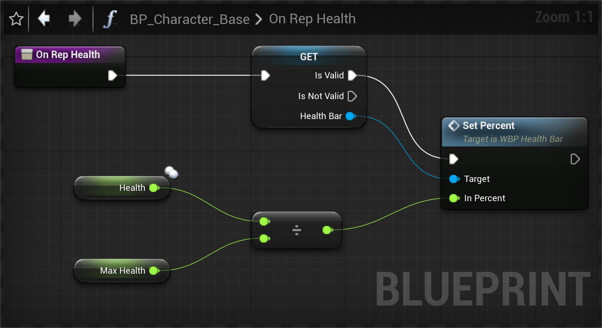

Combo nodes provide helpers to apply damage to targets in what is commonly called Damage Containers.

It is primarily designed to be used on project's not using GAS already (in which case [Gameplay Effect Containers](/gameplay-effects/containers) is better suited)

## Overview

Much like Epic's [Action RPG Sample Project](https://www.unrealengine.com/marketplace/en-US/product/action-rpg), combo nodes implements the concept of [Gameplay Effect Containers](https://github.com/tranek/GASDocumentation#concepts-ge-containers), but it relies on Characters having proper Ability System setup and Gameplay Attributes available to use in Gameplay Effects.

To that end, Combo Nodes have a fallback mechanism to change those containers to "Damage Containers", for projects not making use of GAS built-in Attributes and Gameplay Effects.

The `Damage Handling Method` dropdown should be set to `Unreal's Damage System` if you wish to use engine's base Damage System instead of Gameplay Effects (Damage Handling is set to `Gameplay Ability System` by default). 

*Doing so will update the details panel to display Damage Containers instead of Effect Containers.*

These containers are extremely helpful to define a list of Damage to apply to target actors. They provide a very simple way to define any amount of damage to apply, when a Gameplay Event is received (key of the containers map).

Here's a high level overview of how they work and how Combo Graph plugin uses them:

- Damages Container are a map with a Gameplay Tag **key** and a a value with a specific structure (`FComboGraphDamageSystemContainer`).
- The Gameplay Tag **key** is designed to be a gameplay event received by the owning actor when a combo node is evaluating and an animation is playing.
- The structure value lets you define:
  - `BaseDamage` - Amount of Damage to pass down to ApplyPointDamage.
  - `DamageTypeClass` - Damage Type to use with ApplyPointDamage, subclass of `UDamageType`. If set to None, the engine will use `UDamageType` by default.
- Combo Nodes automatically listen for the gameplay event tags defined in the damage containers, and when one such event is received, the container for the tag key is applied.

*Here's a simple example using a single container and damage type to apply a set amount of damage. The damage defined here will be applied when `Event.Montage` gameplay event is received by the owning actor, using `ApplyPointDamage()` on the target actor (from the Gameplay Event Data payload).*

## Setup Damage Containers

To test out and describe how containers can be used to apply damage, we're going to use a basic looping combo.

Also related to the application of damage containers, it is expected that you have followed the [collision guide](/collision/) since we're going to use the gameplay event sent when a hit is registered.

In the [Handling Collision](/collision/) page, we go over the steps to send a gameplay event when a hit is registered, passing in data for Instigator / Target and Hit Result as Target Data.

*Here is the brief overview of the gameplay event sent when the collision system detects a hit, and using `Event.Montage` gameplay tag for the gameplay event. Make sure you're using `Send Gameplay Event to Actor (Combo Graph)` instead of the regular one coming from Gameplay Abilities plugin.*

That way, we can setup damage containers to react to this event and apply our damage when `Event.Montage` event is received by the owning character.

In the Combo Graph asset, select a combo node (or more than one), and add a new Damage Container like so:

*With a combo node selected, click the `+` icon to add a new container entry, set the key to `Event.Montage`, then expand the value and add a `BaseDamage` amount to apply and an optional Damage Type. (make sure `Damage Handling Method` is set to `Unreal's Damage System` with you don't see the damage container)*

## Add Animation Notify States for Collisions

In order for the weapon mesh to enable and disable collisions, I'm setting up both Combo nodes with the following [Auto Setup](/usage/auto-setup) configuration (You can also edit both anim montages to define the notify states in the animation timeline itself)

## Receiving Damages in the Actor Blueprint

You can use both `Any Damage` and `Point Damage` events on the receiving side, eg. the Character Blueprint.

*In this example, `Health` variable is a plain float set to replicate with Rep Notify. This is because, in the demo where those screenshots were taken, we'd like to replicate the change visually to other players, and doing it via rep notify lets us update the widget component displaying health bars for the character.*

If we test in-game now, when our collision system register hits, the damage container we defined should be applied, resulting in health loss each time we hit a target.

