## Introduction

A conduit node can be added in graphs only after the initial entry node. It is used to drive the initial branching logic of a combo, without having to go through an anim node.

Conduit can be useful if you want to have a single Combo Graph that reacts to several different input activation (like both Light / Heavy Attacks), without having to manage two different graphs.

Conduits can only be wired from the entry node, and only one can be present in a graph. They are optional and rely on an Input Action parameter when the graph is initialized (via the Gameplay or Ability task).

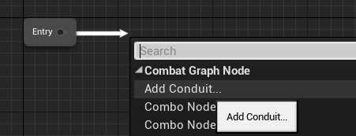
*To add a conduit, drag a pin from the entry node and choose "Add Conduit"*

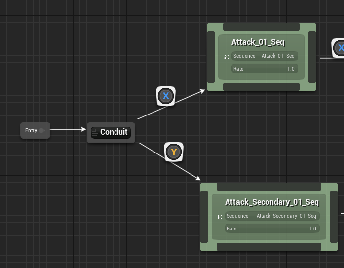
*You can then draw connections to combo node animations as usual*

The transition edges linking the conduit and further combo nodes need to define the Input Action associated to it, and it must be a unique input (if you have edges with duplicate input action, the graph will use the first one it finds).

## Initial Input Parameter

For the graph to know which path it should take when first running a combo graph, we need to pass an additional parameter when we initialize the graph from our Gameplay Abilities (via the Ability Task) or Pawn Blueprints / AI Tasks (via the Gameplay Task).

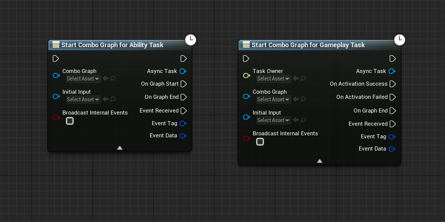
*If you don't see the `Initial Input` parameter, click the arrow button at the bottom of the node. Is is an advanced parameter.*

> Parameter description: Initial Input Action to pass in to combo graph (only relevant with Conduit immediately following entry node). Without conduit, will be ignored.

### Gameplay Task

How you pass this information is very similar for both the Gameplay Task or Abilities route:

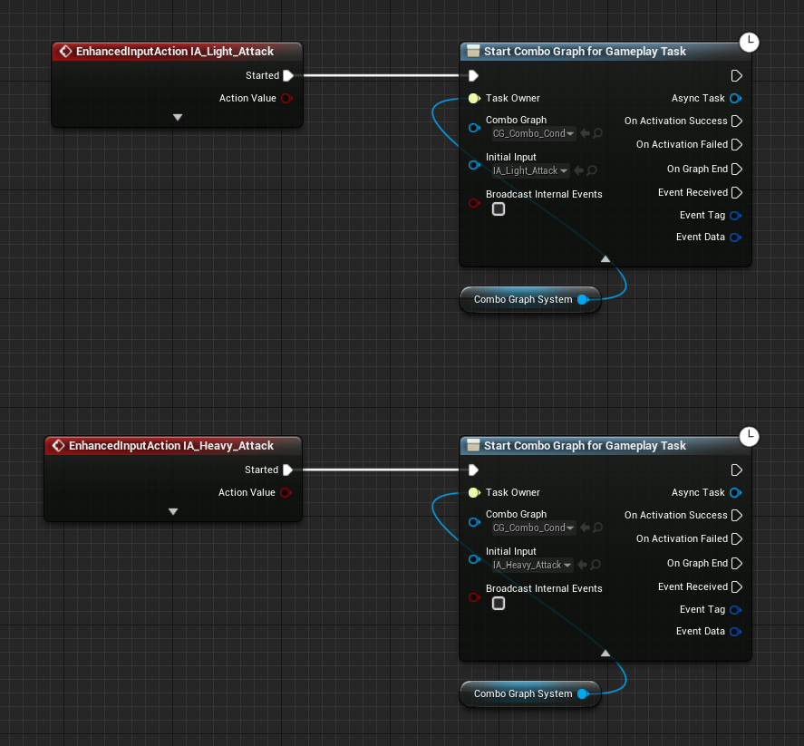
*Example usage from within a Character Blueprint using the Gameplay Task*

Both nodes uses the same `CG_Combo_Conduit` graph, but defines a different `Initial Input` parameter: one being the Light Attack Input, the other being the Heavy Attack Input. Both are matching one of the transition node after the conduit defined in the graph created earlier.

> If you're using a Conduit and forgot to define the Initial Input parameter in the tasks, you'll see this warning in the console log: `Warning: UComboGraphAbilityTask_StartGraph::Activate - StartComboGraph failed. Reason: Graph "CG_Combo_Conduit" is using a Conduit Node but task is missing an Initial Input Action parameter` 

### Ability Task

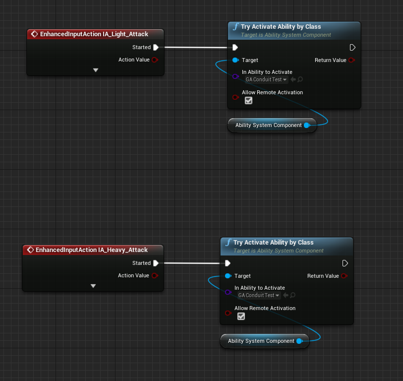
*Example usage from within a Character Blueprint using Abilities activation*

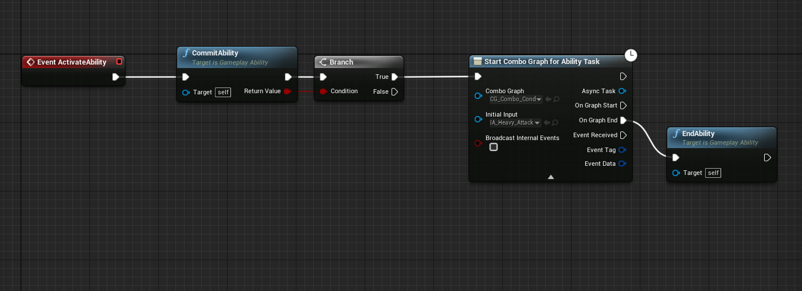
*Ability Event Graph implementation*

How you determine or pass down the input information is up to you. In the examples above, it will always be the same Input parameter.

You could use an Ability triggered by Event, and use the Event Data optional objects to hold both the Combo Graph asset to run, and the Input Action to define as Initial Input.

The ability class defaults need to define the Ability Triggers for the ability, something similar to:

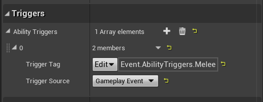

And the event Graph needs to use `Event ActivateAbilityFromEvent` (from where you can get access to the event data payload), and must not have the usual `Event ActivateAbility` in the Event Graph.

How you then activate the ability from Pawn Blueprints may look like the following. We send the Gameplay Event to the actor owning the ability (must be granted) we defined in the ability class default triggers, and pass down a different input in the payload

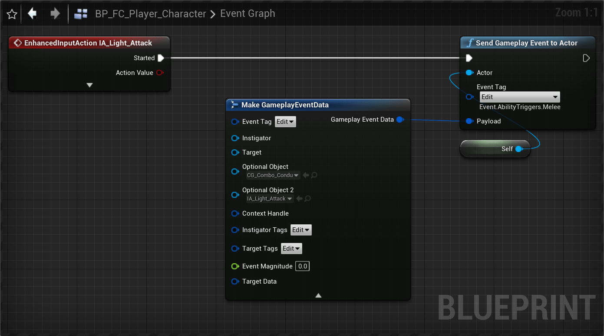
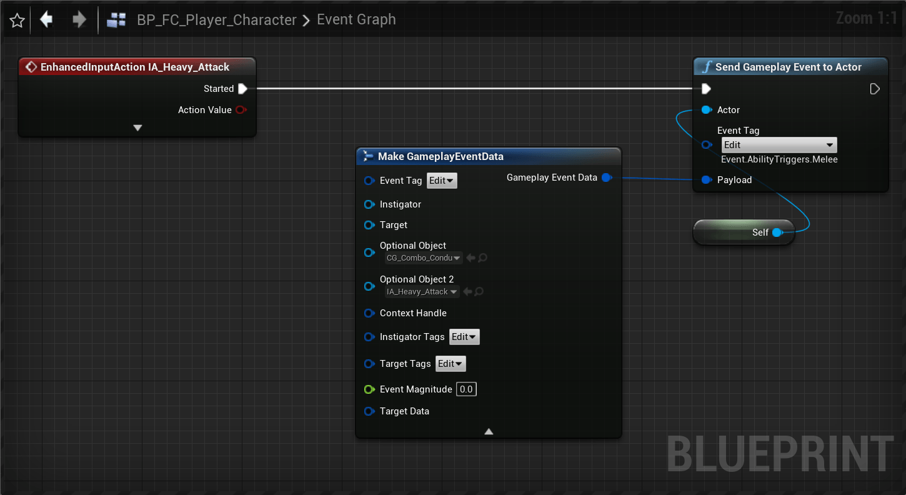

If you wish to remove code duplication, you could refactor the above into a function with both Combo Graph Asset and an Input Action to fill in the payload with:

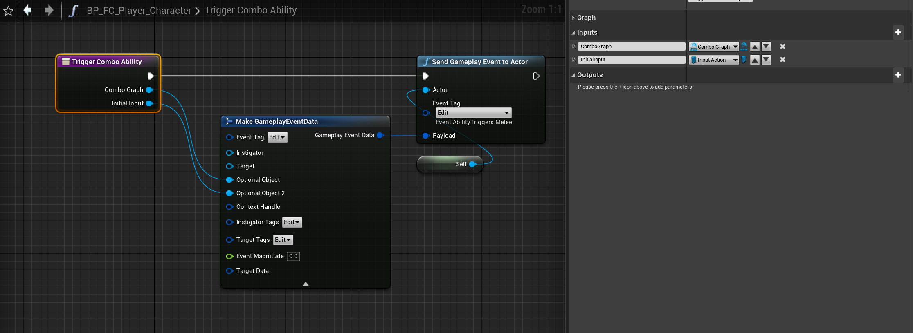
*Simple custom BP function filling the payload optional objects and sending the event.*

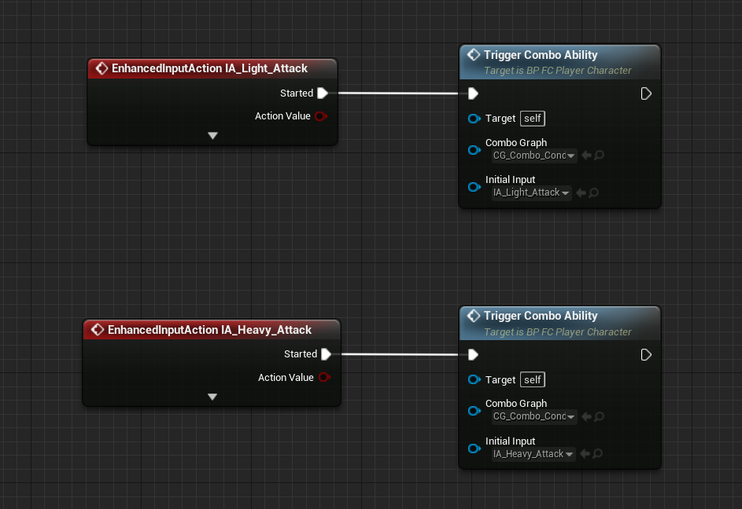
*Refactored inputs in the Pawn Blueprint*

## Using GAS Companion

This section is only relevant to GAS Companion users that are leveraging the Enhanced Input bindings to activate their abilities.

The Ability Input Binding you can a reference to from your Avatar Actor in abilities provides a method to return the Input Action it was bound to, for a specific Ability.

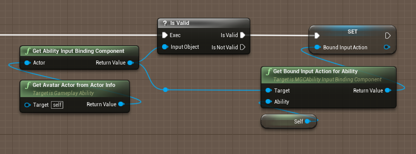

So if you have several instances of an ability bound to different input, you can get this information this way.

Here is my current setup for running combo graph with abilities:

1. A melee Gameplay Ability parent that is subclassed by different type of melee attacks. This parent Blueprint defines the event graph logic.
2. Each type of melee attacks is then subclassed into a different Ability, without Event Graph logic, with an override of the Combo Graph asset to run and definition for the Ability Tags (Ability Tags, Block Abilities with Tags, Activation Owned Tags)

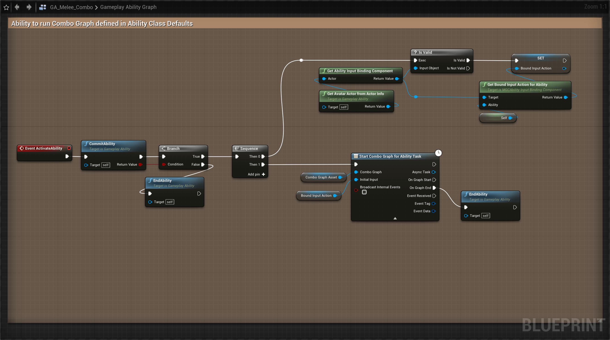
*Event Graph implementation for base `GA_Melee_Combo` parent class. `Combo Graph Asset` is a Blueprint variable with default value of none and further defined in child blueprints.*

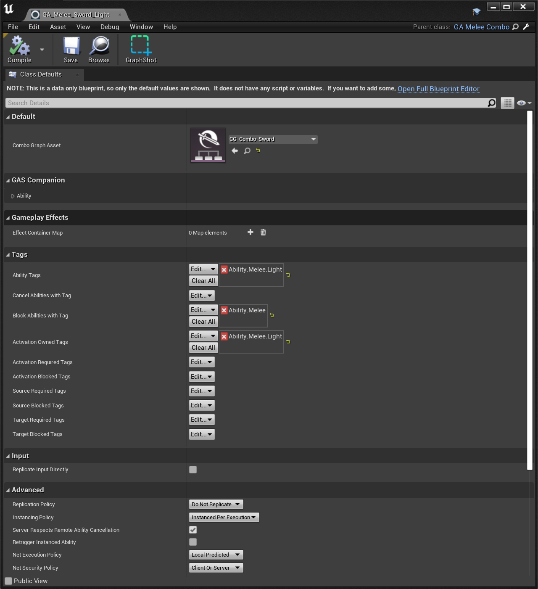
*Light attack melee ability child blueprint*

*Heavy attack melee ability child blueprint*

Those are effectively data-only blueprint just further defining the ability tags (they even uses the same Graph asset, now that conduit is implemented, but they started with two different graphs).

And both of these abilities are granted in the Avatar Actor ASC with different input actions:

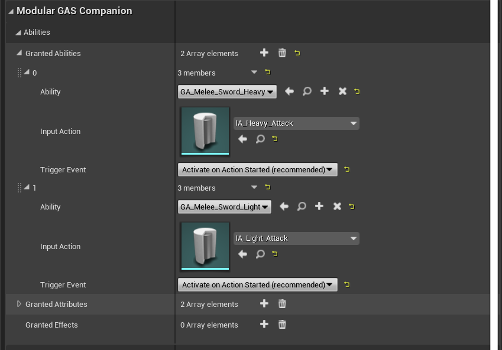

and with the following properties for `MGCAbilityInputBinding` component, to add the input mapping context:

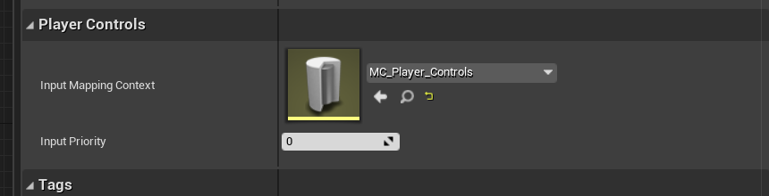
