Transition edges now have a Transition Behavior property you can use to change how combo node transition happen.

Here is the combo setup this documentation page is going to use:

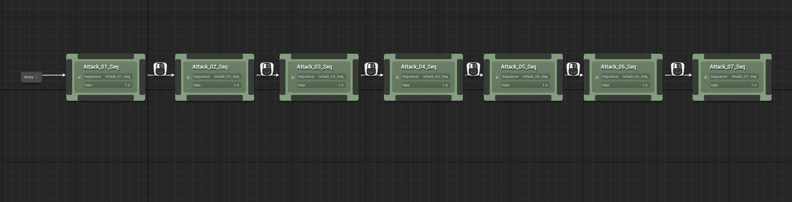
*Simple combo sequence with edges all using "Light Attack" input action bound to left click*

> Animations used here are coming from [Essential Sword & Shield Animations
](https://www.unrealengine.com/marketplace/en-US/product/essential-sword-shield-animations) by [space.bar.anim](https://www.unrealengine.com/marketplace/en-US/profile/space.bar.anim). I definitely recommend to check out his work.

None of the sequences defined here are using an anim notify state to setup the combo window, and all rely on [Auto Setup](/usage/auto-setup/) with default configuration of combo window activating at 25% of the sequence length, and closing at 75% of the sequence length.

## Transition Behaviors

If you select an edge (transition icon between two nodes), you'll see its properties in the detail window, with two new additions compared to 1.0.0 of the plugin:

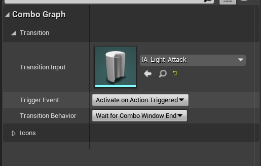
*We'll go through the Trigger Event related to Enhanced Input in its respective [page](/graph/triggers)*

The one property of interest to us here is `Transition Behavior`.

By default, combos will transition to next node when a valid input is registered / confirmed at the end of the Combo Window notify state (either set manually in animation asset, or set via [Auto Setup](usage/auto-setup/)).

Sometimes, you want a bit more control, for instance to trigger the transition earlier, that's where this `Transition Behavior` option comes handy.

Here are the four possible options:

- `Immediately`: Trigger combo transition immediately, as soon as input trigger is registered
- `OnAnimNotifyClass`: Trigger combo transition based on a specific Anim Notify class.
- `OnAnimNotifyName`: Similar to the above, but using a skeleton notify name.
- `OnComboWindowEnd` (default): Trigger combo transition when combo window notify state ends if an input was registered

For anim notify behaviors, by the time an input trigger is received, combo transition will happen when the animation reaches this notify state or immediately if animation current time frame is passed the notify state.

### On Combo Window End (default)

This is the default behavior, and up until `1.1.0`, the only possible option.

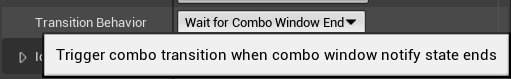

`video: /graph/transition-behavior/on_combo_window_end.mp4`

*Here is the result. Even by spamming the attack button, montages will blend out and only transition to next node when the combo window reaches the end state.*

### Immediately

Now, if we change this Transition Behavior to be set on `Immediately`:

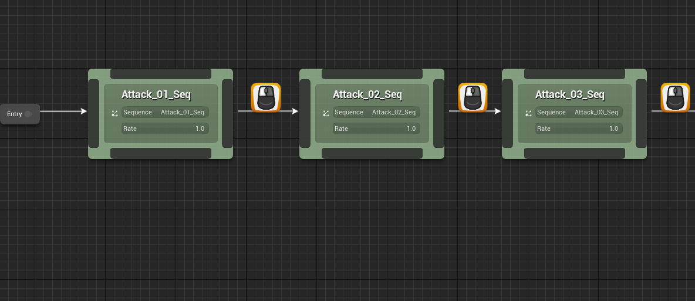
*You can select multiple edges, and edit their properties at once.*

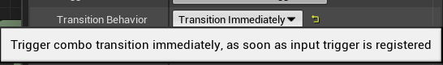

`video: /graph/transition-behavior/immediately.mp4`

*Here is the result. Now combo feels more "responsive", and transition will happen as soon as the input is received within the combo window.*

### On Anim Notify Class

With this option, you have the ability to setup an Anim Notify (one off trigger within the animation timeline) you can manually place on a specific frame within the combo window.

It offers greater control than both previous option, and lets you tell the combo graph task exactly when you want the transition to happen. By the time an input trigger is received, combo transition will happen when the animation reaches this notify state frame or immediately if animation current time frame is passed the notify state.

Like we did previously, select all edges (or just the one you want to change the transition behavior) and set it to 

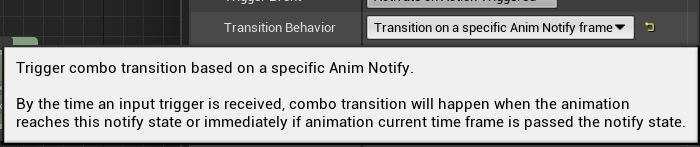

Upon setting this option to `Transition on a specific Anim Notify frame`, you'll see a new property displayed:

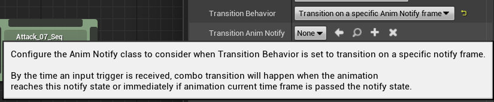

This is a dropdown listing all available Anim Notify classes within the project. You could use anything here, combo graph task only cares about the frame it is set to, but I recommend you create a specific Anim Notify Blueprint for this specific case.

The Notify itself doesn't have to define any logic, but you're free to do so if you need it. Just know that the combo task doesn't need anything special other than the notify being present in the timeline.

1. Create a new Anim Notify Blueprint from Content Browser.

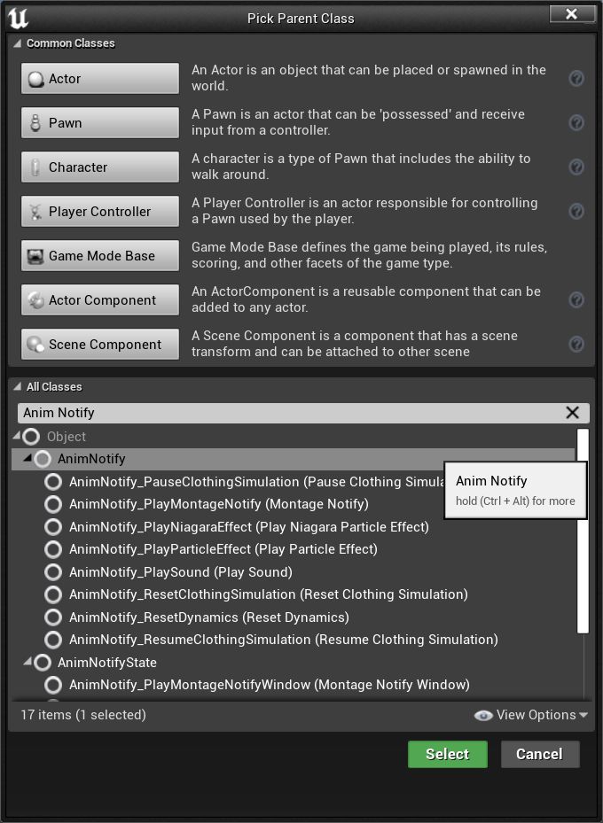

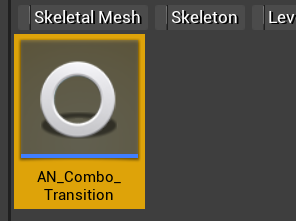
*That's it, the notify state blueprint doesn't need to define or implement anything special. In this example, I only implemented `Received Notify` to print a debug string on screen.*

2. Now, open up all the animations used by combo nodes with output edges set to this behavior:

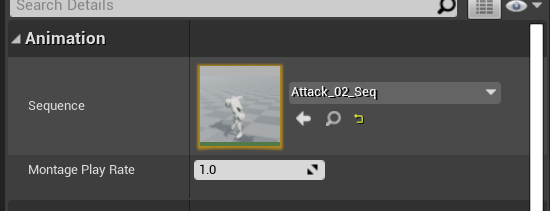
*You can open them from content browser or using the details property in the graph details panel, by double clicking on the asset icon (Hold shift + double click to open the asset in a new window)*

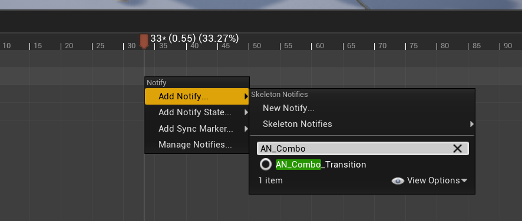
*At the frame you'd like to the transition to happen, add the notify state created earlier.*

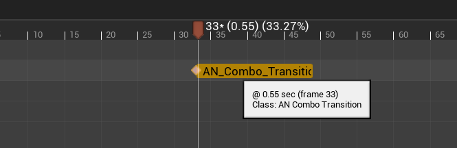
*You can copy the notify here, and paste into the other animations, which may speed up the process a tiny bit.*

3. Go back to the combo graph, and adjust each output edges for the animation you added the notify to and define it here.

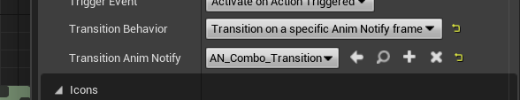

> Since we're getting into animation timelines with this, I also would recommend to start setting up the combo window notify states within animation assets. It'll be easier to reason about and helps to visually see when the combo inputs can be registered within animations time frames.    
> Remember, both `Immediately` and `Anim Notify` behaviors will consider an input to be valid if it is happening between the frames defined by the combo window.

`video: /graph/transition-behavior/notify_state.mp4`

*Here is the result. Depending on which frame you setup the Notify State for each animation, transition will differ.*

### On Anim Notify Name (Skeleton Notify)

This option is really similar to the previous one, but relies on Skeleton notifies instead.

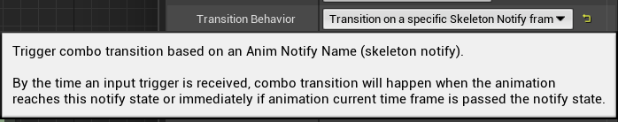

Upon setting this option to Transition on a specific Skeleton Notify frame, you'll see a new property displayed:

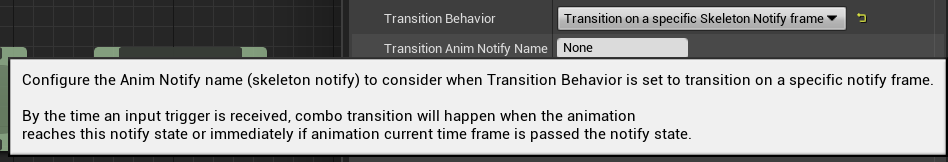

2. Now, go back to the desired animations for nodes using this transition behavior and create a new notify (if you have one already, you can use the Skeleton notifies dropdown)

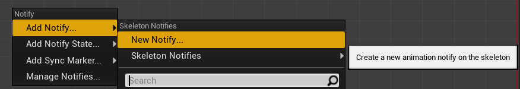
*Beware, adding a skeleton notify will edit your skeleton and needs to be saved. Something to keep in mind if you're working in a team where the Skeleton may be changed by different team members.*

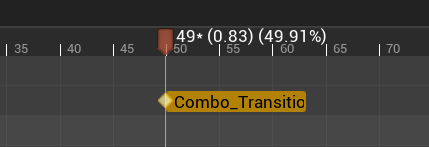
*In this example, I named the notify `Combo_Transition`. You can use any notify name. Like we did before, I copy pasted the notify in each animation assets used in the combo.*

3. Go back to the combo graph, and edit each output edges for the animation you added the notify and make sure `Transition Anim Notify Name` is set to the exact value of the skeleton notify name.

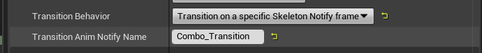
*Make sure the name value matches the actual skeleton notify name.*

`video: /graph/transition-behavior/skeleton_notify.mp4`

*Here is the result. It should behave the same as the previous example with Notify State classes. Except here, we don't need an actual Notify State Blueprint.*

> What happens if the notifies are defined outside of the combo window (with default auto setup, after 75% of the animation length) ? Then, the default behavior will take over and will transition (if an input was registered) when the combo window is closing, disregarding the notify state.

