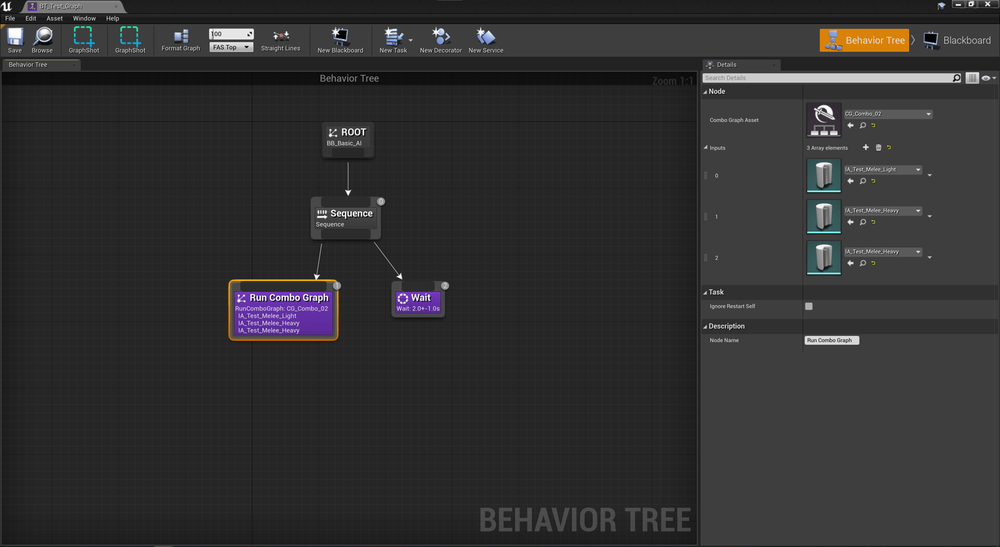
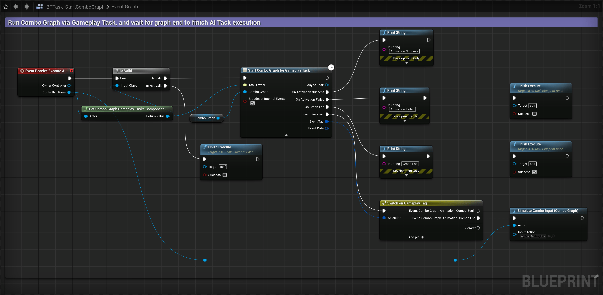
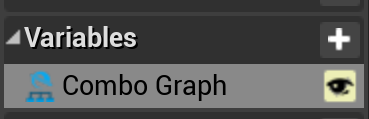
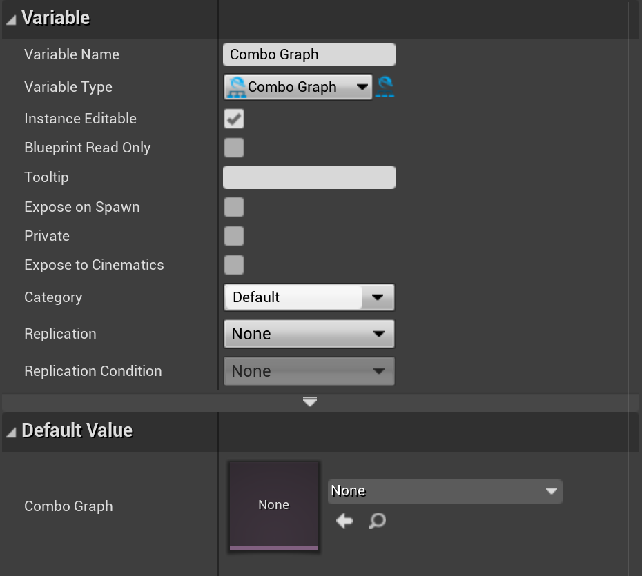
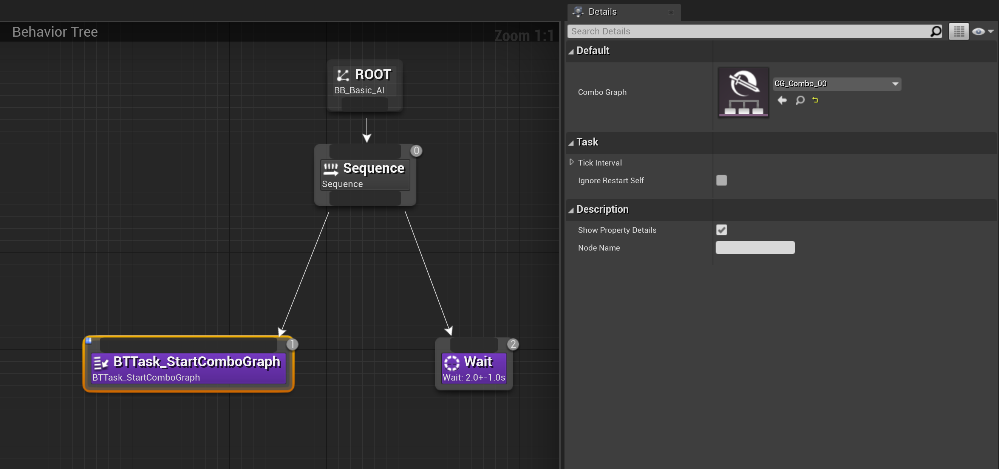

Learn more how you can use Combo Graph asset with AI agents.

<iframe
    width="560"
    height="315"
    src="https://www.youtube-nocookie.com/embed/5ow-w0FLOcA"
    title="YouTube video player"
    frameborder="0"
    allow="accelerometer; autoplay; clipboard-write; encrypted-media; gyroscope; picture-in-picture"
    allowfullscreen
>
</iframe>

Using Combo Graph asset from within Behavior Trees can be done using either a [Gameplay Ability](/usage/with-gameplay-abilities), or using [`Start Combo Graph` gameplay task](/usage/with-gameplay-tasks).

## Built-in BT Task

`Run Combo Graph` Behavior Tree Task (`UComboGraphBTTask_RunComboGraph` in native) is a simple BT Task written to handle most common scenarios of running a Combo Graph asset with a set of predefined Input Actions.

It has the following Blueprint exposed variables:

| Name              | Description                                                                                       |
| ----------------- | ------------------------------------------------------------------------------------------------- |
| Combo Graph Asset | Animation asset to play. Note that it needs to match the skeleton of pawn this BT is controlling  |
| Inputs            | Stack of Input Actions to process and simulate inputs when the underlying gameplay task receives ComboBegin event, and schedule for execution on the next frame |

More elaborated tasks may be added in the future. Possible improvements include:

- Repeat a single input n times (0 means indefinitely until end of graph).
- Random Input (from the available transitions) n times (0 means indefinitely until end of graph), possibly with configurable probability.
- Make the stack of Input Actions a Blackboard based property that BT services or task can set upstream.

## Custom Tasks

### Using Gameplay Abilities

Your behavior tree task will basically asks the AI Pawn ASC to activate an ability that is setup to run a Combo Graph asset via the ability task, and wait for the ability to end (either with a delegate your GAS setup is exposing, or via a gameplay event sent from the Ability Blueprint `OnEndAbility`) to mark the ability as success or failed with `FinishExecute()`

See the next chapter about using the gameplay task, the patterns to simulate combo inputs will be pretty much the same but applied to the ability task instead.

### Using Gameplay Tasks

Your behavior tree task will make use of [`Start Combo Graph` gameplay task](/usage/with-gameplay-tasks), with either a `ComboGraphSystemComponent` or an Ability System Component on the Pawn owner.

`Simulate Combo Input (Combo Graph)` is a method exposed via a Blueprint library and can be used to notify combo graphs that an input should happen, essentially sending a specific gameplay event with the Input Action passed in via Gameplay Event Data.

In this example, it's used when we receive `Event.ComboGraph.ComboEnd` internal event (Broadcast Internal Events on the task is set to true). You can also use the other `Event.ComboGraph.ComboBegin` tag, but in this case, make sure you're simulating the input on the next frame.

Those two events are essentially sent from the [Anim Notify State](/usage/auto-setup) to open combo windows.

*`ComboGraph` variable used in the above BT Task is an instance editable variable with the type set to `ComboGraph`.*

This way, Behavior Trees can define the Combo Graph asset on the task instance within the BT graph.

You also define additional variables to customize the BT task logic, for instance to pass in a stack of Input Actions to process using `Simulate Combo Input (Combo Graph)` helper.