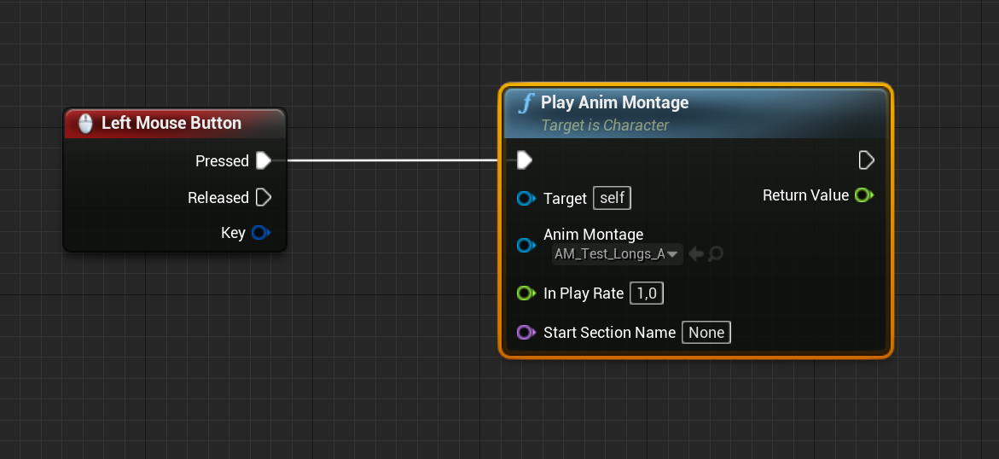
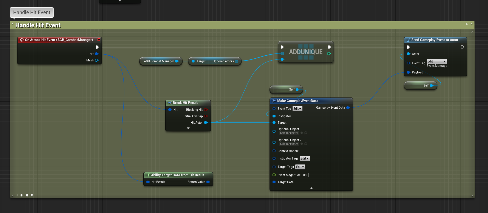

Combo Graph doesn't have a built in collision system but was built from the ground up with integration in mind.

Instead of providing a custom solution for this, tightly integrated with the system, it instead relies on gameplay events that your hit collision system sends to the owner (the avatar actually) of combo abilities when a hit is registered, along with proper payload information such as instigator / targets and hit result with target data.

Doing so, it is fairly straight forward to integrate with third party collision system, or your own mechanism.

There is quite a few really good collisions systems on the marketplace, either at reasonable price or even free.

This page will describe the typical usage of two of those systems, and how they can be used along with Combo Graph plugin.

- AGR Pro (free): https://www.unrealengine.com/marketplace/en-US/product/agr-pro
- Combat Components: https://www.unrealengine.com/marketplace/en-US/product/combat-components

If you're using another system, you can head over to [Send Hit Information to Abilities](#send-hit-information-to-abilities) section, and adjust the detailed step to the system you're using. As long as your collision mechanism exposes an Hit Event along with proper Hit Result, the pattern will be the same.

## Setup Collision Mesh

**This part is common to most collision plugins. It is about setting up a Static or Skeletal Mesh Component for your Character Blueprint that you can attach melee weapons to.**

The first thing we need to have is a static or skeletal mesh that will represent our melee weapon.

Open up your character blueprint, and under the Character Mesh (called `Mesh` by default), select the mesh and click add component to add a new Static Mesh Component (or Skeletal Mesh Component if your weapon is a skeletal mesh):

*Select the Skeletal Mesh Component for your Character Mesh*

*Click Add Component and add either a Static Mesh Component or Skeletal Mesh Component (depending on your weapon mesh)*

With the Static Mesh Component we just added selected, setup the Static Mesh to use for your weapon in the Details Panel, define a socket to attach to (or tweak the component transform):

*If your skeleton has a socket to attach the weapon to (recommended), you can define the attach point with the `Parent Socket` magnifying glass*

> **Note** If you're equipping / unequipping weapons, you can also do this programmatically with 

## Plugin Integration: AGR Pro

Tutorial videos from AGR author: [AGR PRO v 4.0.0 Combat Manager Component](https://youtu.be/ls5tQEHiBow) / [Melee weapon full setup](https://youtu.be/vN-_DnaWNvw)

### Collision Setup

Go to `Project's Settings > Engine > Collision`

In the **Trace Channels** category, click `New Trace Channel...` button and crate a new custom chanel with the name of your choosing, set the Default Response to `Ignore`. We'll specifically turn collision presets to Block later on:

*Here using `AGR_Collision` for the channel name with `Ignore` for the Default Response*

Then for the `CharacterMesh` Preset, click the `Edit` button and change the profile for `AGR_Collision` trace type from `Ignore` to `Block`.

Doing so, we will ensure the trace channel AGR is going to use for collisions is ignoring everything but the `CharacterMesh` profile. With this setup, we are making sure Hit Events are going to be triggered when our collision mesh collides with the actual Skeletal Mesh for characters (which are of `Pawn` object type using `CharacterMesh` profile for collisions) and ensure we're ignoring the actual capsule for the pawns (which are of `Pawn` object type but using `Pawn` profile for collisions).

This way, we'll be able to get accurate hit information for location / impact vector along the bone name that was hit. If the collision was triggered on the capsule, Hit Bone name would always be invalid as the capsule doesn't have a skeleton to get back this info from.

> **Note** If you'd like your mesh to collide with other objects than Character's Skeletal Mesh (for instance the environment such as walls), you can adjust the settings here for the various preset and set the `AGR_Collision`

### Setup Mesh Collision Sockets (AGR)

AGR Combat Component is using two sockets to know where melee traces should start and end. To do so, we need to create a `Start` at the base of the hitting part of the weapon, and an `End` socket at the tip of the sword.

Here is the socket setup for the Longsword mesh I am using in this tutorial (the mesh itself comes from [Kubold's LongSword Animset Pro](https://www.unrealengine.com/marketplace/en-US/product/longsword-animset-pro) on the marketplace)

*Click `Create Socket` for each socket in the Socket Manager on the bottom right (Click the image to open in full screen)*

### Setup AGR Combat Manager Actor Component

We now need to add `AGR_CombatManager` Actor Component to our character.

*Click `AddComponent` and add `AGR Combat Manager`*

And, with the component selected, adjust the settings to your liking.

At the very least, you should change the `Trace Channel` setting to the one we created earlier `AGR_Collision`, make sure Start and End Socket Trace names matches the socket created in the previous section, and maybe turn on `Debug` boolean if you'd like to see the debug trace when the collision is enabled.

*Make sure the Trace Channel is set to our custom channel for collisions*

With the component added, we can setup the collision meshes (in this tutorial, we're setting up just one) with the Pawns's `On Begin Play` event.

*Alternately, you could use the component `On Component Activated` event if you also set `Auto Activate` bool for the component to true*

We can test the collision activation now with an animation montage. Open up the anim montage you'd like to use and setup the anim notify state `AGR_Attack_NotifyState` to begin when the character starts swinging and end the notify when it stops swinging.

If we setup a basic test input to play this montage, and if you have setup the `Debug` boolean to true for `AGR_CombatManager` component, you should see debug traces being drawn when you play the montage.

*As usual with montages, make sure the skeleton the montage is using is compatible with your character mesh, and that your Animation Blueprint is using the same Montage slot as your montage*

*I've changed here the Collision Handling method to `Simple Box Trace` with `Add Trace Mesh` method called on begin play, so that debug traces are a bit more visual.*

### Test Hit Event (AGR)

Now that collision system for AGR Component is in place, we can test registration of hits and send back that information to Abilities, such as abilities that ure using Combo Graphs with `StartComboGraph`. For now, we're going to simply print out information we get from hit results.

With `AGR_CombatManager` component selected in the components list, check at the bottom of the Details panel for the event list, and click `+` for `On Attack Hit Event`, and setup your event graph like so:

*With `AGR_CombatManager` selected in the components list, click `+` next to `On Attack Hit Event` event in the details panel, and setup the event graph like so. Here, we're just printing out information for the Hit Result we get.*

> AGR Combat Component by default will register multiple hits for a melee trace, but it provides a mechanism to ensure it only happens once. This is why we use `AGR_CombatManager > IgnoredActors` array, and add the hit actor to it on the first registered hits. AGR will internally clear up that array when the attack ends.

*With a Pawn placed in our level, if we try to hit him, we should have `On Attack Hit Event` event called with hit result properly filled.*

We have now everything needed to send back that information to Abilities so that they can react to it, such as apply Gameplay Effects for damages, or trigger Gameplay Cues for visual or sound effects. Head over to [Send Hit Information to Abilities](#send-hit-information-to-abilities) section to complete this tutorial.

## Plugin Integration: Combat Components

[Combat Components](https://www.unrealengine.com/marketplace/en-US/product/combat-components) comes with a an actor component `CCColisionHandlerComponent` designed to handle collisions for primitive components (such as static or skeletal mesh weapons).

This section will focused on the bare minimal steps to get hit collision system working with this plugin, and how to communicate back hit registration events back to Combo Graphs. Head over to their [official documentation](https://ue4dcs.com/combatcomponents/collisionhandler/overview) if you'd like to know more about Combat Components itself.

### Setup Mesh Collision Sockets (CC)

**This section assumes you have followed the steps outlined in [Setup Collision Mesh](#setup-collision-mesh)**

The last required step for the setup of the Collision Mesh, as explained in [Combat Components' documentation](https://ue4dcs.com/combatcomponents/collisionhandler/overview), is to define and place some sockets on the colliding component.

Here is the socket setup for the Longsword mesh I am using in this tutorial (the mesh itself comes from [Kubold's LongSword Animset Pro](https://www.unrealengine.com/marketplace/en-US/product/longsword-animset-pro) on the marketplace)

*Click `Create Socket` as many times as needed in the Socket Manager on the bottom right (Click the image to open in full screen)*

### Setup Collision Actor Component

We now need to add `CCColisionHandlerComponent` Actor Component to our character.

*Click `AddComponent` and add `CCColisionHandler`*

And, with the component selected, adjust the settings to your liking (you should refer to [Combat Components' documentation](https://ue4dcs.com/combatcomponents/collisionhandler/overview) for more information on this)

*These are typical settings I'm usually using. Setting `Pawn` in the ignored profile names will ensure hits are going to be registered with characters' skeletal meshes while ignoring the capsule. It ensures we get more accurate collisions and information such as the hit bone name in the hit result.*

With the component added, we can setup the collision meshes (in this tutorial, we're setting up just one) with the component's `On Collision Activated` event. This will be called later on with Anim notifiers in montage where we tell the system when collisions should be enabled and disabled based on our melee animations.

With `CCColisionHandler` collision handler selected in the components list, check at the bottom of the Details panel for the event list, and click `+` for `On Collision Activated`, and setup your event graph like so:

*Click the image to open in full screen*

We can test the collision activation now with an animation montage. Open up the anim montage you'd like to use and setup the anim notify state `CC_ActivateCollision` to begin when the character starts swinging and end the notify when it stops swinging.

*Click the image to open in full screen*

If we setup a basic test input to play this montage, and if you have setup the `Debug` boolean to true for `CCColisionHandler` component, you should see debug traces being drawn when you play the montage.

*As usual with montages, make sure the skeleton the montage is using is compatible with your character mesh, and that your Animation Blueprint is using the same Montage slot as your montage*

### Test Hit Event (CC)

Now that collision system for Combat Components is in place, we can test registration of hits and send back that information to Abilities, such as abilities that ure using Combo Graphs with `StartComboGraph`.

First, like we did previously with `On Collision Activated`, we need to define behavior for `On Hit` event for `CCColisionHandler` component. 

*With `CCColisionHandler` selected in the components list, click `+` next to `On Hit` event in the details panel, and setup the event graph like so. Here, we're just printing out information for the Hit Result we get.*

*With a Pawn placed in our level, if we try to hit him, we should have `On Hit` event called with hit result properly filled.*

We have now everything needed to send back that information to Abilities so that they can react to it, such as apply Gameplay Effects for damages, or trigger Gameplay Cues for visual or sound effects. Head over to [Send Hit Information to Abilities](#send-hit-information-to-abilities) section to complete this tutorial.

## Send Hit Information to Abilities

We have now everything needed to send back that information to Abilities so that they can react to it, such as apply Gameplay Effects for damages, or trigger Gameplay Cues for visual or sound effects.

We do so by sending a Gameplay Event with tag **Event.Montage** (you can use another tag for this, it is completely up to you) to the owner of ability with proper payload and information for:

- Instigator (usually self): The actor responsible for the hit. This is also the actor to which we're sending the event to.
- Target: The actor receiving the hit
- Target Data: The Ability Target Data we're building from the Hit Result we got using `AbilityTargetDataFromHitResult` method of the `AbilitySystemBlueprintLibrary`.

### For AGR Pro

*Doing so, abilities have everything needed to apply gameplay effects or trigger gameplay cues with information about the hit result location / impact points, etc.*

### For Combat Components

*Doing so, abilities have everything needed to apply gameplay effects or trigger gameplay cues with information about the hit result location / impact points, etc.*

### Hit Reactions ?

> This pattern can also be used to handle hit reactions via abilities (for instance to play a hit reaction montage) by sending an event that is going to trigger the activation of an ability ([by event](https://github.com/tranek/GASDocumentation#concepts-ga-data)) on the hit actor (actor which received the hit and to which we're sending the gameplay event).    
> Since we're passing along infos such as instigator / target and complete hit result along with location and hit bone, the receiving ability should have everything needed to decide which montage it's going to play
> 

## Receiving the Event from Abilities

Using the `StartComboGraph` task in abilities, the `OnEventReceived` should trigger for the event we send on hit, as long as the underlying Combo Graph nodes are telling the system to listen for that event tag (with `EventTags` gameplay tag container on nodes), or if the nodes are defining some effect containers with these tags as value for the effect containers map (More info for this in the [Gameplay Effects (Cost and Containers)](/usage/gameplay-effects) page).

For instance, we can print again the hit result info from within the gameplay ability, like we did previously in the Character Blueprint, but this time using the payload we sent earlier:

> Make sure that the combo graph node playing the montage is defining in the `EventTags` container the same Gameplay Event Tag we send from the Character BP for the `On Hit` event.
