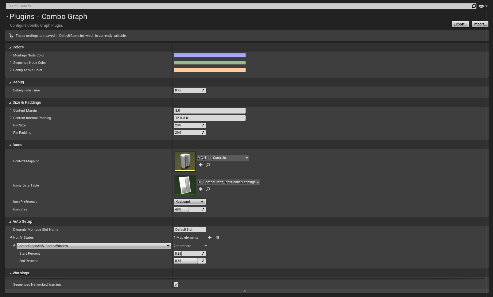

## Plugin Settings

You'll find the settings the plugin exposes in Project's Settings under the Plugin Category.

Scroll down the left sidebar if you don't see it.

Once opened, you'll be granted with the following window:

Here is a brief description about each of these settings.

Most can be left to their default value, except for `ContextMapping` which we'll cover in the [Enhanced Input section](/usage/enhanced-input/), and `NotifyStates` for the auto setup configuration which we'll go over in the [Auto Setup section](/usage/auto-setup/):

- Colors
  - `MontageNodeColor`: Default background color for Montage nodes
  - `SequenceNodeColor`: Default background color for Sequence nodes
  - `DebugActiveColor`: Default background color for combo nodes in active states (during debug)
- Debug
  -  `DebugFadeTime`: The duration used to interpolate the background color of nodes from Active to Default color when active states change (no longer active during debug). If set to 0.0, disable color interpolation.
- Paddings
  -  `ContentPadding`: The padding around the main node box
- Icons
  -  `ContextMapping`: Enhanced Input Context Mapping to use to draw edge (transition) icons in Graphs
  -  `IconsDataTable`: Path to the DataTable used to draw edge (transition) icons in Graph. Determine mappings between Keys and Icon textures. This is set by default to an internal DataTables (that you can find in `/ComboGraph/Xelu_Icons/`) that setup texture icons for every keyboard and gamepad key. Icons are coming from Xelu's Free Controllers & Keyboard Prompts: https://thoseawesomeguys.com/prompts/. Thanks to "Nicolae (Xelu) Berbece" and "Those Awesome Guys" to make it available in the public domain licence under Creative Commons 0 (CC0)
  -  `IconPreference`: Icon preference to draw edge (transition) icons in Graph. Can be either Keyboard or Gamepad based
  -  `IconSize`: Size of Icons when drawing edges (transitions) in Combo Graphs
- Auto Setup
  -  `DynamicMontageSlotName`: The Slot Name to use with dynamic montages, created from sequences
  -  `NotifyStates`: Map of Auto Setup Animation Notify States. The key is the Anim Notify State class, the value is the time start / end definition in percent
- Warnings
  -  `bSequencesNetworkedWarning`: Flag to enable / disable message warnings (logs and on screen) about Sequences being used in a networked environment
