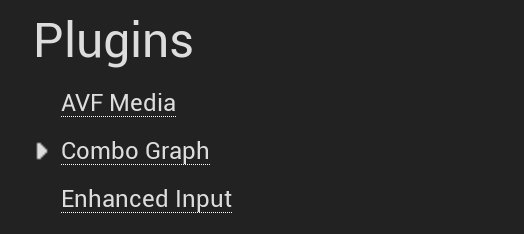
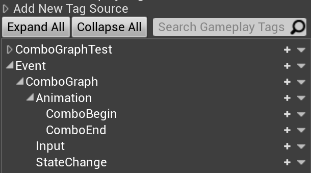

## First opening

When first opening a project with Combo Graph plugin enabled, you'll be granted with the following "Error" in the message log:


*Combo Graph: AbilitySystemGlobals settings do not include an entry for class of type ComboGraphAbilitySystemGlobals which is required for Gameplay Cues Container (custom Effect Context).*

*Click the link to add en entry to DefaultGame.ini file: <u>Set AbilitySystemGlobalsClassName to ComboGraph.ComboGraphAbilitySystemGlobals (recommended)?</u>*

This is not really an error but rather validation checks to ensure proper configuration for Ability System `AbilitySystemGlobalsClassName`. Combo Graph relies on a custom Effect Context which is set and allocated by AbilitySystemGlobals in GAS.

The link on the second line of those validation errors can be used to setup the proper configuration automatically for you. Upon clicking the link `DefaultGame.ini` file will be updated accordingly and those validation errors won't appear anymore when restarting the editor.

### Ignoring Startup Validation Warnings

If you wish to disable those warnings, without changing `AbilitySystemGlobalsClassName` to be `ComboGraph.ComboGraphAbilitySystemGlobals` specifically (for instance if you already have a custom AbilitySystemGlobals), you can manually disable the check with the following configuration for `DefaultGame.ini`

```ini title=DefaultGame.ini
[/Script/ComboGraph.ComboGraphProjectSettings]
bIgnoreStartupValidationWarnings=True
```

Just keep in mind that passing down parameters from [Cue Containers](/gameplay-cues) won't work properly anymore, unless you allocate the correct effect context manually with your AbilitySystemGlobals class (see `UComboGraphAbilitySystemGlobals` and `FComboGraphGameplayEffectContext`)


## Plugin Settings

You'll find the settings the plugin exposes in Project's Settings under the Plugin Category: `Project Settings > Plugins > Combo Graph`


*Scroll down the left sidebar if you don't see the entry.*

Once opened, you'll be granted with the following window:


Here is a brief description about each of these settings.

Most can be left to their default value, except for `ContextMapping` which we'll cover in the [Enhanced Input section](/usage/enhanced-input/), and `NotifyStates` for the auto setup configuration which we'll go over in the [Auto Setup section](/usage/auto-setup/):

- Colors
  - `MontageNodeColor`: Default background color for Combo Montage nodes
  - `SequenceNodeColor`: Default background color for Combo Sequence nodes
  - `DebugActiveColor`: Default background color for combo nodes in active states (during debug)
- Debug
  -  `DebugFadeTime`: The duration used to interpolate the background color of nodes from Active to Default color when active states change (no longer active during debug). If set to 0.0, disable color interpolation.
- Paddings
  -  `ContentMargin`: The padding around the main node box for Combo Nodes.
  -  `ContentMargin`: The padding within the main node box for Combo Nodes.
  -  `PinSize`: The minimum desired sizes for pin connections.
  -  `PinPadding`: The minimum amount of padding to draw around pin connections.
- Icons
  -  `ContextMapping`: Enhanced Input Context Mapping to use to draw edge (transition) icons in Graphs
  -  `IconsDataTable`: Path to the DataTable used to draw edge (transition) icons in Graph. Determine mappings between Keys and Icon textures. This is set by default to an internal DataTables (that you can find in `/ComboGraph/Xelu_Icons/`) that setup texture icons for every keyboard and gamepad key. Icons are coming from Xelu's Free Controllers & Keyboard Prompts: https://thoseawesomeguys.com/prompts/. Thanks to "Nicolae (Xelu) Berbece" and "Those Awesome Guys" to make it available in the public domain licence under Creative Commons 0 (CC0)
  -  `IconPreference`: Icon preference to draw edge (transition) icons in Graph. Can be either Keyboard or Gamepad based
  -  `IconSize`: Size of Icons when drawing edges (transitions) in Combo Graphs
- Auto Setup
  -  `DynamicMontageSlotName`: The Slot Name to use with dynamic montages, created from sequences
  -  `NotifyStates`: Map of Auto Setup Animation Notify States. The key is the Anim Notify State class, the value is the time start / end definition in percent
- Warnings
  -  `bSequencesNetworkedWarning`: Flag to enable / disable message warnings (logs and on screen) about Sequences being used in a networked environment

## Gameplay Tags added by Combo Graph

The plugin relies on a few Gameplay Tags, namely to send and listen to specific gameplay event within ability tasks. Those are native tags create by the plugin and are meant for internal uses (you can't remove them from the editor).



No specific actions needed, but it is good to be aware of those tags.