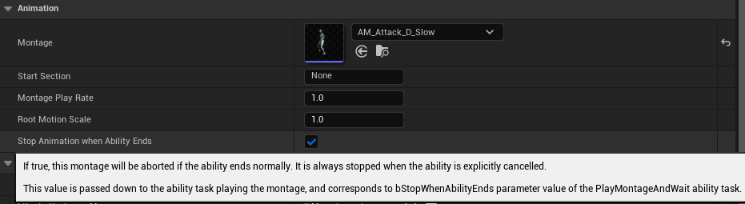

*[on September 7th, 2023](https://github.com/combo-graph/combo-graph/pull/50)*

## feat: Expose bStopWhenAbilityEnds bool to Combo Nodes making it possible to prevent montage being aborted if the ability ends normally

**New boolean value `bStopAnimationWhenAbilityEnds` available in the details panel for Combo nodes**

It is always stopped when the ability is explicitly cancelled.

This value is passed down to the ability task playing the montage, and corresponds to bStopWhenAbilityEnds parameter value of the PlayMontageAndWait ability task.

