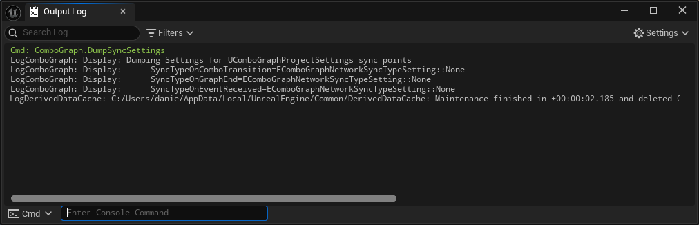

*[on March 14th, 2025](https://github.com/combo-graph/combo-graph/pull/60)*

## feat: added configurable sync point for WaitNetSync task

Sync points and their configuration are accessible via Project Settings, beneath the `Plugins > Combo Graph` category.

The initial values for all the sync points are set to "None" by default.

*   None: Means sync point task is not used, and delegate is called immediately
*   BothWait: Both Client and Server will wait until the other reaches the node. (Whoever gets their first, waits for the other before continueing)
*   OnlyClientWait: Only client will wait for the server signal. Server will signal and immediately continue without waiting to hear from Client.
*   OnlyServerWait: Only server will wait for the client signal. Client will signal and immediately continue without waiting to hear from Server.

Upon changing the sync point values in Project Settings, the configuration will be written to `Config/DefaultGame.ini` under the `[/Script/ComboGraph.ComboGraphProjectSettings]` section.

```ini
[/Script/ComboGraph.ComboGraphProjectSettings]
SyncTypeOnEventReceived=None
SyncTypeOnGraphEnd=None
SyncTypeOnComboTransition=None
```

The console command `ComboGraph.DumpSyncSettings` can be used to display in the output log the current values of each settings:



