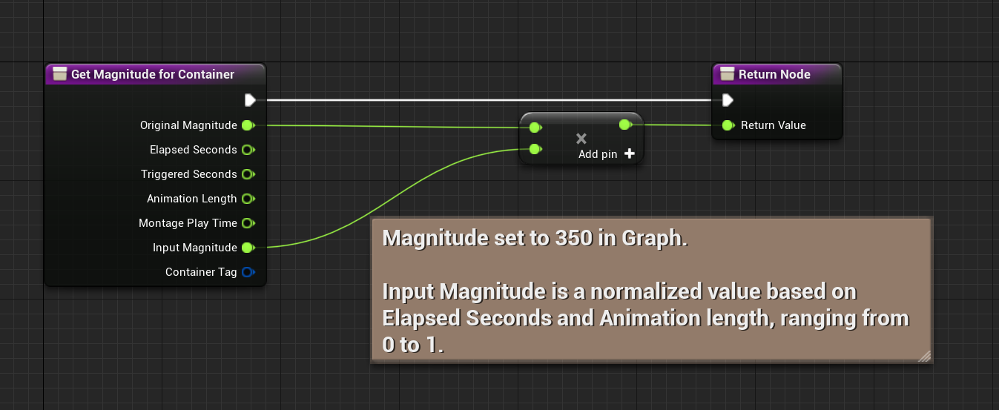
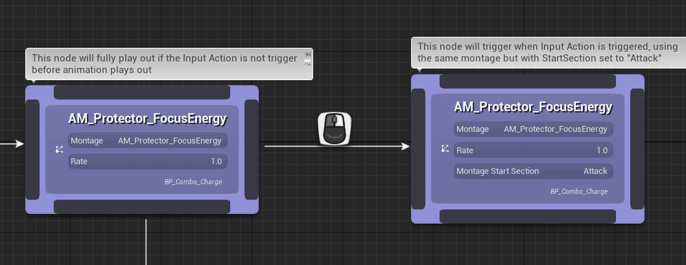

Further support for Enhanced Inputs Triggers, introduction of Transition Behaviors and addition to some API for Combo Nodes introduced in 1.1.0 makes it possible to support and implement charge attacks within Combo Graphs. This documentation page will cover this topic and explain how charge attacks can be implemented.

> Animations used here are coming from [Protector Animation Pack
](https://www.unrealengine.com/marketplace/en-US/product/protector) by [WeaponMaster Animset](https://www.unrealengine.com/marketplace/en-US/profile/WeaponMaster+Animset).

## Definition of Charge Attacks

Charge Attacks depending on the type of game you're making can mean a lot of things. Here, I'm mostly referring to the heavy attack style found in Souls or Bloodborne games, where the input can be hold to deliver a stronger attack at the cost of longer animation time.

This is what we're going to implement here.

## Animation Setup

### Required Animations

First thing we need to do is identify the animation sequences / montages available to you in your anim packs to support these kind of attacks. As described earlier, Protector Animation Pack
](https://www.unrealengine.com/marketplace/en-US/product/protector) is the animation pack I'm going to use in this tutorial. It has a very nice set of attacks named after "FocusEnergy".

Ideally, you're looking for:

- A start animation sequence: A windup animation that is going from idle to beginning of charge state.
- A looping sequence: An anim that represents the "ready" state of the charge attack, that can optionally loop on itself.
- A "release" or attack sequence: An anim that is going to be played when input is released, transition from loop to the attack state.
- A cancel sequence: This is not strictly necessary but can be handy to transition from start or loop sequence to a canceled state, for instance when the input was not held long enough.

The best way to set all these sequences up for usage in combo graph is to use an anim montage with sections for each of those. `1.1.0` also adds a new option on montage node to specify a start section for the play montage task to use.

### Setting up Montage with Sections

> This chapter goes briefly over how an anim montage could be sectioned into several parts, but won't go into details on how it can be done in Editor. Please refer to the official documentation if you need guidance  
> - [Animation Montage](https://docs.unrealengine.com/4.27/en-US/AnimatingObjects/SkeletalMeshAnimation/AnimMontage/)
> - [Animation Montage Overview](https://docs.unrealengine.com/4.27/en-US/AnimatingObjects/SkeletalMeshAnimation/AnimMontage/Overview/)
> - [Editing an Animation Montage](https://docs.unrealengine.com/4.27/en-US/AnimatingObjects/SkeletalMeshAnimation/AnimMontage/Editor/) - This one goes over into much detail on how animation sequences can be added to a montage, and setup as sections.

`video: /topics/charge-attacks/montage.mp4`

*This is the anim montage the combo graph asset is going to use.*

Montage has four sections:

- `Default`: Set with a starting sequence animation
- `Loop`: Set with a non-looping "ready" animation (can be looped)
- `Enhance`: Optional. In this case, this is similar to the Loop section, with a subtle animation indicating charge reached a certain point.
- `Attack`: Set with a starting sequence animation

And no special [section relationships](https://docs.unrealengine.com/4.27/en-US/AnimatingObjects/SkeletalMeshAnimation/AnimMontage/Editor/#sectionrelationships).

The montage is setup this way to achieve the result I'm looking for, eg. if the input is not released before end of animations (or at least before "Attack" section kicks in), I'd like the animation attack to play out.

You could setup the "Loop / Enhance" section as looped sections, which would result in a looping animation within combo graph, until one the output edges received confirmation of an input and trigger transition to next part of the combo.

The last animation asset the combo we're about to setup is using:

`video: /topics/charge-attacks/cancel_montage.mp4`

*Rate has been set to 0.5 in this video just to see better how the animation plays out. It's pretty fast.*

This montage is going to be used to transition from the starting montage (the one with four sections) if the Enhanced Input is canceled. For instance, with `Hold And Release` trigger, and a default `Hold Time Threshold` of 0.5, cancel event would trigger if the input is released before 500ms. We'll go over the creation of the Input Action asset later on.

## Combo Graph

Now that we have most of our animations ready for combo usage, it's time to dig in the creation of the actual combo graph asset.

### Asset Creation

Let's create a new one. Within the content browser, right click and choose `Combo Graph > Combo Graph`

We will also create a montage Combo Node Blueprint right now, and implement logic later on to adjust the containers damage based on the charge amount of time.

*On creation, the Editor will ask for a parent class. If you don't have BP combo node already, `ComboGraphNodeMontage` should be the only available option and will be picked automatically if don't select any.*

*Name those Blueprints with a name of your choosing. Here the BP Combo Node is named `BP_Combo_Charge`*

> Tip: Once the combo asset is created, setup your preview mesh accordingly, it'll update the asset browser with animations sharing a compatible skeleton with the mesh.
> 

Then, click on graph class default and setup `Default Node Montage Type` to the BP Combo node we created.

**Note**: This step is optional. We do that now as we will implement magnitude calculation later down the line (if you don't need it, you can skip this step and the previous node BP creation). This is useful to set now to avoid replacing nodes when we setup magnitude based on charge amount.

*Default Node Montage Type: Node Class type used for montages assets when dropped in a graph, or dropped on an existing node pin. This property lets you customize which class Combo Graph will use to create a new montage node in these situations. Mainly useful if you have a custom Combo Node Montage BP or native subclass*

If you now drop an animation asset in the graph from the Animation Browser (bottom right of combo graph editor) or from the Content Browser, the Blueprint node is going to be used.

`video: /topics/charge-attacks/combo_graph.mp4`

*When a montage asset is dropped onto the graph, or dropped on one of the pin for a node, `BP_Combo_Charge` will be used instead of the native class.*

Another way is using the Context Menu when you right click somewhere within the graph:

*Generated Context Menu can be customized in the Combo Node Blueprint with `ContextMenuName`, something we explain in more detail in [Combo Node Blueprint page](/graph/combo-node).*

### Combo Layout

You can setup the combo like so:

We use the Montage with the sections created [earlier](#setting-up-montage-with-sections) for the entry node. This montage will fully play out if the Input Action we're about to create doesn't trigger.

If then branches out into two part:

- On the right output, this is the Attack / Release part. We're using the same montage, but the node defines a Start Section set to "Attack".
- On the bottom output, we transition to a Cancel / End montage, which is going to be trigger if the Input Action is canceled / aborted before the Trigger had a chance to happen.

### Enhanced Input for Hold and Release

We now need to create a new Input Action, which is going to be used to detect specifically player input for charge attacks. We'll set it up to use "Hold And Release" trigger.

From the Content Browser, create a new asset with `Input > Input Action` and configure it like so:

*As always, you can name the asset whatever you want.*

You can further tune the Thresholds if you'd like, but the default values of 0.5 for each will do. Increasing `Hold Time Threshold` will require longer hold time and will trigger the cancel state if hold time is not reached.

Don't forget to add this new Input Action to your Input Mapping Context:

*We go over the creation of Mapping Context in further details in the [Enhanced Input](/project-setup/enhanced-input) page.*

### Setup Combo Transition with Hold Input

We can now go back to our Combo Graph asset for the charge attack, and update transition edges to use the newly created Input.

*If you don't see the icons rendered, make sure to setup the Context Mapping in the Graph Class Defaults or in Project Settings.*

With the transition selected between the first node and the charged attack, setup the properties like so:

*Transition will happen when the Input Action triggers, meaning input was held for at least 500ms. I'm using here a [Transition Behavior](/graph/transition-behavior) to delay the charge attack up until specific frame, or immediately if animation time frame is beyond the notify state frame when the input trigger happens. Note that the time it triggers is important and needs to be within the Combo Window.*

*You can refer to the animation asset created earlier, the timeline looks like this*

With the transition selected between the first node and the cancel / end animation, setup the properties like so:

*Trigger Event related to Enhanced Input is set to `Activate on Canceled` and [Transition Behavior](/graph/transition-behavior) set to immediately.*

This should be it. Combo should now be fully implemented and we can now test in game the result.

`video: /topics/charge-attacks/charge_attack_result.mp4`

## Container Magnitude Calculation

Now, related to charge attacks, you may want to adjust the amount of damage each attack is going to apply based on how long a charged attack was held. For instance, a fully charged attack may apply full damage, while an attack triggered before full charge would apply a fraction of the original damage.

This is where our custom Combo Node Blueprint comes into play.

> This section relies on concepts we explained in both [Collision](/collision) and [Effect Containers (GAS)](/gameplay-effects/containers) / [Damage Containers](/gameplay-effects/damage-system). We won't cover it in depth here.    
> The effect container configuration for both charge and attack nodes are using this:

> Both Gameplay Effect Containers (for GAS) and Damage Containers (without GAS and not using Attributes to handle damages) can be used here. `GetMagnitudeForContainer` we're about to implement is made to work with both methods.

Open up the Blueprint asset created earlier, and used within the graph (for me it is `BP_Combo_Charge`)

*When you first open the Blueprint, you should a few event node implemented for you but disabled. Those are mostly lifecycle events. They all should have a tooltip explaining their usage and when they are triggered.*

For our purpose, you don't need to implement anything in the Event Graph. What we need to do is to implement an overridable function called `GetMagnitudeForContainer`.

*You can see here the other functions implementable in Blueprint. They are all set as `BlueprintNativeEvent`, meaning the native class is providing a default implementation that is overriden when defined in Blueprint.*

*You can mouseover parameters pin to see a brief description on each parameter.*

The gist of this method is to return a new magnitude value for containers to apply. The input parameters can be used to determine the new value. The default native implementation simply return the `OriginalMagnitude`.

*Here is an example that returns a new magnitude based on Original Magnitude and Input Magnitude, a value ranging from 0 to 1 based on Enhanced Input Elapsed Time and Animation Length (1 means Elapsed Time is at or above the total animation length).*

*Same, but using a debug print to display each parameter when the container is applied.*

Since our combo nodes are using this Blueprint, the `GetMagnitudeForContainer` method we overriden should be called before applying Gameplay Effect or Damage Containers.

`video: /topics/charge-attacks/charge_magnitude.mp4`

*The amount of damage applied now depends on the input hold time and magnitude defined in containers.*

## Wrap up

That wraps it up for the topic of charge attacks.

You can then play and explore the possibilities, like setting up subsequent charged attacks after the first one, or even loop back to the previous combo node.

`video: /topics/charge-attacks/charge_attack_loop.mp4`
