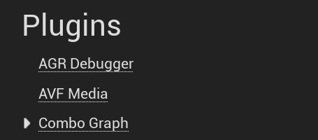
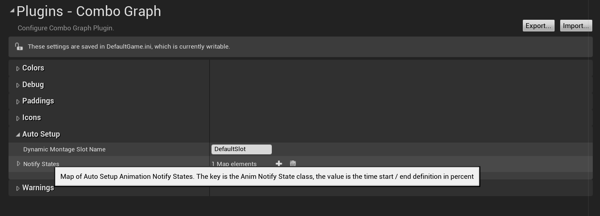
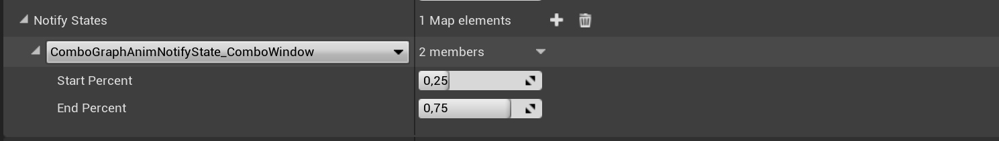
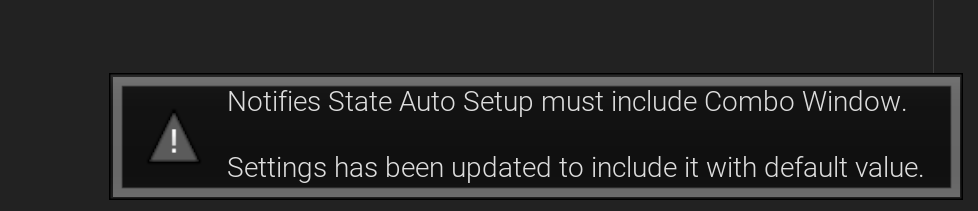
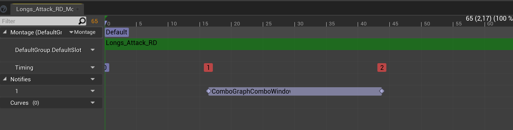
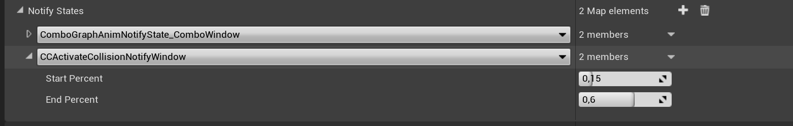
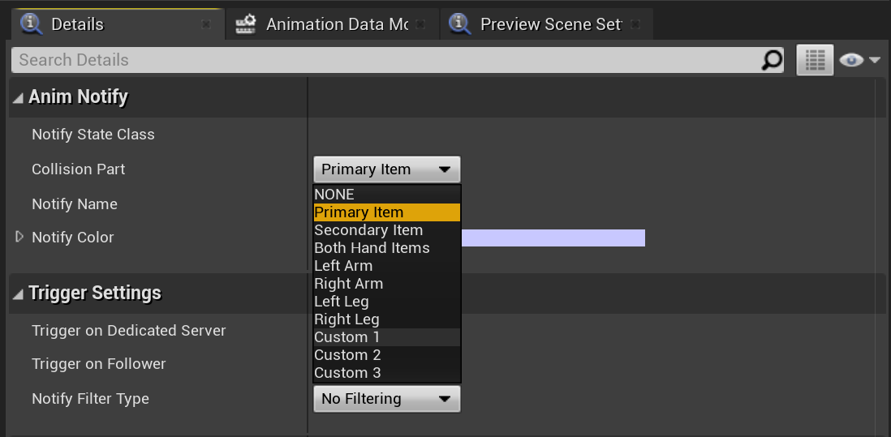
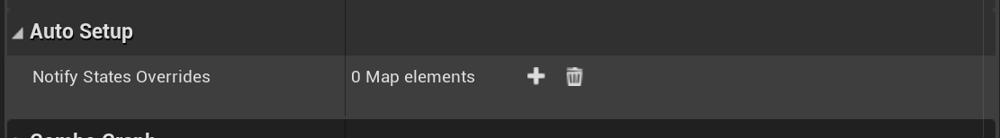
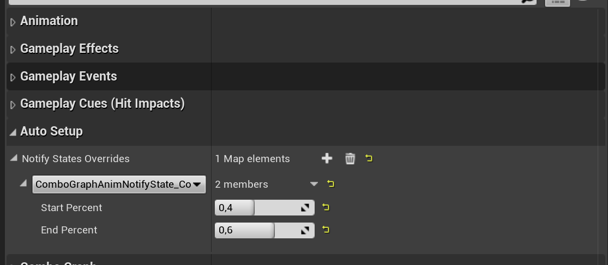

The Combo Graph plugin has a built-in mechanism to define a set of Anim Notify States (ANS) that are going to be likely needed for each combo montages or sequences.

This is great for prototyping a new combo, as you don't need to edit each and every animation assets for the combo to work (combo window notify state is required - `UComboGraphAnimNotifyState_ComboWindow`), or to enable / disable collisions traces to register hits and apply damages for instance.

However, you still have the possibility to further tune how those ANS should be used in animation assets by defining them like you would usually do in the Notifies tracks with the Animation timeline. The auto setup system only takes place if the anim asset doesn't have the corresponding ANS.

The auto-setup definition works at two level: Globally in the plugin project's settings, and per combo node.

## Global Auto Setup

Open up the Project's Settings, scroll down the left sidebar to the Plugin Category and click on Combo Graph entry.

You'll find in the `Auto Setup` category a map that you can further define with your own Notifiers:

*Map of Auto Setup Animation Notify States. The key is the Anim Notify State class, the value is the time start / end definition in percent*

### Combo Window Notify State

It is pre-filled with an internal Anim Notify State `UComboGraphAnimNotifyState_ComboWindow`.

If you try to remove this entry, the plugin will prevent you from doing so and revert it back to its default state, since it is required for combo nodes to work properly. 

With that being said, if you'd like to override the auto setup, you can still do that in the animation asset you'd like to use, and define it in the animation timeline like you usually do:

If an animation montages or sequence has an Anim Notifier defined in one of their track, that is also defined in the auto setup definitions, the mechanism will detect that and disable the auto setup for that notifiers, so that real ANS in anim asset takes over.

### Custom Notify States

You can then use this system to define your own custom notify states to automatically trigger when playing combo nodes. In this example, we're using [Combat Components Plugin](https://www.unrealengine.com/marketplace/en-US/product/combat-components) from the marketplace, and setup the collision notifier to automatically starts at 15% of the animation length, and ends at 60%.

*With debug enabled, we can see the collision traces when the combo nodes in the graph are played*

Remember that you can still use the Anim Notify State in the animation timeline that will override the auto setup so that the real animation notifiers will take over. 

This may actually be needed if you need to specify some properties the Notifier exposes. For instance, the `Collision Part` property that defaults to "Primary Item" with Combat Components' collision notifier:

The auto setup sadly can't easily know which properties / parameters third party (or your own) anim notifiers are exposing, so it's difficult for the Combo Graph Editor module to exposes that as well in Auto Setup configurations. In that case, the default values for those properties as designed by the Anim Notifier will be used. Here, auto setup for `CCActivateCollisionNotifyWindow` will use "Primary Item" for the `CollisionPart` no matter what.

## Per Node Auto Setup

In addition to the globally available auto setup definitions in plugin settings, you have the possibility to further tune it or even override them by selecting a Node in Combo Graphs, and adjusting the `Notify States Overrides` in the Details panel:

*Here, we're overriding the combo window to adjust timings a bit from 0.25 / 0.75 default values to 0.4 / 0.6*

> **Notify states overrides for Auto Setup**.    
> Before going through play montage task, adds all items from this map to plugin settings map (if any keys are in both, the value from the node map wins).    
> If animation asset (montage or sequence) being played is using one of the AnimNotifyState, the auto setup for this notify is ignored (notifies in anim assets win).

With `Notify States Overrides` you can either override an ANS Auto Setup with different timings, or add new ones that are going to be specific to this combo node.