This page will go over basic configuration to enable projects to use Enhanced Input and how it's used by the Combo Graph plugin.

## Enhanced Input Plugin

[Official Documentation 4.27](https://docs.unrealengine.com/4.27/en-US/InteractiveExperiences/Input/EnhancedInput/) / [Official Documentation 5.0](https://docs.unrealengine.com/5.0/en-US/GameplayFeatures/EnhancedInput/)

The Enhanced Input Plugin is a powerful system for reading and interpreting user input. It gives developers an easy upgrade path and backward compatibility with the engine's default input system. Enhanced Input implements features like radial dead zones, chorded actions, contextual input and prioritization, and the ability to extend your own filtering and processing of raw input data in an Asset-based environment.

Combo Graph uses it exclusively to handle player inputs and drive the execution flow of Combo Graphs.

If you're not using Enhanced Input yet, no worries. You can start using it along the engine's default input system as backward compatibility is ensured.

## Project Setup

**Note** *This is a required step for Combo Graph plugin to work properly*

To configure your project to use Enhanced Input, the Enhanced Input Plugin should be active. If Combo Graph plugin is enabled, it should auto enable Enhanced Input for you. You can check this by opening the Edit dropdown menu in the editor and selecting Plugins. Under the Input section of the Plugin List, find the Enhanced Input Plugin and check it is enabled. If not, enable it then restart the editor.

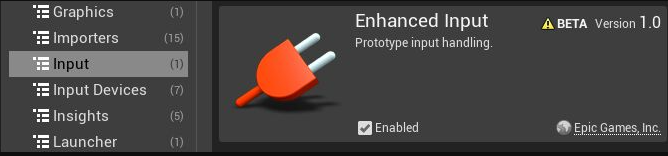

Before being able to use it though, we have a bit of Project setup to do. Open up the Project's Setting and navigate to `Engine > Input` category.

There, make sure you are using

- `EnhancedPlayerInput` for the `Default Player Input Class`
- `EnhancedPlayerInputComponent` for the `Default Input Component Class`

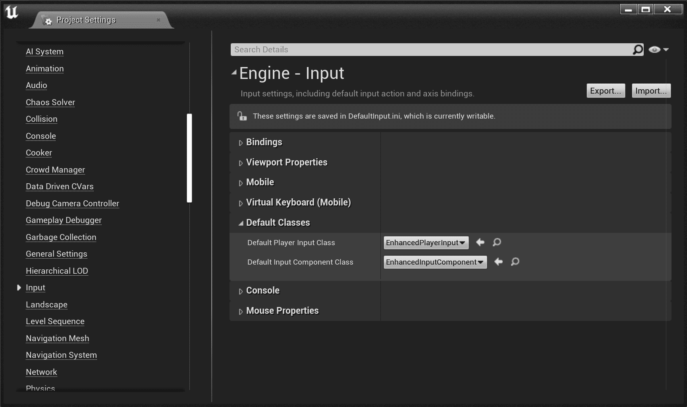

### Input Actions

In the context of Combo Graphs, we'll need some inputs to use within the graph. This highly depends on the game you're making, but for this tutorial, a light and heavy attacks input seems appropriate. We'll create these two input actions that we can then use between combo nodes in graphs.

> **Note from Official Documentation** Input Actions are the connection between the system and your project's code. You can create an Input Action by right-clicking in the Context Browser, expanding the Input option, and choosing Input Action. To trigger an Input Action, you must include it in an Input Mapping Context, and add that Input Mapping Context to the local player's Enhanced Input Local Player Subsystem.
> 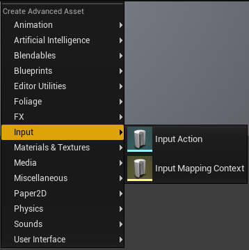

1. Create a new Input Action via the context menu for light attacks
2. Create a new Input Action via the context menu for heavy attacks

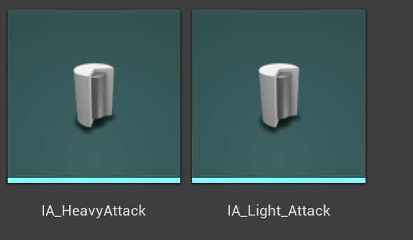

You can open up the assets but we don't need to change anything here. The default setup is all we need for these kind of triggers for actions that happen once, immediately upon pressing a button.

### Input Mapping Contexts

> **Note from Official Documentation** Input Mapping Contexts describe the rules for triggering one or more Input Actions. Its basic structure is a hierarchy with a list of Input Actions at the top level. Under the Input Action level is a list of user inputs that can trigger each Input Action, such as keys, buttons, and movement axes. The bottom level contains a list of Input Triggers and Input Modifiers for each user input, which you can use to determine how an input's raw value is filtered or processed, and what restrictions it must meet in order to drive the Input Action at the top of its hierarchy. Any input can have multiple Input Modifiers and Input Triggers. These will evaluate in the order in which they appear in the list you create; this is particularly important for Input Modifiers, which use the output of each step as the input for the next.

> To create an Input Mapping Context, right-click the **Context Browser**, expand the Input option, and choose **Input Mapping Context**.
> 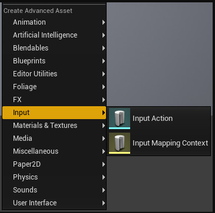

For this tutorial, we'll create a new mapping context that defines the list of Input Actions for our light and heavy attacks with a list of user inputs that can trigger each Input Action.

1. Create a new Mapping Context, Open it up.

When you do, you'll get this data asset window.

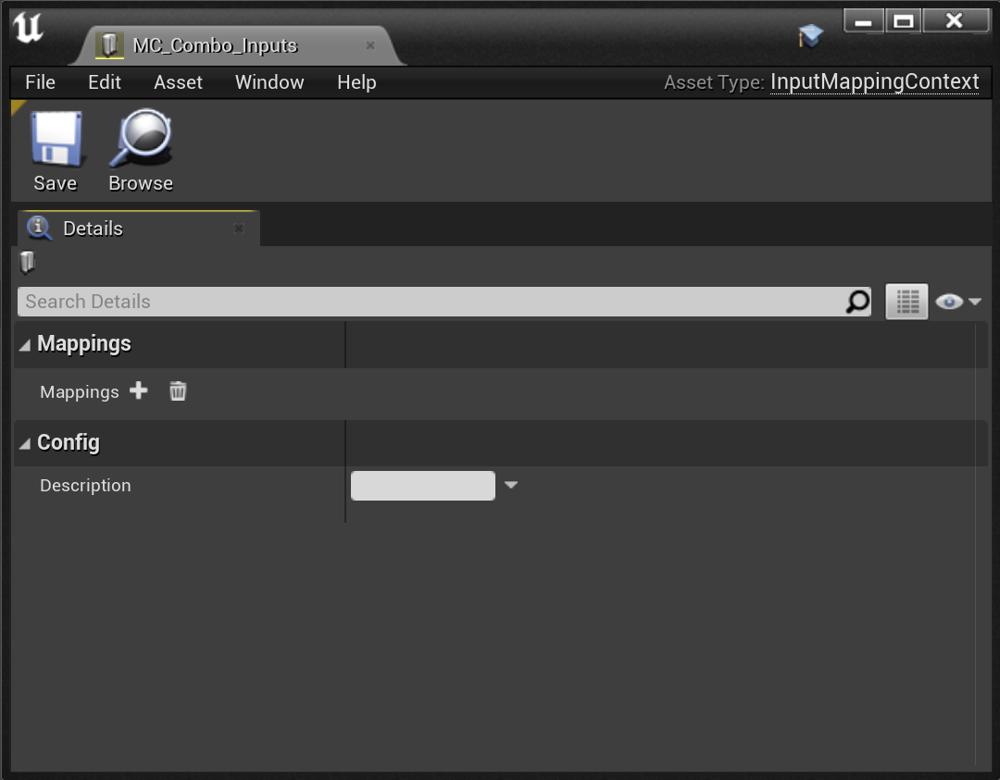

2. Under the Mapping property, click the `+` icon and populate your Input Mapping Context with all of the relevant Input Actions and their associated user input.

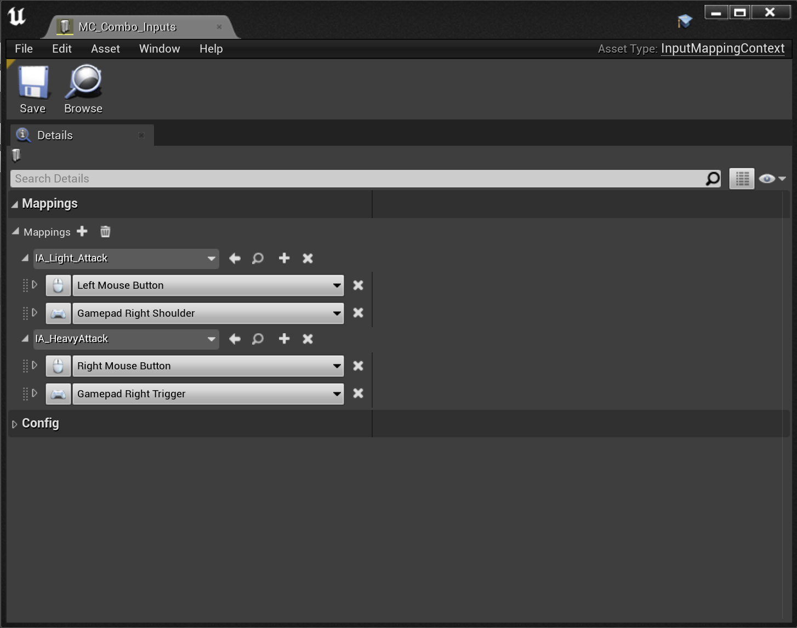

3. Once you have populated an Input Mapping Context, you can add it to the Local Player associated with the Pawn's Player Controller. You can do this by casting the Pawn's Controller to a Player Controller, getting its Enhanced Input Local Player Subsystem, and adding the Input Mapping Context to it with an integer priority value. The Enhanced Input Local Player Subsystem also supports querying or removing specific Input Mapping Contexts, or clearing all Input Mapping Contexts.

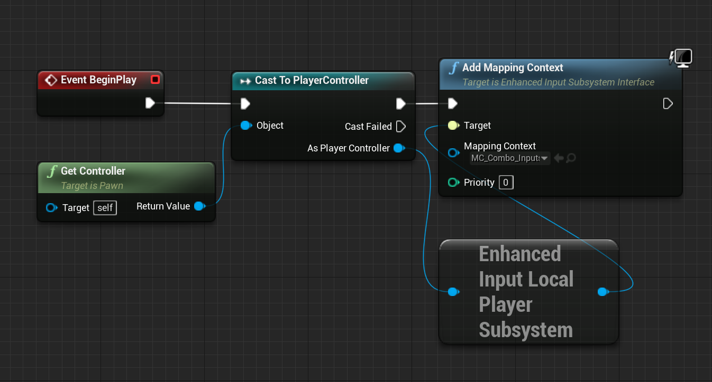

> **Using GAS Companion?** You can use `MGCAbilityInputBinding` component instead and setup the Mapping Context you'd like to use. It will add this mapping context to the Enhanced Input Local Player Subsystem for the Pawn's Player Controller (exactly like we did in Blueprints above).
> 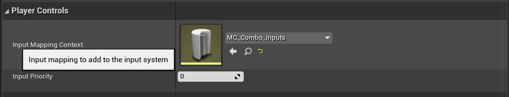

## Combo Graph specifics

With this project / character setup done, we have everything needed for Combo Graphs to respond to user inputs.

There is one additional step we need to do in order for combo graphs to be able to draw user inputs for transitions (or edges) that links combo nodes together. Those transitions, when selected allow you to define an Input Action that when the user inputs mapped in the Context Mapping is triggered, will tell the system an input was registered and can transition to the next part of the combo.

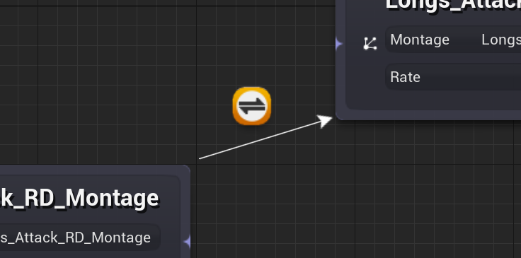

*When an edge is selected, the details panel should be updated with properties for this edge which lets you define the input action for the transition:*
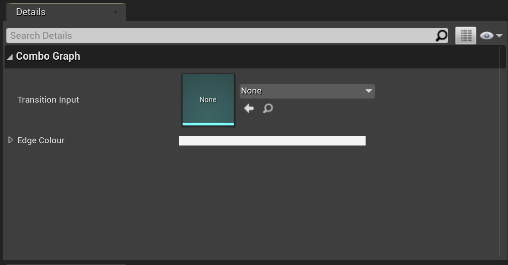

The Combo Graph plugin needs to know which Mapping Context it should consider to determine what is the user input associated with this Input Action, so that it knows what is the input icon to render for the edge image. The `ContextMapping` setting is designed to let you define the Input Mapping Context for that purpose.

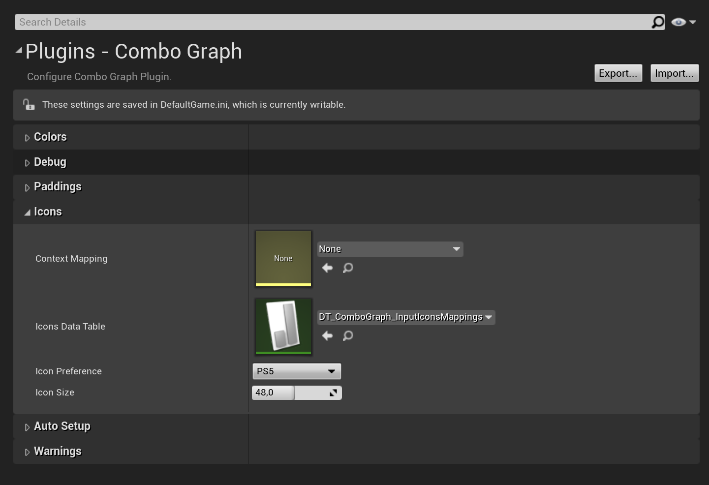

Change the value of `ContextMapping` to the one we created earlier (or your already existing context)

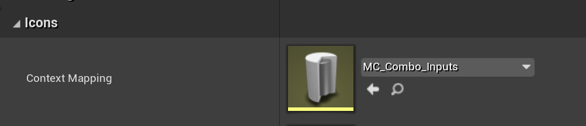

> **How does it work?** Internally, the plugin will look for that Mapping Context and search for the mappings defined if an Input Action matching the edge is available. If one is found, it will lookup the `IconsDataTable` for each defined user input in the mapping, consider the `IconPreference`, and if a corresponding icon is found for the input, will use that Texture to draw the icon in the graph.
>
> `IconsDataTable` is set by default to an internal DataTables (that you can find in `/ComboGraph/Xelu_Icons/`) that setup texture icons for every keyboard and gamepad key (for each icon type: keyboard, ps4, ps5, xbox one and xbox series).
>
> *Icons are coming from Xelu's Free Controllers & Keyboard Prompts (https://thoseawesomeguys.com/prompts/). Thanks to "Nicolae (Xelu) Berbece" and "Those Awesome Guys" to make it available in the public domain licence under Creative Commons 0 (CC0)*

> Note that changing mappings or user inputs in the Mapping Context, or the value of icons related plugins settings may require to close and re-open Combo Graph asset already opened.
