Combo nodes provide helpers to apply Cost Gameplay Effects and list of Gameplay Effects to apply to targets in what is commonly called Gameplay Effect Containers.


https://github.com/tranek/GASDocumentation#concepts-ge-containers

TODO ...

- [Gameplay Effects (Cost and Containers)](/usage/gameplay-effects) to learn more how you can apply damages or other gameplay effects when a hit is registered. We'll also explain how you can define a cost GameplayEffect for each combo nodes.


## Gameplay Effect Cost

Each Combo nodes, montage or sequence, are exposing a `Cost Gameplay Effect` property under the **Gameplay Effects** category.

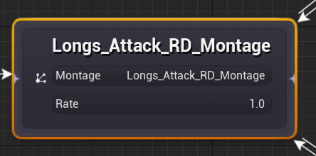
*With a combo node selected...*

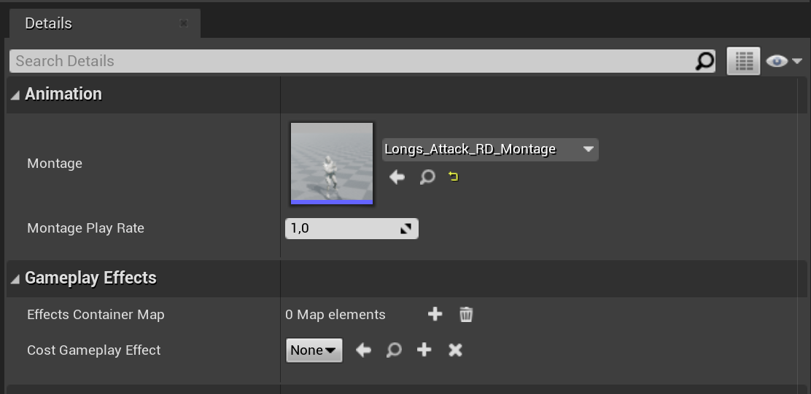
*... The details panel should be updated with its properties, where we can define a Gameplay Effect for cost to check for attributes and apply when the node is evaluating*

`Cost Gameplay Effect` is a subclass of `GameplayEffect` and you can put here any Gameplay Effect, the same way you would do with the `Cost Gameplay Effect Class` available in Gameplay Abilities.

When a combo node is evaluating, prior to playing the montage, this `Cost Gameplay Effect` will be used to:

- check all the modifier attributes against the owner current attributes value, testing that all attributes value after application will be above 0.
- if the check is successful, the gameplay effect is committed and all attributes modifier are applied

If one of those two steps failed, the combo node will prevent the animation from playing and proceed to end the graph execution, calling the `OnGraphEnd` delegate on the `StartComboGraph` task (which should in turn end the ability if you wire in `EndAbility` for that delegate)

### Example

In this example, I am using a character with an AttributeSet that includes attributes for Health, Stamina and Mana (**Note** *This is using GAS Companion standard setup and built in AttributeSet*) and will use this setup to demonstrate the use of a Gameplay Effect to apply Stamina cost for combo nodes.

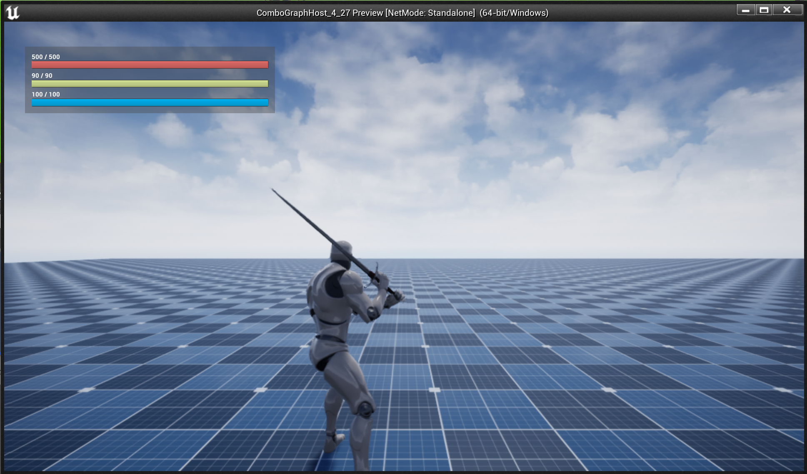
*The Character starts off with a stamina value of 90*

The Combo Graph I'm going to use here is fairly simple and implements a looping combo going back and forth between two melee attack:

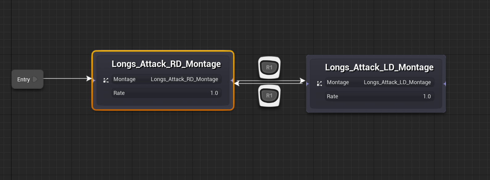
*"Looping" combo that will go back and forth between two melee attack animations as long as user input for the light attack is triggered*

[](combo_graph_cost_example_01.gif)

### Cost Gameplay Effect Creation

Let's first go through the step of creating a gameplay effect to apply cost for our combo nodes.

The Gameplay Effect should be an **Instant** effect with any number of Modifiers for attributes. In this example, we're simply going to define one modifier to decrease stamina value by a set amount.

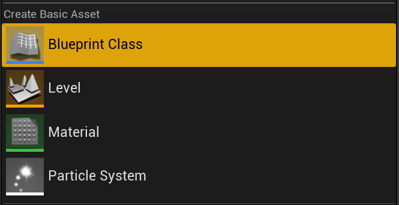
*Right Click in Content Browser, and create a new Blueprint Class*

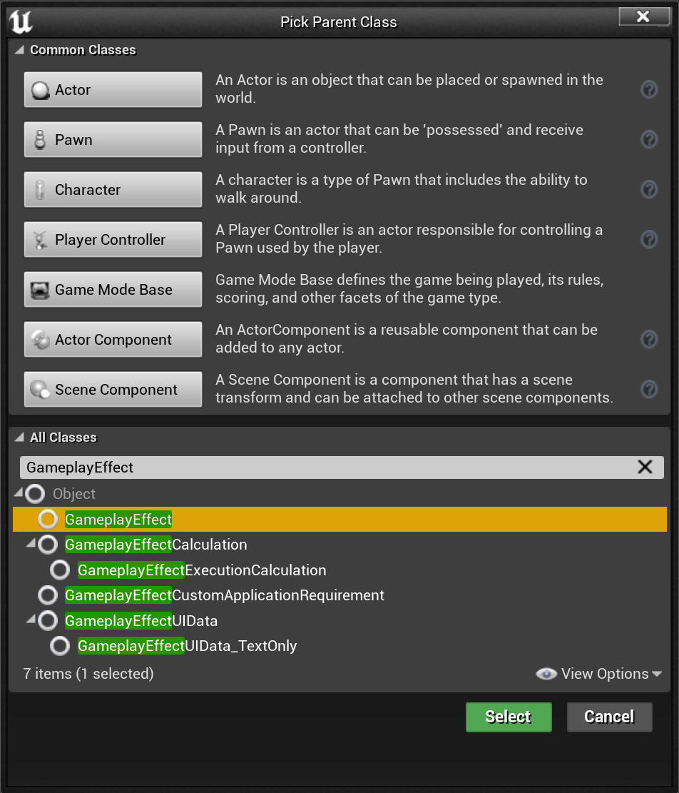
*Pick `GameplayEffect` for the parent class*

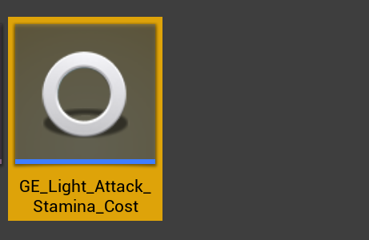
*Create the effect and name it however you wish, here using `GE_Light_Attack_Stamina_Cost`*

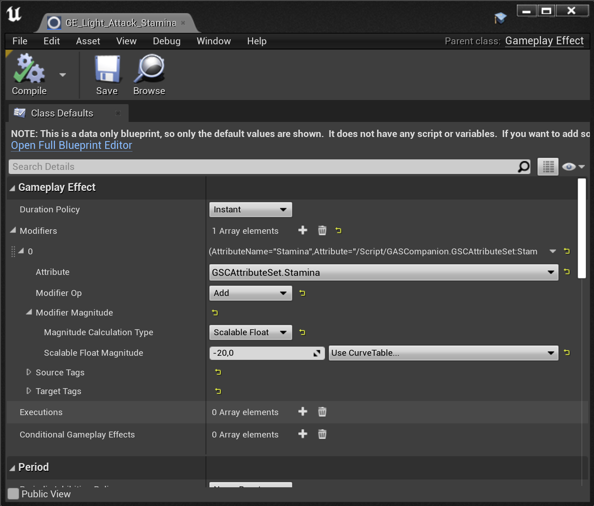
*Open the Gameplay Effect Blueprint, and setup the modifiers with at least one attribute with an Additive modifier operation (`Modifier Op` set to `Add`) and a negative scalable float.*

> Here, we're using the stamina attribute from `GSCAttributeSet` (part of GAS Companion). Adjust the attribute to use with the one you'd like to use for your Character (Remember that the AttributeSet must be granted in the Character's Ability System Component)

### Usage with Combo Nodes

Now that we have a Gameplay Effect we can use to check and apply cost, we can go back to our Combo Graph asset, and set it up for our Combo Nodes.

[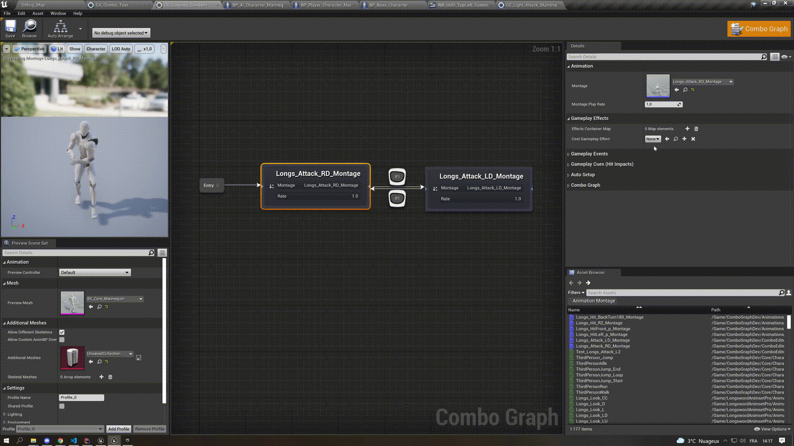](combo_graph_cost_example_02.gif)
*Select the nodes for which you'd like to setup a cost, and pick the gameplay effect created earlier for `Cost Gameplay Effect`. You can select multiple nodes and change the property for all of them (Click the image to open in full screen)*

Upon setting up a cost gameplay effect, the graph node should be updated to display it in the box.

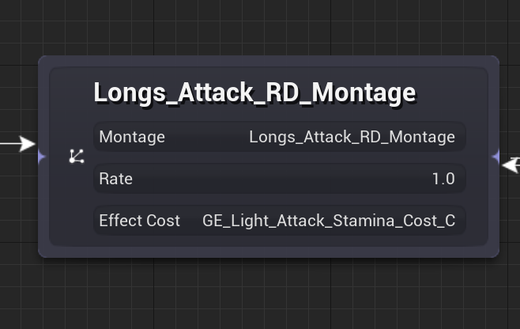

With both combo nodes now using a Gameplay Effect to decrease the stamina value by a value of 20 (like we created earlier), if we now hit play and run the combo graph, the attributes should be updated each time the combo node is evaluating and animation is playing.

[](combo_graph_cost_example_03.gif)
*Stamina is decreased each time the attack animations are played, and prevented if current stamina value is lower than 20 (`OnGraphEnd` event for the task is then called)*

[](combo_cost_showdebug_abilitysystem.gif)
*You can also use GAS gameplay debugger with `showdebug abilitysystem` command to check the attribute values.*

## Gameplay Effect Containers

### Overview

Much like Epic's [Action RPG Sample Project](https://www.unrealengine.com/marketplace/en-US/product/action-rpg), combo nodes implements the concept of [Gameplay Effect Containers](https://github.com/tranek/GASDocumentation#concepts-ge-containers).

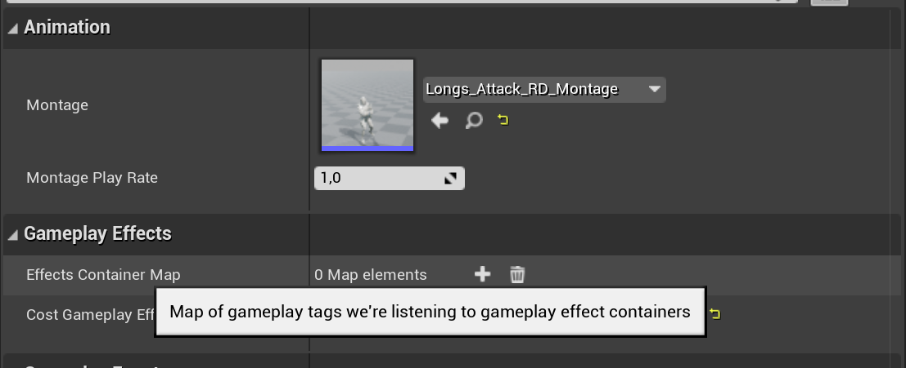
*With a combo node selected, Gameplay Effect Containers can be defined with `Effect Containers Map` property.*

These containers are extremely helpful for containing Gameplay Effects and Target Data. They provide a very simple way to define any number of Gameplay Effect to apply, when a Gameplay Event is received (key of the containers map).

Here's a high level overview of how they work and how Combo Graph plugin uses them:

- Effect Containers are a map with a Gameplay Tag **key** and a a value with a specific structure (`FComboGraphGameplayEffectContainer`).
- The Gameplay Tag **key** is designed to be a gameplay event received by the owning actor when a combo node is evaluating and an animation is playing.
- The structure value lets you define:
  - A list of Gameplay Effect classes to apply when the Gameplay Event (defined by the Gameplay Tag key) is received .
  - Optionally set up set by caller tag and magnitude.
- Combo Nodes automatically listen for the gameplay event tags defined in the effect containers, and when one such event is received, the container for the tag key is applied.

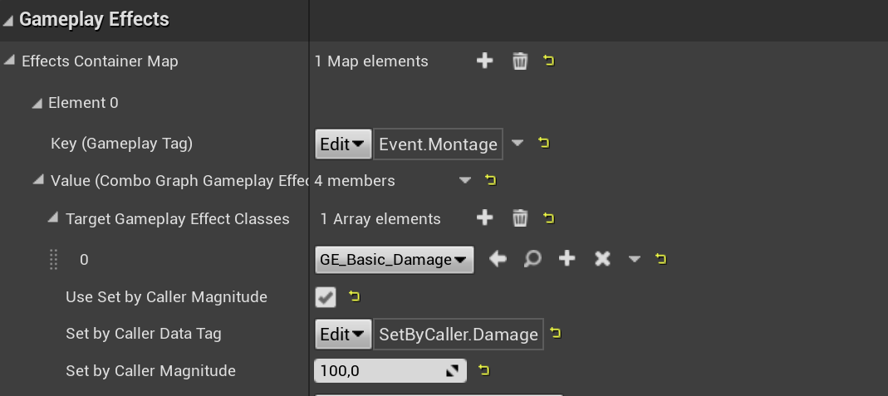
*Here's a simple example using a basic Gameplay Effect to apply damage with a value set by caller. The `Target Gameplay Effect Classes` defined for Gameplay Tag key (`Event.Montage`) will be applied when `Event.Montage` gameplay event is received by the owning actor.*

<div class="notes">

> Combo Graph uses a single Target Data mechanism pulling Target Data from an event, taking hit results from either the Event Data GameplayEffect ContextHandle or Target Data, or the Event Data Target Actor if neither of the hit results were valid. <br /> <br />
> For the sake of simplicity, the `TargetType` class responsible for the targeting logic is not exposed to Blueprints and for now will always use the built-in one described above pulling data from a gameplay event.

</div>

### Usage Example

To test out and describe how containers can be used to apply damage, we're going to reuse the looping combo we used earlier for costs.

[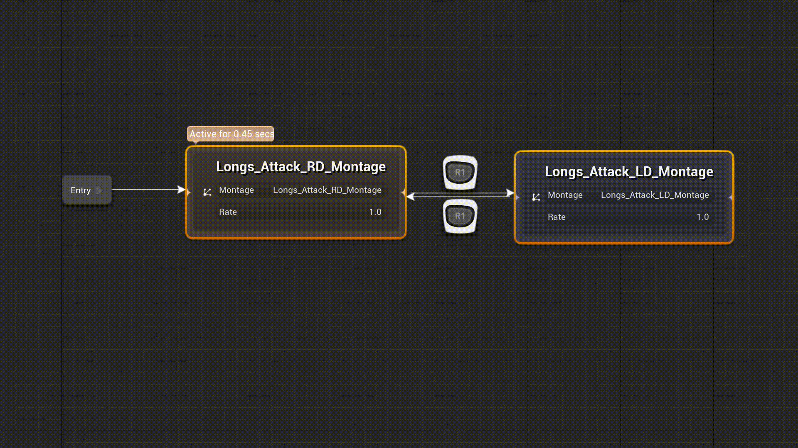](ge_containers_combo_graph.gif)

It is also expected that you have some Pawns available with an Ability System Component and an AttributeSet granted with attributes holding the Health value for the Pawns.

Also related to the application of effect containers, it is expected that you have followed the [collision guide](/guides/collision/) since we're going to use the gameplay event sent when a hit is registered.

### Pawn / Character and AttributeSet Setup

> If you already have a GAS setup and a Character class with an Ability System Component, you can skip this part.

> In this tutorial, I'm going to use the AttributeSet `UComboGraphTestAttributeSet` and Character `AComboGraphTestAbilitySystemCharacter` used internally for unit / functional testing the plugin, but you can adjust the steps here to use whatever attributes and pawns you are already using.

Let's setup a test character that we're going to hit and apply gameplay effect for damage. In this tutorial, I'm going to use `AComboGraphTestAbilitySystemCharacter` for the native parent class. `AComboGraphTestAbilitySystemCharacter` is part of the functional testing plugin for Combo Graph available on [Github](https://github.com/mklabs/ComboGraphTests)

It is a very basic Character class with the bare minimum amount of code to setup an Ability System Component (ASC) for the character, and the required `IAbilitySystemInterface` implementation. Also has the possibility to define in Blueprint a list of AttributeSet to grant to the ASC.

<div class="notes">

> If you want to see the source code for this character class and try to implement it yourself, here is the header and source file content. <br />
> **Note**: You'll likely need to change `COMBOGRAPHTESTS_API` to your own macro module definition, (or simply remove it):

```cpp title=Public/ComboGraphTestAbilitySystemCharacter.h
#pragma once

#include "CoreMinimal.h"
#include "AbilitySystemInterface.h"
#include "GameFramework/Character.h"
#include "ComboGraphTestAbilitySystemCharacter.generated.h"

class UDataTable;
class UAttributeSet;

UCLASS()
class COMBOGRAPHTESTS_API AComboGraphTestAbilitySystemCharacter : public ACharacter, public IAbilitySystemInterface
{
	GENERATED_BODY()

public:
	AComboGraphTestAbilitySystemCharacter(const FObjectInitializer& ObjectInitializer);

	static FName AbilitySystemComponentName;

	/** List of attributes to grant and initialize */
	UPROPERTY(EditDefaultsOnly, Category="Combo Graph|Test")
	TArray<TSubclassOf<UAttributeSet>> GrantedAttributes;

	/** Datatable to use to initialize base value of granted attributes */
	UPROPERTY(EditDefaultsOnly, Category = "Combo Graph|Test", meta = (RequiredAssetDataTags = "RowStructure=AttributeMetaData"))
	TSoftObjectPtr<UDataTable> AttributesDataTable;

	virtual UAbilitySystemComponent* GetAbilitySystemComponent() const override;
	virtual void PostInitializeComponents() override;

private:
	/** Default ASC */
	UPROPERTY(Category = AbilitySystem, VisibleAnywhere, BlueprintReadOnly, meta = (AllowPrivateAccess = "true"))
	UAbilitySystemComponent* AbilitySystemComponent;
};
```

```cpp title=Private/ComboGraphTestAbilitySystemCharacter.cpp
#include "Abilities/ComboGraphTestAbilitySystemCharacter.h"

#include "AbilitySystemComponent.h"

FName AComboGraphTestAbilitySystemCharacter::AbilitySystemComponentName(TEXT("AbilitySystemComponent_Test0"));

AComboGraphTestAbilitySystemCharacter::AComboGraphTestAbilitySystemCharacter(const FObjectInitializer& ObjectInitializer) : Super(ObjectInitializer)
{
	AbilitySystemComponent = CreateDefaultSubobject<UAbilitySystemComponent>(AbilitySystemComponentName);
	AbilitySystemComponent->SetIsReplicated(true);
}

UAbilitySystemComponent* AComboGraphTestAbilitySystemCharacter::GetAbilitySystemComponent() const
{
	return AbilitySystemComponent;
}

void AComboGraphTestAbilitySystemCharacter::PostInitializeComponents()
{
	Super::PostInitializeComponents();

	check(AbilitySystemComponent);

	// Load data table soft object if valid
	const UDataTable* InitDataTable = nullptr;
	if (!AttributesDataTable.IsNull())
	{
		UDataTable* DataTable = AttributesDataTable.LoadSynchronous();
		if (DataTable)
		{
			InitDataTable = DataTable;
		}
	}

	// Grant attributes and initialize with data table if it was found (can be nullptr)
	for (const TSubclassOf<UAttributeSet> GrantedAttribute : GrantedAttributes)
	{
		AbilitySystemComponent->InitStats(GrantedAttribute, InitDataTable);
	}
}
```

Same goes for the Attribute Set we're going to use in this section, here using `UComboGraphTestAttributeSet` also coming from [ComboGraphTests plugin](https://github.com/mklabs/ComboGraphTests).

> If you want to see the source code for this character class and try to implement it yourself, here is the header and source file content. <br />
> **Note**: You'll likely need to change `COMBOGRAPHTESTS_API` to your own macro module definition, (or simply remove it):

```cpp title=Public/ComboGraphTestAttributeSet.h
#pragma once

#include "CoreMinimal.h"
#include "AbilitySystemComponent.h"
#include "ComboGraphTestAttributeSet.generated.h"

// Uses macros from AttributeSet.h
#define ATTRIBUTE_ACCESSORS(ClassName, PropertyName) \
	GAMEPLAYATTRIBUTE_PROPERTY_GETTER(ClassName, PropertyName) \
	GAMEPLAYATTRIBUTE_VALUE_GETTER(PropertyName) \
	GAMEPLAYATTRIBUTE_VALUE_SETTER(PropertyName) \
	GAMEPLAYATTRIBUTE_VALUE_INITTER(PropertyName)

UCLASS()
class COMBOGRAPHTESTS_API UComboGraphTestAttributeSet : public UAttributeSet
{
	GENERATED_BODY()

public:

	// Sets default values for this AttributeSet attributes
	UComboGraphTestAttributeSet();

    // AttributeSet Overrides
    virtual void PostGameplayEffectExecute(const FGameplayEffectModCallbackData& Data) override;
    virtual void GetLifetimeReplicatedProps(TArray<FLifetimeProperty>& OutLifetimeProps) const override;

    UPROPERTY(BlueprintReadOnly, Category = "Health Attribute Set", ReplicatedUsing = OnRep_Health)
    FGameplayAttributeData Health = 0.0;
    ATTRIBUTE_ACCESSORS(UComboGraphTestAttributeSet, Health)

	UPROPERTY(BlueprintReadOnly, Category = "Health Attribute Set", ReplicatedUsing = OnRep_MaxHealth)
	FGameplayAttributeData MaxHealth = 0.0f;
	ATTRIBUTE_ACCESSORS(UComboGraphTestAttributeSet, MaxHealth)

	// Damage is a meta attribute used to calculate final damage, which then turns into -Health
	// Temporary value that only exists on the Server. Not replicated.
	UPROPERTY(BlueprintReadOnly, Category = "Health Attribute Set", meta = (HideFromLevelInfos))
	FGameplayAttributeData Damage;
	ATTRIBUTE_ACCESSORS(UComboGraphTestAttributeSet, Damage)

protected:

    UFUNCTION()
    virtual void OnRep_Health(const FGameplayAttributeData& OldHealth);

	UFUNCTION()
	virtual void OnRep_MaxHealth(const FGameplayAttributeData& OldMaxHealth);
};
```

```cpp title=Private/ComboGraphTestAttributeSet.cpp
#include "Abilities/ComboGraphTestAttributeSet.h"

#include "GameplayEffectExtension.h"
#include "Net/UnrealNetwork.h"

// Sets default values
UComboGraphTestAttributeSet::UComboGraphTestAttributeSet()
{
	// Default constructor
}

void UComboGraphTestAttributeSet::PostGameplayEffectExecute(const FGameplayEffectModCallbackData& Data)
{
    Super::PostGameplayEffectExecute(Data);

	if (Data.EvaluatedData.Attribute == GetDamageAttribute())
	{
		// Store a local copy of the amount of Damage done and clear the Damage attribute.
		const float LocalDamageDone = GetDamage();
		SetDamage(0.f);

		if (LocalDamageDone > 0.f)
		{
			// Apply the Health change and then clamp it.
			const float NewHealth = GetHealth() - LocalDamageDone;
			SetHealth(FMath::Clamp(NewHealth, 0.f, GetMaxHealth()));
		}
	}
	else if (Data.EvaluatedData.Attribute == GetHealthAttribute())
	{
		// Clamp Health
		SetHealth(FMath::Clamp(GetHealth(), 0.f, GetMaxHealth()));
	}
}

void UComboGraphTestAttributeSet::GetLifetimeReplicatedProps(TArray<FLifetimeProperty>& OutLifetimeProps) const
{
    Super::GetLifetimeReplicatedProps(OutLifetimeProps);

    DOREPLIFETIME_CONDITION_NOTIFY(UComboGraphTestAttributeSet, Health, COND_None, REPNOTIFY_Always);
    DOREPLIFETIME_CONDITION_NOTIFY(UComboGraphTestAttributeSet, MaxHealth, COND_None, REPNOTIFY_Always);
}

void UComboGraphTestAttributeSet::OnRep_Health(const FGameplayAttributeData& OldHealth)
{
    GAMEPLAYATTRIBUTE_REPNOTIFY(UComboGraphTestAttributeSet, Health, OldHealth);
}

void UComboGraphTestAttributeSet::OnRep_MaxHealth(const FGameplayAttributeData& OldMaxHealth)
{
    GAMEPLAYATTRIBUTE_REPNOTIFY(UComboGraphTestAttributeSet, MaxHealth, OldMaxHealth);
}
```


</div>

#### Blueprint

Let's reuse the Third Person Character template in this section

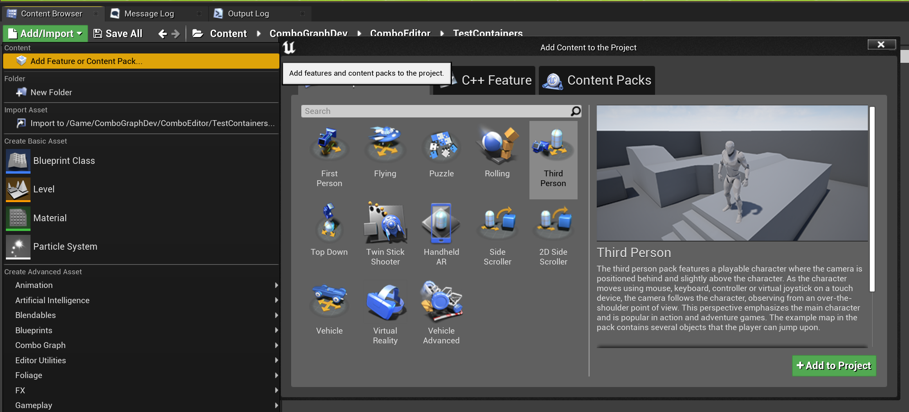
*If you don't already have the template in your project, click the `Add / Import` button on the top left of the Content Browser and add the Third Person template to the project.*

1. Now make a duplicate of `ThirdPersonCharacter` blueprint, name it however you like and open it up.
2. With [ComboGraphTests plugin](https://github.com/mklabs/ComboGraphTests) installed, reparent the Blueprint to `ComboGraphTestAbilitySystemCharacter` (or use your own Parent class)

<div style="display: flex; justify-content: space-around;">

<div style="width: 300px">

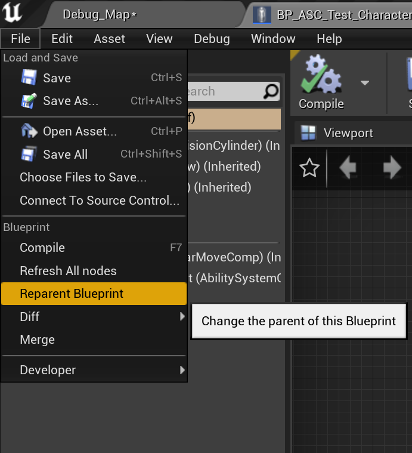

</div>

<div style="width: 300px">

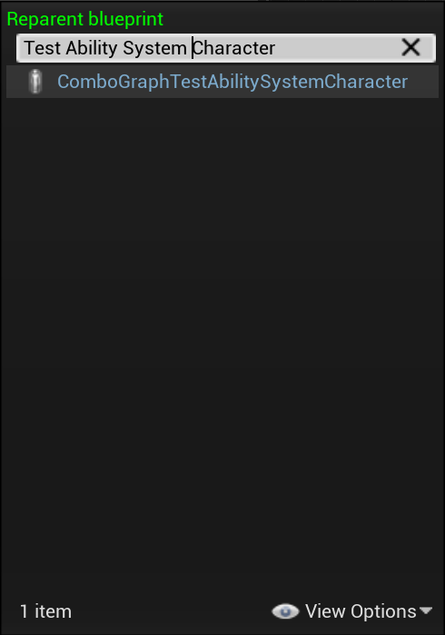

</div>
</div>

3. `ComboGraphTestAbilitySystemCharacter` provides a way to initialize Attributes based on a DataTable. Create a new DataTable now for that purpose:

<div style="display: flex; justify-content: space-around; align-items: center;">

<div style="width: 350px">

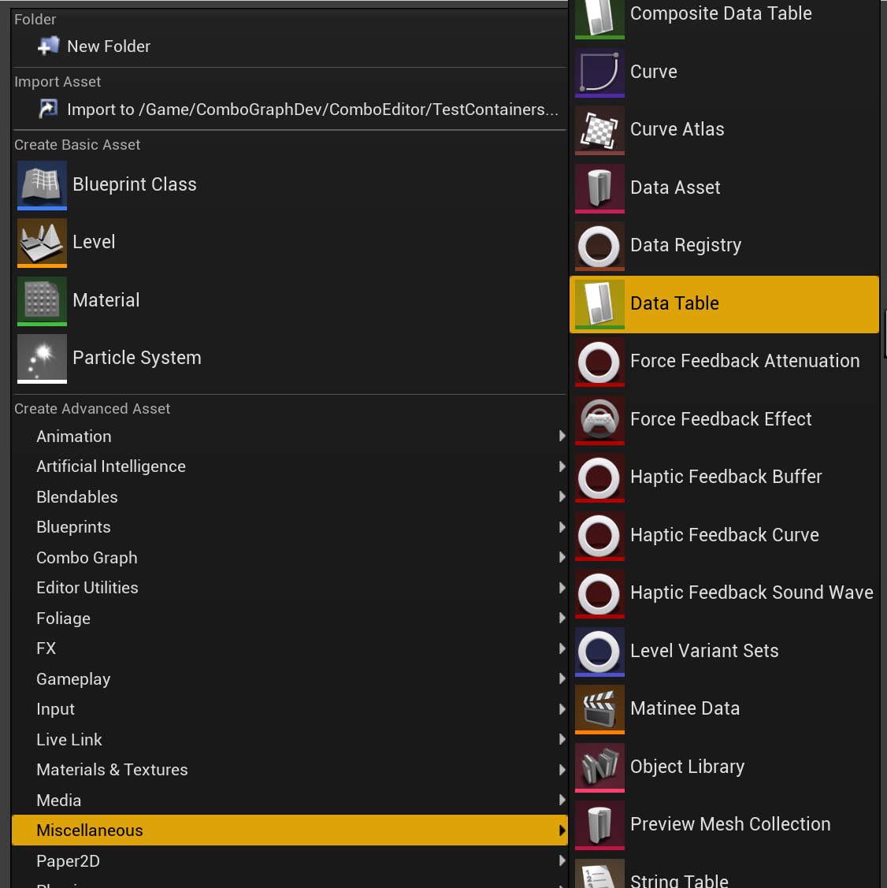
*Right click in the context browser, and create a new DataTable from `Miscellaneous > DataTable`*

</div>

<div style="width: 250px">

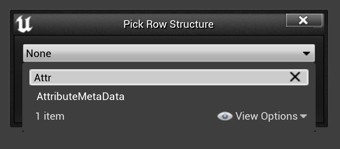
*And pick AttributeMetaData for the Row Structure*

</div>

</div>

Open up the DataTable created, and define the `Base Value` for both `ComboGraphTestAttributeSet.Health` and `ComboGraphTestAttributeSet.MaxHealth`

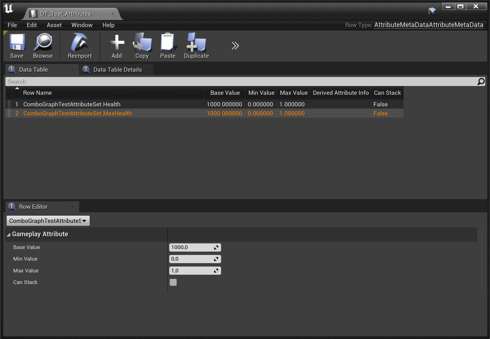
*The Row Name pattern should follow `<AttributeSetName>.<AttributeName>`*

4. Then, adjust the `Granted Attributes` property to include the Attribute Set you want to use

<div style="width: 300px">

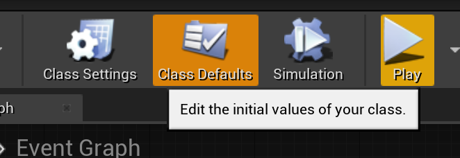
*In the Blueprint Class defaults ...*

</div>

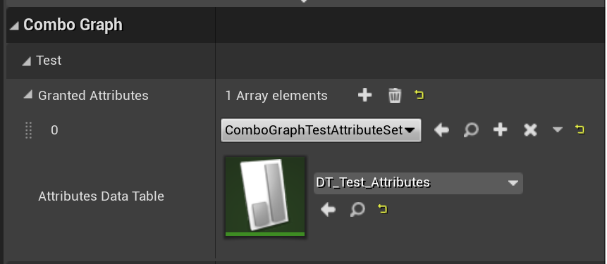
*... and set the Attribute Sets to grant to the Character's ASC (here using `UComboGraphTestAttributeSet` and the initialization DataTable created earlier)*

5. Place the Character in your level and check attributes are granted with GAS gameplay debugger

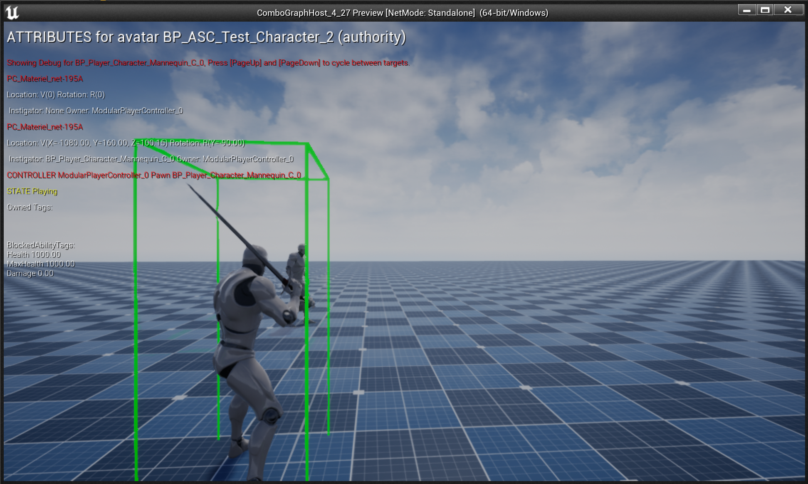
*Hit `²` to open up the console, and input `showdebug abilitysystem` to open up the debugger, followed by `AbilitySystem.Debug.NextTarget` to switch the debugged actor to our test Character.*

Our test character should have the Health and MaxHealth attributes both set to 1000 (or whatever value you used in the initialization DataTable).

If you'd like to avoid to have to rely on the gameplay debugger to check the attributes, we can resort to a little hack in the test character BP and print out the value of the attributes on tick, like so:

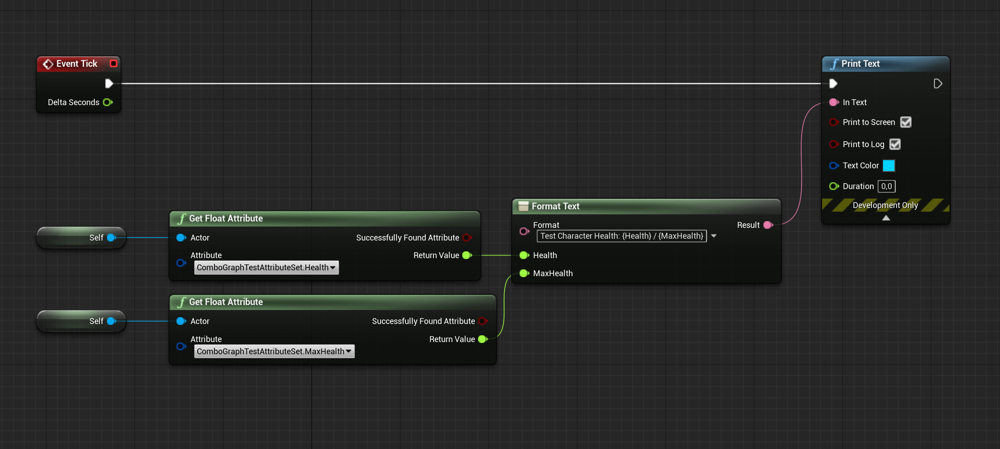
*Make sure the `Duration` value is set to *0.0* for the Print Text node anytime you're printing debug values on tick.*

<div style="width: 400px;">


*We should now have the debug values on screen now.*

</div>