At its core, Combo Graph is based off GAS (Gameplay Ability System) and provides a way to visually design combo strings and link montages together.

The main idea behind this plugin is to try to cut down iteration times as much as possible when designing and prototyping a new combat system / combos.

It essentially comes with a custom Combo Graph asset and editor, and a set of Ability Tasks to interact with the system. There is no specific custom classes to inherit from or use: No Base GameplayAbility, no Base Character or Controller, etc. This means it should integrate fairly easy with your current GAS setup.

And if not using GAS already, the plugin comes with few helpers to get you started even if you don't know GAS.

## Your first Combo Graph

We're going to make a new combo graph asset. You can create new combo graph from the Content Browser context menu:

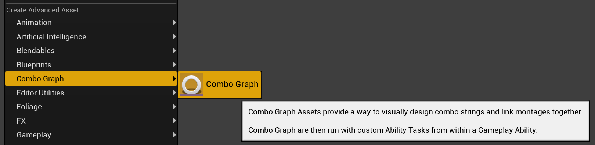

Name it as you wish, and open it up. You'll be granted with the following window:

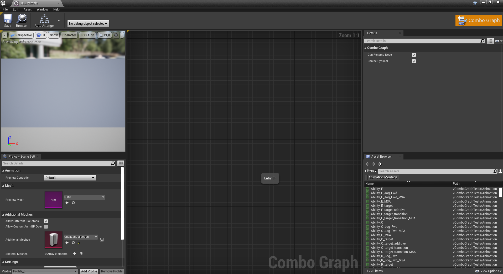

Here is a brief description of each panel:

| Panel         | Title                                 | Description  |
| -----         | ------------------------------------- | ------------ |
| Top Left      | Persona Preview Viewport              | If a preview mesh is defined, will play the animation for the currently selected node in the graph |
| Bottom Left   | Persona Preview Scene settings        | Can be used to change the Preview Mesh (all other options can be ignored) |
| Middle        | Combo Graph                           | This is where you can right click or draw from a previous node and create new combo nodes, either sequence or montages. |
| Top Right     | Property Details                      | Will display and allow you to change properties for the currently selected node or edge (transition between nodes). If nothing is selected, will display properties for the combo graph asset. |
| Bottom Right  | Animation Asset Browser               | List montages and sequences in the project. If a preview mesh is currently defined, will only display animations with a compatible skeletons. This panel can be used to drag and drop animations assets in the graph. |

### Combo Nodes

When designing combo logic, you define combo nodes like you would in a Behavior Tree and link them together using a transition edge bound to an Input Action.

> **Note** Make sure you're using animations (montages or sequences) that are using a compatible skeleton for your character mesh (defining the preview mesh and using the animation asset browser is a good way to ensure that). Also important, your character Animation Blueprint should use at the very least one Montage Slot (ex. `DefaultSlot`) that is used by your Montages. If you're using a different slot than `DefaultSlot`, you'll likely need to adjust `DynamicMontageSlotName` in the [Plugin Settings](/project-setup) otherwise using Sequences defined in your combo graph won't play properly.

When a combo node is selected, the details window will display exposed properties for the node, that we'll go over later on in their respective sections.

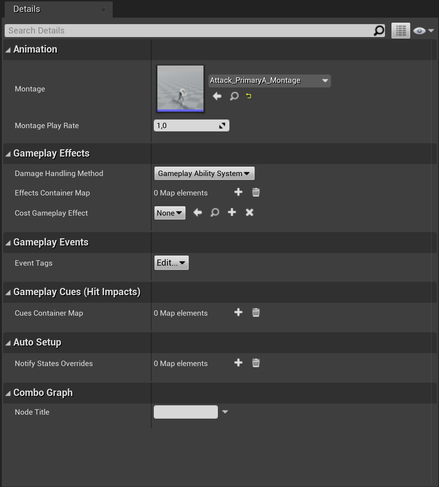

### Combo Transitions (Edges)

Similarly, if you select an edge (transitions between nodes), the details window will be updated with properties for the transition. This is where you can register an input action to listen to and transition to the child combo node if the input is triggered during the combo window.

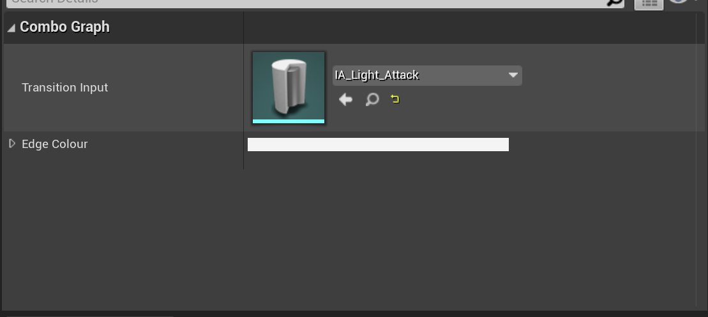

> If input icons are not rendered when you define an Input Action for a transition, make sure you have setup your `ContextMapping` input context in the plugin settings. This is explained with further details in the [Enhanced Input section](/usage/enhanced-input/).

This is all we need to do for now. Simply drag off from the entry node and define a few combo nodes using either montages or sequences, and for each transitions define an Input Action that is used in an Input Mapping context your Player Controller is using.

## Using Combo Graphs with Gameplay Abilities

When you are ready to use your combo graph, you can start making a Gameplay Ability to start using it. The primary way to run combo graph is via a gameplay task.

Create a new Gameplay Ability via the Content Browser context menu, and pick the parent class you'd like to use (if you don't have one, `GameplayAbility` is the one to use):

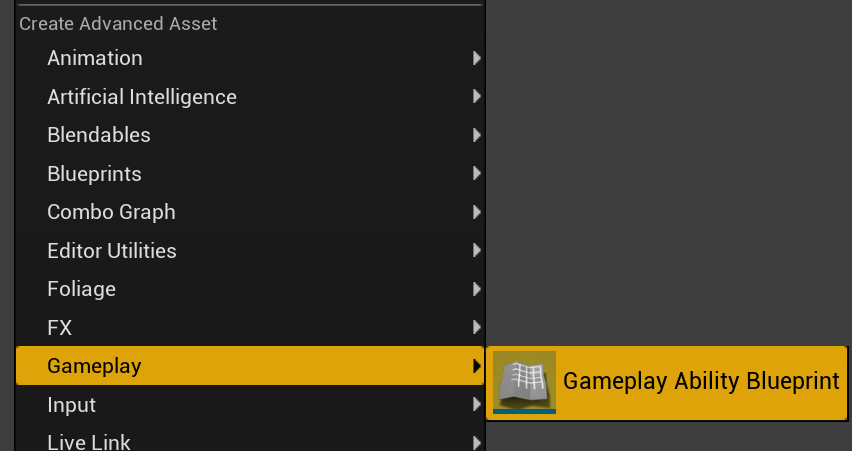

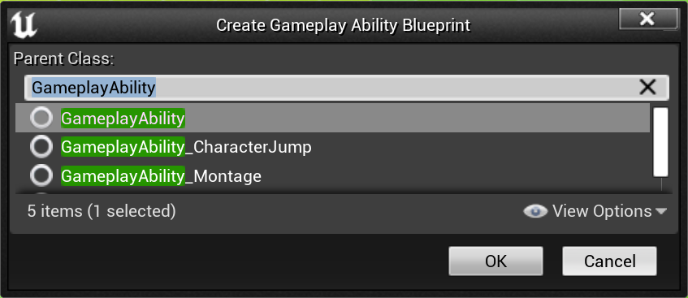

Then, for your Ability Event Graph, the `StartComboGraph` task is the primary way to start a combo graph from within a Gameplay Ability:

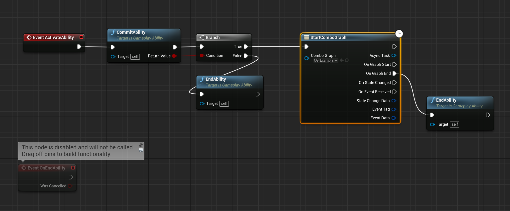

Here's a brief overview of a typical ability execution flow:

1. First, we commit the ability to ensure cost and cooldowns are committed (if you have them defined for your GA).
2. We end the ability if commit failed.
3. We use the Combo Graph Task `StartComboGraph` by passing the Combo Graph asset we want to use
4. Finally, we make sure to end the ability when the graph ends, by calling `EndAbility` on the `OnGraphEnd` event for the task.

There's a few events exposed to Blueprints that are triggered by the task if you'd like to react to these, the most important one being `OnGraphEnd`:

- `OnGraphStart`: Triggered when the combo graph is first started, should happen right away.
- `OnGraphEnd`: Triggered when the combo graph is done executing, either when a montage is completed (meaning no input was registered or reached the end of the tree) or interrupted from an external source or ability.
- `OnStateChanged`: This is called whenever the graph transitions from a node to another. `StateChangeData` is a structure with `FromNode` / `ToNode` objects if you need to identify them. This structure is only filled with `OnStateChanged` event.
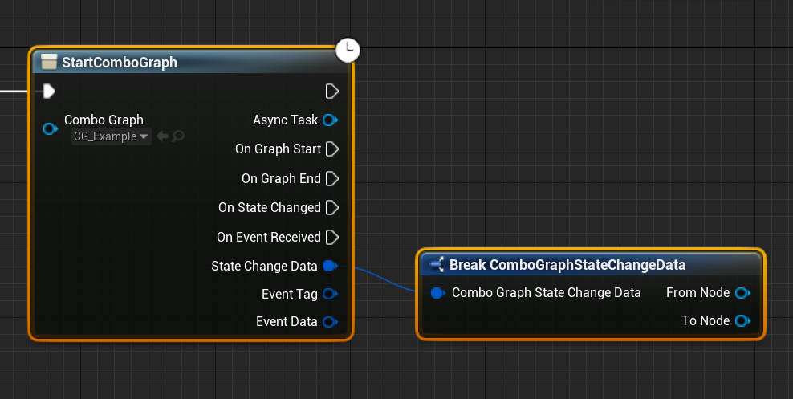
- `OnEventReceived`: Called when a gameplay event is received by the owner of the combo graph, which is the same as the Avatar of the currently running ability (in most case, will be your player character). This event is really similar to the one available with `PlayMontageAndWaitForEvent` task that you can find in Epic's ActionRPG project, tranek's GASDocumentation or GAS Companion. `EventTags` and `EventData` are only filled with `OnEventReceived` event.

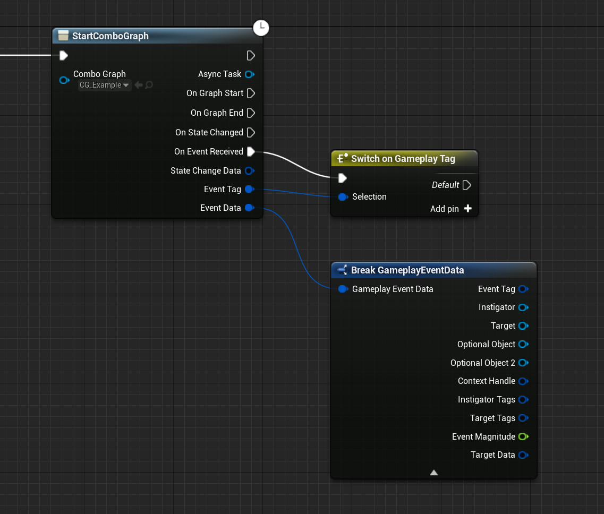

> **Note** Abilities that are meant to run Combo Graph should use `Instanced Per Actor` for their Instancing Policy (every other settings can be left to defaults)
> 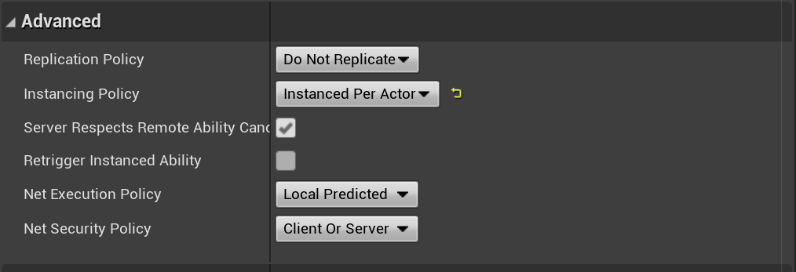
> Also, you can and probably want to define and customize tag containers for your ability such as `Ability Tags`, `Block Ability with Tags` or `Activation Owned Tags`.
> 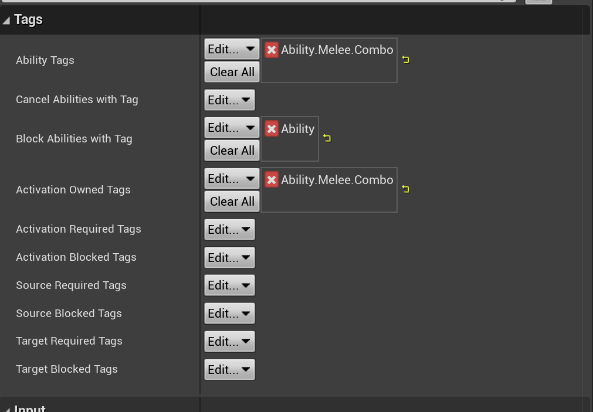

## Grant and run the ability

This part highly depends on your GAS setup. Simply put, we need to be able to run the ability. To do that, the ability needs to be granted to your character and the ability needs to be activated, most likely with a player input.

> **Using GAS Companion?** You can use `MGCAbilitySystemComponent` - *on your Character (child of `ModularCharacter`) or PlayerState (child of `ModularPlayerState` with Pawn Class set to a child of `ModularPlayerStateCharacter`)* - and grant your newly created ability to run the combo graph in the `GrantedAbilities` array for the component, optionally defining an input to activate it.
> 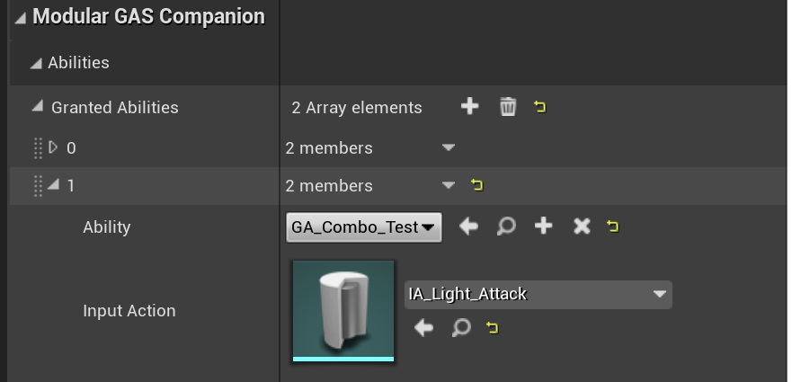

Depending on your GAS setup, since `GiveAbility` from GAS plugin is not exposed by default to Blueprints, you'll need to use your own preferred way to grant abilities and make sure the newly created ability to run our combo graph is granted to your character.

This could look like the following (On Begin Play):

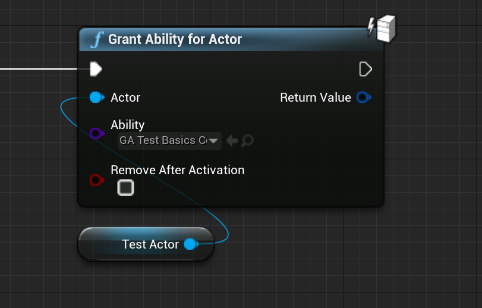

**Note** This is coming from an internal Blueprint Function Library used in the functional tests for the plugin.

Once granted, simply activate the ability by class (or tags if you have defined some Ability Tags for the ability).

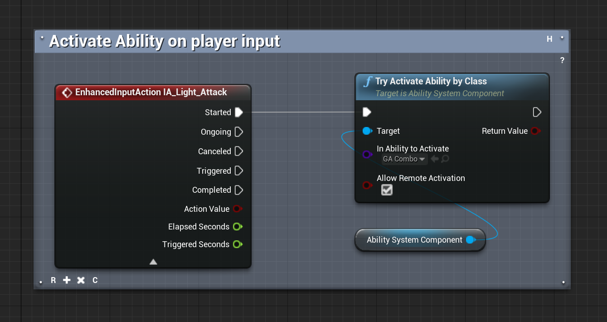

Since combo graph transitions are using Enhanced Input action, also make sure that your Player Controller has a mapping context enabled.

Here is the minimal character setup to be able to run our newly created combo graph:

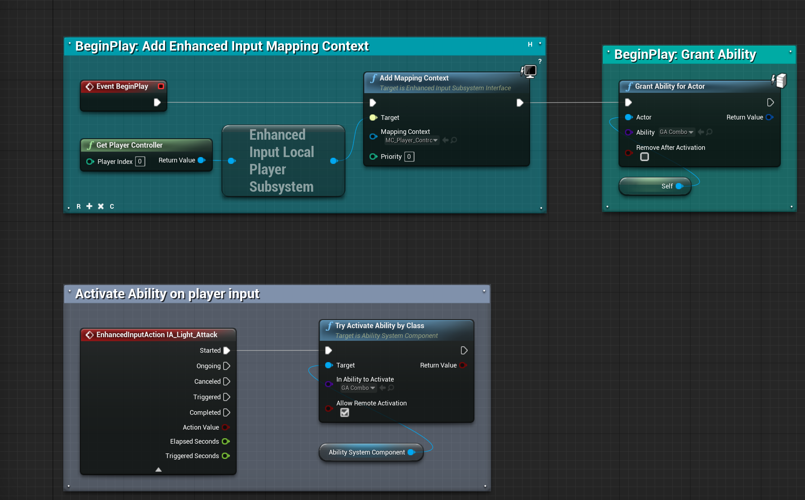

## Next Steps

We're done with this basic getting started section. You can now head over other part of the documentation such as:

- [Auto Setup and Anim Notifiers](/usage/auto-setup/) which will cover how Anim Notify States are used and how you can use the Auto Setup system to automatically define some without having to edit each and every animation asset.
- [Gameplay Effects (Cost and Containers)](/gameplay-effects) to learn more how you can apply damages or other gameplay effects when a hit is registered. We'll also explain how you can define a cost GameplayEffect for each combo nodes.
- [Gameplay Cues (SFX / VFX Hit Impacts)](/gameplay-cues) to learn more how you can apply sound and visual effects via gameplay cues for hit impacts.
- [Enhanced Input](/usage/enhanced-input) contains a detailed explanation of how you can use and setup Enhanced Input, how it's used by Combo Graphs and how transition icons are determined and drawn between each nodes. 
- [Handling Collision](/guides/collision) describes how you can integrate with external collision systems (or your own) and communicate back hit informations to Combo Graphs with the use of Gameplay Events (related to both Gameplay Effects and Cues Container for Combo Nodes).
- [Usage with AI](/guides/ai) is a high level overview of how you can use Combo Graphs with AI agents.