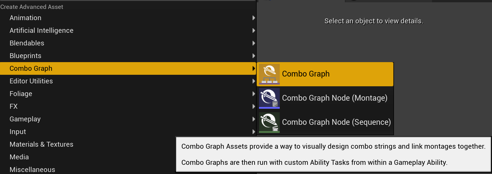
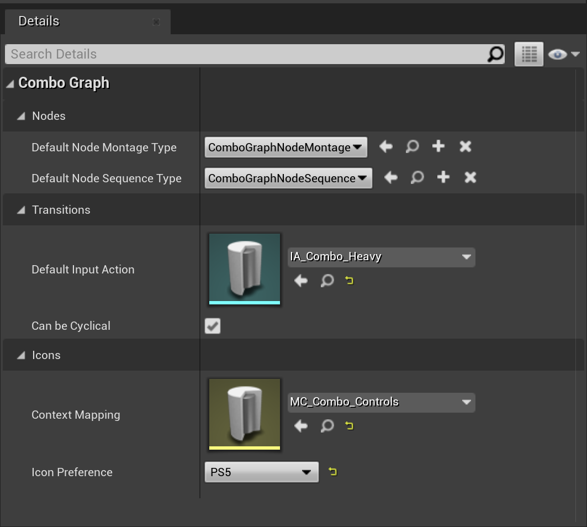

At its core, Combo Graph is based off GAS (Gameplay Ability System) and provides a way to visually design combo strings and link montages together.

It essentially comes with a custom Combo Graph asset and editor, and a set of Ability Tasks (and a Gameplay Task for non GAS users) to interact with the system. There is no specific custom classes to inherit from or use: No Base GameplayAbility, no Base Character or Controller, etc. This means it should integrate fairly easy with your current GAS setup.

And if not using GAS already, the plugin comes with few helpers to get you started even if you don't know GAS.

## Your first Combo Graph

We're going to make a new combo graph asset. You can create new combo graph from the Content Browser context menu:

Name it as you wish, and open it up. You'll be granted with the following window:

Here is a brief description of each panel:

| Panel         | Title                                 | Description  |
| -----         | ------------------------------------- | ------------ |
| Top Left      | Persona Preview Viewport              | If a preview mesh is defined, will play the animation for the currently selected node in the graph |
| Bottom Left   | Persona Preview Scene settings        | Can be used to change the Preview Mesh (all other options can be ignored) |
| Middle        | Combo Graph                           | This is where you can right click or draw from a previous node and create new combo nodes, either sequence or montages. |
| Top Right     | Property Details                      | Will display and allow you to change properties for the currently selected node or edge (transition between nodes). If nothing is selected, will display properties for the combo graph asset. |
| Bottom Right  | Animation Asset Browser               | List montages and sequences in the project. If a preview mesh is currently defined, will only display animations with a compatible skeletons. This panel can be used to drag and drop animations assets in the graph. |

### Combo Graph

If nothing is selected in the graph, the details window will display exposed properties for the graph itself.

**Combo Graph | Nodes**

- `Default Node Montage Type` - Node Class type used for montages assets when dropped in a graph, or dropped on an existing node pin.
- `Default Node Sequence Type` - Node Class type used for sequence assets when dropped in a graph, or dropped on an existing node pin.

Those properties lets you customize which class Combo Graph will use to create a new sequence or montage node in these situations. Can be left to default, but can be changed to use a BP subclass where you can define additional logic.

**Combo Graph | Transitions**

- `Default Input Action` - Default Input Action to use when creating new connections.
- `Can Be Cyclical` - Determine if we can have cycles or not in a graph

**Combo Graph | Icons**

- `Context Mapping` - Enhanced Input Context Mapping to use to draw edge (transition) icons in Graphs (if not set, will fallback to the one defined in Project Settings).
- `Icon Preference` - Icon preference to draw edge (transition) icons in Graph. Can be either Keyboard or Gamepad based (set to Project Settings value when instance is first created)

Those properties are purely cosmetic and used to draw transition icons in the graph. They have no impact on gameplay. `Context Mapping` should be set most of the time to the actual mapping context used by the owner of the combo graph.

### Combo Nodes

When designing combo logic, you define combo nodes like you would in a Behavior Tree and link them together using a transition edge bound to an Input Action.

> **Note** Make sure you're using animations (montages or sequences) that are using a compatible skeleton for your character mesh (defining the preview mesh and using the animation asset browser is a good way to ensure that). Also important, your character Animation Blueprint should use at the very least one Montage Slot (ex. `DefaultSlot`) that is used by your Montages. If you're using a different slot than `DefaultSlot`, you'll likely need to adjust `DynamicMontageSlotName` in the [Plugin Settings](/project-setup) otherwise using Sequences defined in your combo graph won't play properly.

When a combo node is selected, the details window will display exposed properties for the node, that we'll go over later on in their respective sections.

### Combo Transitions (Edges)

Similarly, if you select an edge (transitions between nodes), the details window will be updated with properties for the transition. This is where you can register an input action to listen to and transition to the child combo node if the input is triggered during the combo window.

> If input icons are not rendered when you define an Input Action for a transition, make sure you have setup your `ContextMapping` input context in the plugin settings. This is explained with further details in the [Enhanced Input section](/project-setup/enhanced-input/).

This is all we need to do for now. Simply drag off from the entry node and define a few combo nodes using either montages or sequences, and for each transitions define an Input Action that is used in an Input Mapping context your Player Controller is using.

## Next Steps

We're done with this basic getting started section. You can now head over the following pages, depending on whether you're using GAS or not:

- [With Gameplay Tasks (without GAS)](/usage/with-gameplay-tasks) if you wish to run Combo Graph without using GAS directly.
- [With Gameplay Abilities (with GAS)](/usage/with-gameplay-abilities) if you wish to run Combo Graph via GAS and Gameplay Abilities.

<!-- - [Auto Setup and Anim Notifiers](/usage/auto-setup/) which will cover how Anim Notify States are used and how you can use the Auto Setup system to automatically define some without having to edit each and every animation asset.
- [Gameplay Effects (Cost and Containers)](/gameplay-effects) to learn more how you can apply damages or other gameplay effects when a hit is registered. We'll also explain how you can define a cost GameplayEffect for each combo nodes.
- [Gameplay Cues (SFX / VFX Hit Impacts)](/gameplay-cues) to learn more how you can apply sound and visual effects via gameplay cues for hit impacts.
- [Enhanced Input](/project-setup/enhanced-input) contains a detailed explanation of how you can use and setup Enhanced Input, how it's used by Combo Graphs and how transition icons are determined and drawn between each nodes. 
- [Handling Collision](/collision) describes how you can integrate with external collision systems (or your own) and communicate back hit informations to Combo Graphs with the use of Gameplay Events (related to both Gameplay Effects and Cues Container for Combo Nodes).
- [Usage with AI](/guides/ai) is a high level overview of how you can use Combo Graphs with AI agents. -->