## Using Combo Graphs with Gameplay Abilities

When you are ready to use your combo graph, you can start making a Gameplay Ability to start using it. The primary way to run combo graph is via an ability task.

Create a new Gameplay Ability via the Content Browser context menu, and pick the parent class you'd like to use (if you don't have one, `GameplayAbility` is the one to use):

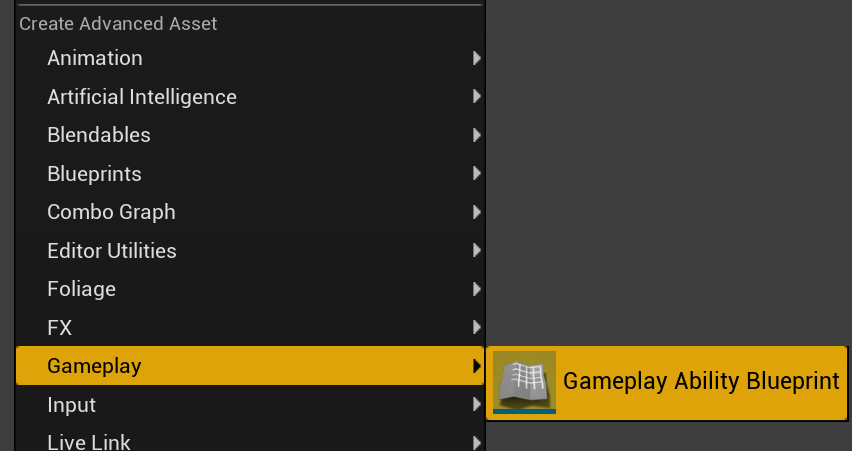

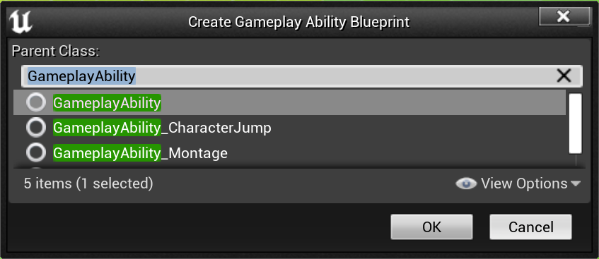

Then, for your Ability Event Graph, the `StartComboGraph` ability task is the primary way to start a combo graph from within a Gameplay Ability:

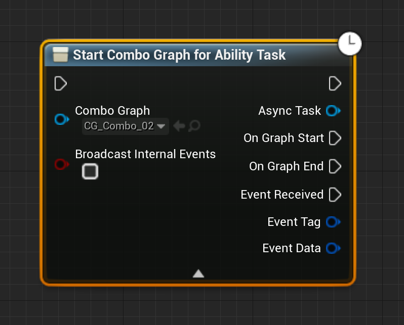
*This task is meant to be used to start / activate a Combo Graph Asset from within a Gameplay Ability.*

*Takes two parameter:*

- *`ComboGraph` which is the actual combo graph asset to run*
- *`bBroadcastInternalEvents` (Advanced display, click the arrow at the bottom of the node to reveal it) that when set will trigger `EventReceived` delegate for gameplay events used internally (such as "ComboBegin" / "ComboEnd" when animation enters or exits the combo window, and "StateChange" when the task transitions from one node to another)*

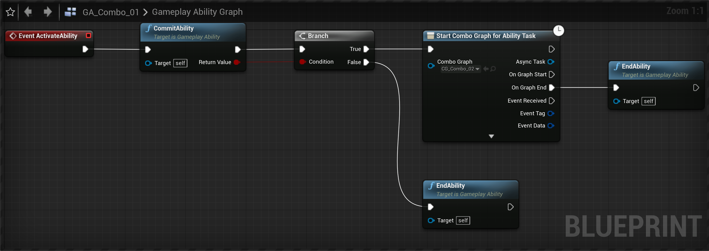

Here's a brief overview of a typical ability execution flow:

1. First, we commit the ability to ensure cost and cooldowns are committed (if you have them defined for your GA).
2. We end the ability if commit failed.
3. We use the Combo Graph Task `StartComboGraph` by passing the Combo Graph asset we want to use
4. Finally, we make sure to end the ability when the graph ends, by calling `EndAbility` on the `OnGraphEnd` event for the task.

There's a few events exposed to Blueprints that are triggered by the task if you'd like to react to these, the most important one being `OnGraphEnd`:

- `OnGraphStart`: Triggered when the combo graph is first started, should happen right away.
- `OnGraphEnd`: Triggered when the combo graph is done executing, either when a montage is completed (meaning no input was registered or reached the end of the tree) or interrupted from an external source or ability.
- `EventReceived`: Called when a gameplay event is received by the owner of the combo graph, which is the same as the Avatar of the currently running ability (in most case, will be your player character). This event is really similar to the one available with `PlayMontageAndWaitForEvent` task that you can find in Epic's ActionRPG project, tranek's GASDocumentation or GAS Companion. `EventTags` and `EventData` are only filled with `EventReceived` event.

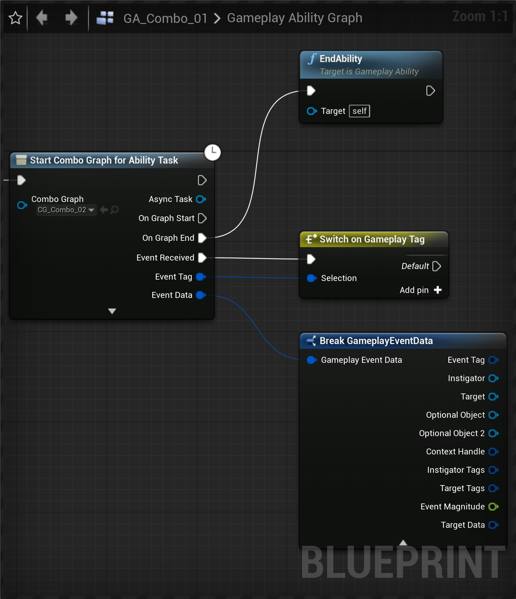

> **Note** Abilities that are meant to run Combo Graph should use `Instanced Per Actor` for their Instancing Policy (every other settings can be left to defaults)
> 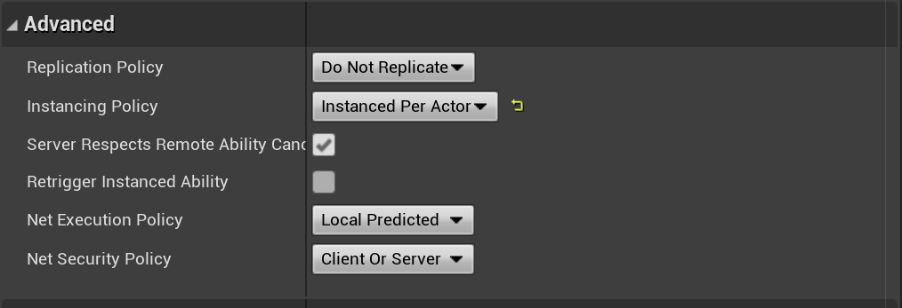
> Also, you can and probably want to define and customize tag containers for your ability such as `Ability Tags`, `Block Ability with Tags` or `Activation Owned Tags`.
> 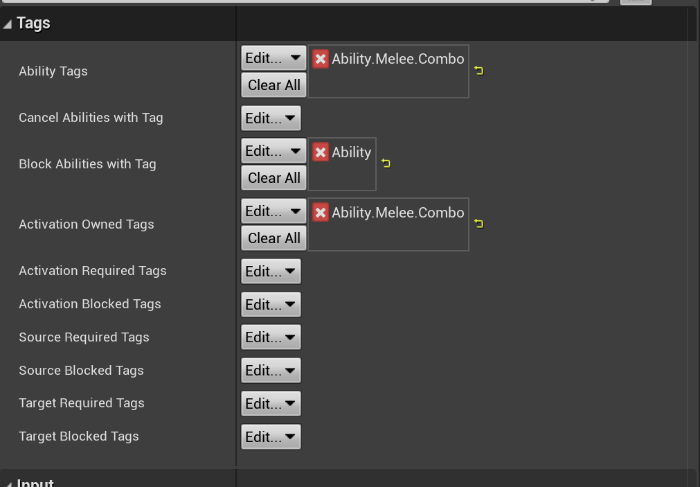

## Grant and run the ability

This part highly depends on your GAS setup. Simply put, we need to be able to run the ability. To do that, the ability needs to be granted to your character and the ability needs to be activated, most likely with a player input.

> **Using GAS Companion?** You can use `MGCAbilitySystemComponent` - *on your Character (child of `ModularCharacter`) or PlayerState (child of `ModularPlayerState` with Pawn Class set to a child of `ModularPlayerStateCharacter`)* - and grant your newly created ability to run the combo graph in the `GrantedAbilities` array for the component, optionally defining an input to activate it.
> 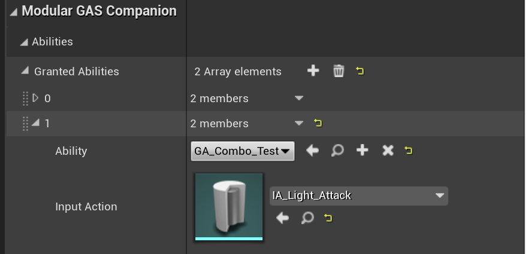

Depending on your GAS setup, since `GiveAbility` from GAS plugin is not exposed by default to Blueprints, you'll need to use your own preferred way to grant abilities and make sure the newly created ability to run our combo graph is granted to your character.

This could look like the following (On Begin Play):

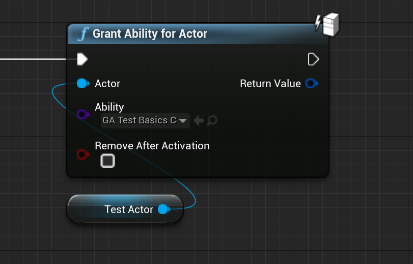

**Note** This is coming from an internal Blueprint Function Library used in the functional tests for the plugin.

Once granted, simply activate the ability by class (or tags if you have defined some Ability Tags for the ability).

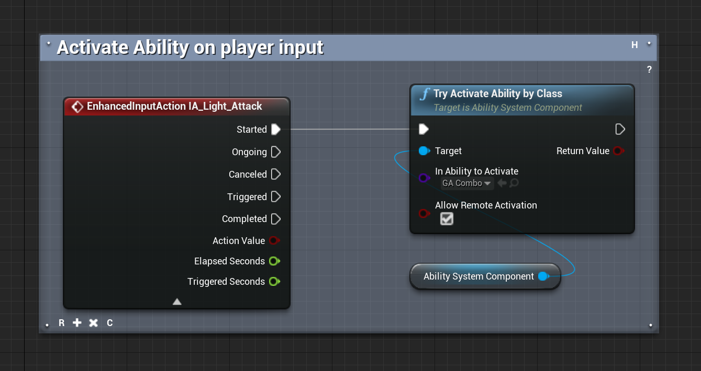

Since combo graph transitions are using Enhanced Input action, also make sure that your Player Controller has a mapping context enabled.

Here is the minimal character setup to be able to run our newly created combo graph:

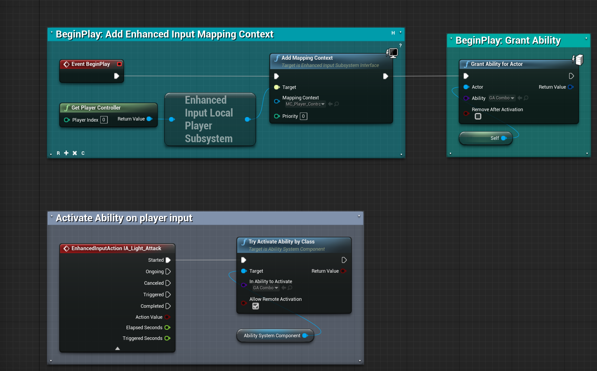