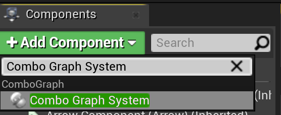
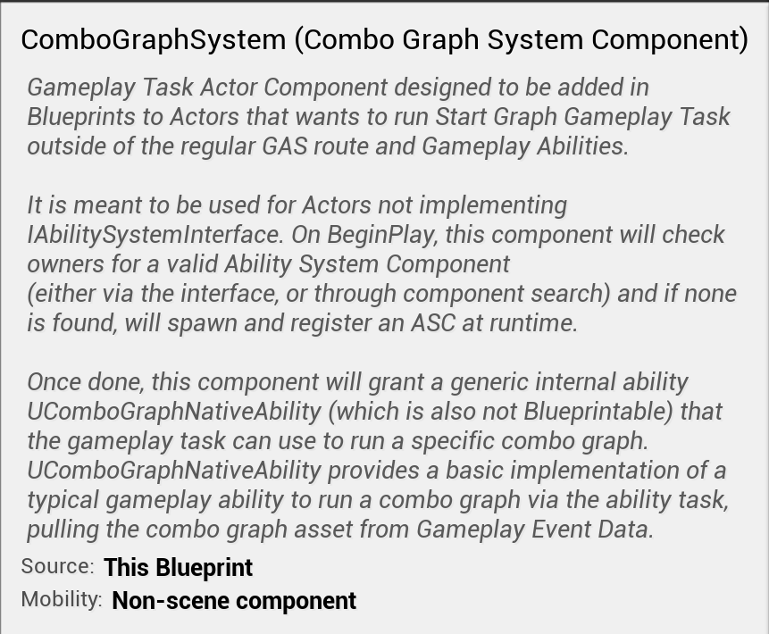
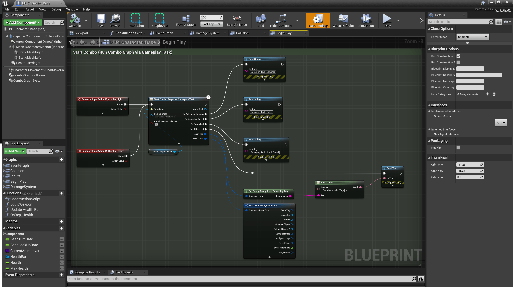
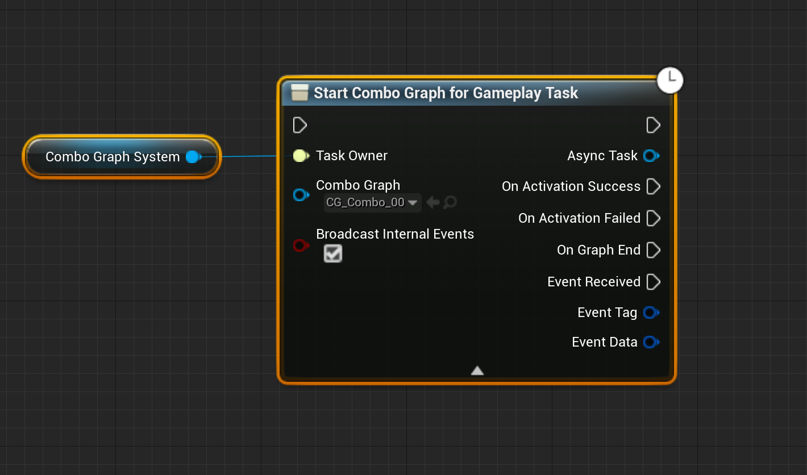
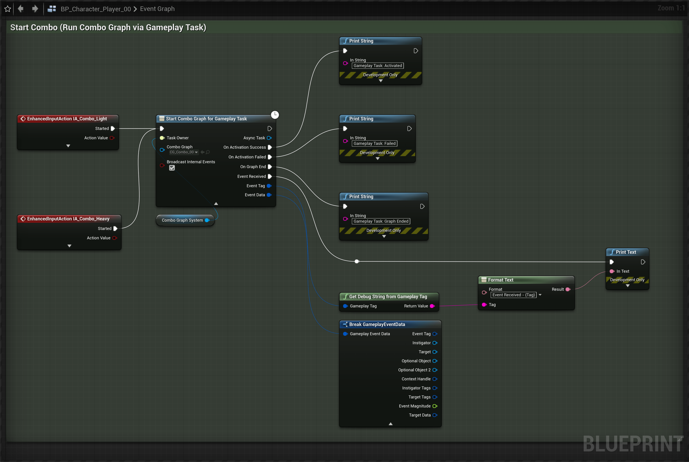

While Combo Graph is based off GAS (Gameplay Ability System), you don't need to know GAS to effectively use and design Combo Graphs.

You don't need a specific Character hierarchy for this method to work, using `Character` as a parent class is fine.

The only limitations of not using an Ability System character, is that you won't be able to use Gameplay Effects and Gameplay Attributes, but Combo Graphs provide a fallback mechanism to use Unreal's Damage System for the [Effect Containers](/gameplay-effects/containers) in Combo Nodes.

### Combo Graph System Component

In order for the gameplay task (`Start Combo Graph for Gameplay Task` explained in the next chapter) to run properly, `ComboGraphSystemComponent` is a required Actor Component (actually a Gameplay Task Component) that needs to be attached to the Character Blueprint.

> If you already have an Ability System Component for your Character, you can skip this step and use the ASC as `TaskOwner` param for the gameplay task.

*Click the `Add Component` button in the Components window and make sure `ComboGraphSystemComponent` is added to the Character Blueprint*

Once the component is added, you can make use of `Start Combo Graph for Gameplay Task`, even for Blueprints inheriting directly from the engine's `Character` class directly.

### Gameplay Task

`Start Combo Graph for Gameplay Task` is a convenience gameplay task for running combo graphs assets. It is meant to be used to start / activate a Combo Graph Asset from outside a Gameplay Ability and regular GAS route.

*This task can be used on Character Blueprint directly, that are not using an Ability System Component already, and not implementing `IAbilitySystemInterface` in c++. This task can be handy too when used within Behavior Tree Tasks.*

Takes three parameter:

- *`TaskOwner` Gameplay Task Owner for the task (such as ComboGraphSystemComponent - more on that component in the previous chapter - or an AbilitySystemComponent)*
- *`ComboGraph` The Combo Graph asset to start / activate*
- *`bBroadcastInternalEvents` Whether to broadcast internal gameplay events with EventReceived delegate (Advanced display, click the arrow at the bottom of the node to reveal it). Will trigger `EventReceived` delegate for gameplay events used internally (such as "ComboBegin" / "ComboEnd" when animation enters or exits the combo window, and "StateChange" when the task transitions from one node to another)*

There's a few events exposed to Blueprints that are triggered by the task if you'd like to react to these, the most important one being `OnGraphEnd`:

- `OnActivationSuccess`: Event called when ability was successfully activated.
- `OnActivationFailed`: Event called when ability failed to activate.
- `OnGraphEnd`: Triggered when the combo graph is done executing, either when a montage is completed (meaning no input was registered or reached the end of the tree) or interrupted from an external source or ability.
- `EventReceived`: Event called when the owner receives a gameplay event the combo graph is listening to. Gameplay Tag keys defined in the Effect and Cue Containers, as well as the `EventTags` property, on Combo Nodes will setup the montage task used internally to broadcast those events. `EventTags` and `EventData` are only filled with `EventReceived` event.

> This task when used from within a Gameplay Ability will return an error (on screen and in console). Use `Start Combo Graph for Ability Task` instead in this scenario.
